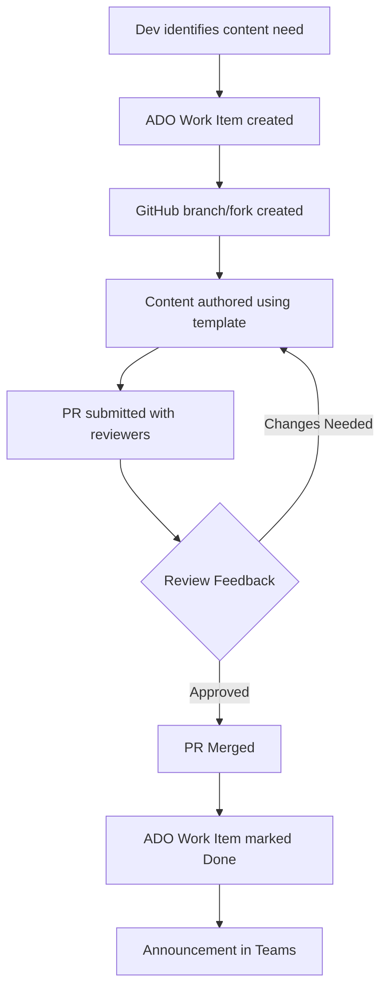

# 🛡 GOVERNANCE.md – UL Software Engineering Playbook

## Overview
Defines the roles, rules, and review model to ensure the Playbook remains high-quality, traceable, and aligned with UL and Microsoft best practices.

---

## 👥 Roles & Responsibilities

| Role               | Responsibilities |
|--------------------|------------------|
| Contributor        | Authors content using templates |
| V-Team Reviewer    | Ensures quality, clarity, and UL relevance |
| Epic Owner         | Signs off on structural or directional changes in their Epic |
| Maintainer         | Merges PRs, maintains folder and naming consistency |
| PMO / Program Owner| Oversees prioritization and alignment to goals |

---

## 🧩 Structural Requirements

- All contributions **must**:
  - Use templates
  - Be placed in correct folders (Epic → Feature → US → Task)
  - Follow naming convention: `Feature01.md`, `US01.md`, etc.

- PR Scope:
  - Max 1 Feature or 3 User Stories per PR
  - Smaller PRs improve review quality

- Licensing:
  - Internal use unless otherwise stated
  - No external proprietary content

---

## 🔄 Contribution Lifecycle

---

## ✅ Best Practices

| Do This | Avoid This |
|---------|------------|
| Use templates | Freeform Markdown |
| Link PRs to ADO | PRs without traceability |
| Assign appropriate reviewers | Self-approvals |
| Announce changes | Silent merges |

---
