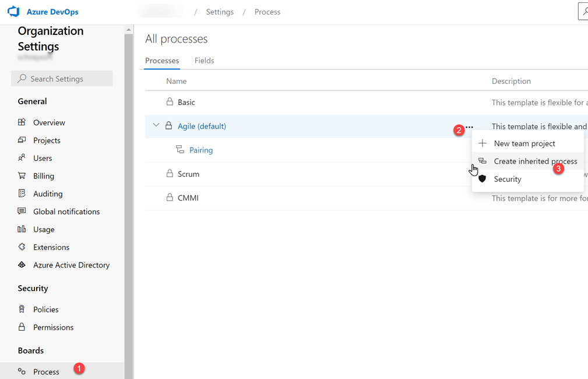
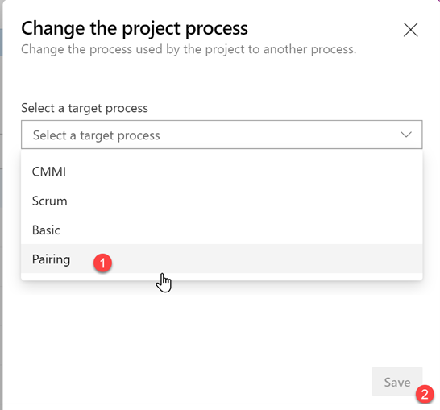

# How to add a pairing custom field in ADO User Stories

This document outlines the benefits of adding a custom field of type _Identity_ in [Azure DevOps](https://docs.microsoft.com/en-us/azure/devops/user-guide/what-is-azure-devops) (ADO) user stories, prerequisites, and a step-by-step guide.

## Benefits of adding a custom field

Having the names of both individuals [pairing on a story](./readme.md) visible on the ADO cards can be helpful during sprint ceremonies and lead to greater accountability by the pairing assignee. For example, it is easier to keep track of the individuals assigned stories as part of a pair during sprint planning by using the "pairing names field". During stand-up it can also help the process lead filter stories assigned to the individual (both as an owner or as a pairing assignee) and show these on the board. Furthermore, the pairing field can provide an additional data point for reports and burndown rates.

## Prerequisites

Prior to customizing ADO, review [Configure and customize Azure Boards](https://docs.microsoft.com/en-us/azure/devops/boards/configure-customize).

In order to add a custom field to user stories in ADO changes must be made on an Organizational setting. This document therefore assumes use of an existing Organization in ADO and that the user account used to make these changes is a member of the [Project Collection Administrators Group](https://docs.microsoft.com/en-us/azure/devops/organizations/security/set-project-collection-level-permissions).

## Step-by-step to change the organization settings

### Duplicate the process currently in use

Navigate to the Organization Settings, within the Boards / Process tab.

### Select the Process type, click on the icon with three dots ... and click 'Create inherited process'

### Click on the newly created inherited process

As you can see in the example below, we called it 'Pairing'

### Click on the work item type User Story

### Click New Field

### Give it a Name and select Identity in Type

Click on Add Field.

This completes the change in Organization settings. The rest of the instructions must be completed under Project Settings.

## Step-by-step to change the project settings

Go to the Project that is to be modified, select Project Settings

### Select Project configuration

### Click on process customization page

### Click on Projects then click on Change process

### Change the target process to Pairing then click Save

### Go to Boards

### Click on the Gear icon to open Settings

### Add field to card

Click on the green + icon to add select the Pairing field. Check the box to display fields, even when they are empty. Save and close.

### View the modified the card

Notice the new Pairing field. The Story can now be assigned an Owner and a Pairing assignee!

