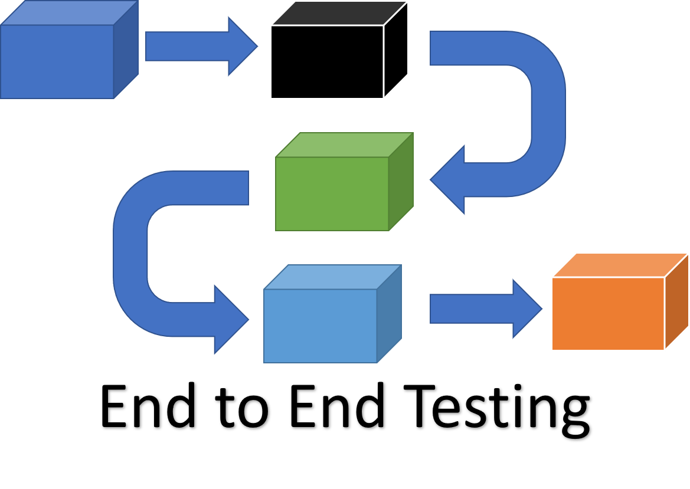
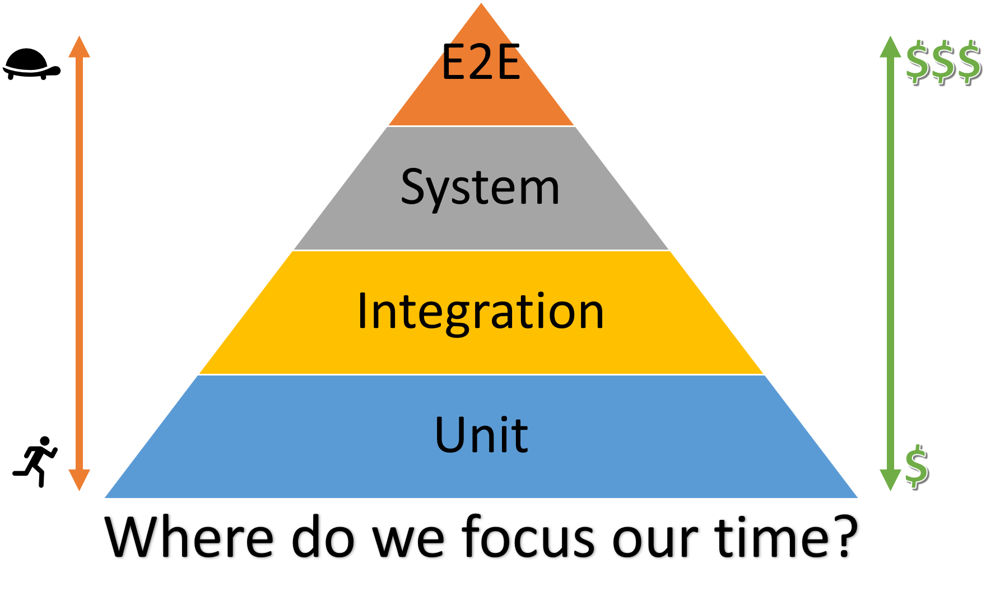
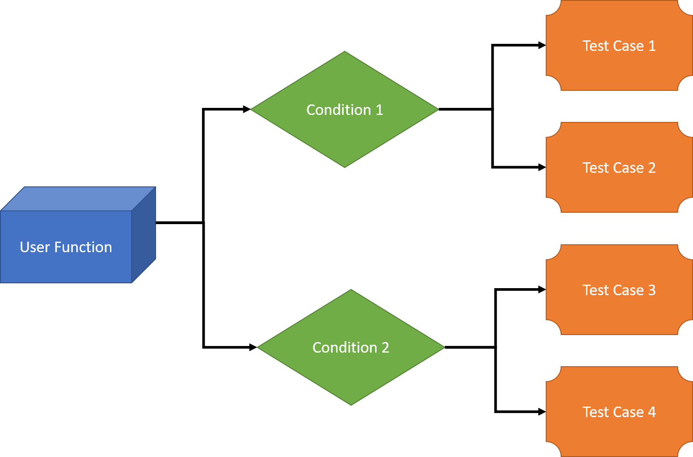

# E2E Testing

End-to-end (E2E) testing is a Software testing methodology to test a functional and data application flow consisting of several sub-systems working together from  start to end.

At times, these systems are developed in different technologies by different teams or organizations. Finally, they come together to form a functional business application.  Hence, testing a single system would not suffice. Therefore, end to end testing verifies the application from start to end putting all its components together.

## Why E2E Testing [The Why]

In many commercial software application scenarios, a modern software system comprises of its interconnection with multiple sub-systems. These sub-systems can be within the same organization or can be components of different organizations. Also, these sub-systems can have somewhat similar or different lifetime release cycle from the current system. As a result, if there is any failure or fault in any sub-system, it can adversely affect the whole software system leading to its collapse.

The above illustration is a testing pyramid from [Kent C. Dodd’s blog](https://blog.kentcdodds.com/write-tests-not-too-many-mostly-integration-5e8c7fff591c) which is a combination of the pyramids from [Martin Fowler’s blog](https://martinfowler.com/bliki/TestPyramid.html) and the [Google Testing Blog](https://testing.googleblog.com/2015/04/just-say-no-to-more-end-to-end-tests.html).

The majority of your tests are at the bottom of the pyramid. As you move up the pyramid, the number of tests gets smaller. Also, going up the pyramid, tests get slower and more expensive to write, run, and maintain. Each type of testing vary for its purpose, application and the areas it suppose to cover. For more information on comparison analysis of different testing types, please see this [## Unit vs Integration vs System vs E2E Testing](../readme.md) document.

## E2E Testing Design Blocks [The What]

We will look into all the 3 categories one by one:

### User Functions

Following actions should be performed as a part of building user functions:

- List user initiated functions of the software systems and their interconnected sub-systems.
- For any function, keep track of the actions performed as well as Input and Output data.
- Find the relations, if any between different Users functions.
- Find out the nature of different user functions i.e. if they are independent or are reusable.

### Conditions

Following activities should be performed as a part of building conditions based on user functions:

- For each and every user functions, a set of conditions should be prepared.
- Timing, data conditions and other factors that affect user functions can be considered as parameters.

### Test Cases

Following factors should be considered for building test cases:

- For every scenario, one or more test cases should be created to test each and every functionality of the user functions. If possible, these test cases should be automated thru the standard CI/CD build pipeline processes with the track of each successful and failed build in AzDO.
- Every single condition should be enlisted as a separate test case.

## Applying the E2E testing [The How]

Like any other testing, E2E testing also goes through formal planning, test execution, and closure phases.

E2E testing is done with the following steps:

### Planning

- Business and Functional Requirement analysis
- Test plan development
- Test case development
- Production like Environment setup for the testing
- Test data setup
- Decide exit criteria
- Choose the testing methods that most applicable to your system. For the definition of the various testing methods, please see [Testing Methods](./testing-methods.md) document.

### Pre-requisite

- System Testing should be complete for all the participating systems.
- All subsystems should be combined together to work as a complete application.
- Production like test environment should be ready.

### Test Execution

- Execute the test cases
- Register the test results and decide on pass and failure
- Report the Bugs in the bug reporting tool
- Re-verify the bug fixes

### Test closure

- Test report preparation
- Evaluation of exit criteria
- Test phase closure

### Test Metrics

The tracing the quality metrics gives insight about the current status of testing. Some of the common metrics of E2E testing are:

- **Test case preparation status**: Number of test cases ready versus the total number of test cases.
- **Frequent Test progress**: Number of test cases executed in the consistent frequent manner, e.g. weekly, versus a target number of the test cases in the same time period.
- **Defects Status**: This metric represents the status of the defects found during testing. Defects should be logged into defect tracking tool (e.g. AzDO backlog) and resolved as per their severity and priority. Therefore, the percentage of open and closed defects as per their severity and priority should be calculated to track this metric. The AzDO Dashboard Query can be used to track this metric.
- **Test environment availability**: This metric tracks the duration of the test environment used for end to end testing versus its scheduled allocation duration.

## E2E Testing Frameworks and Tools

### 1. Gauge Framework

Gauge is a free and open source framework for writing and running E2E tests. Some of the key features of Gauge that makes it unique include:

- Simple, flexible and rich syntax based on Markdown.
- Consistent cross platform/language support for writing test code.
- A modular architecture with plugins support.
- Supports data driven execution and external data sources.
- Helps you create maintainable test suites.
- Supports Visual Studio Code, Intellij IDEA, IDE Support.
- Supports html, json and XML reporting.

[Gauge Framework Website](https://gauge.org/)

### 2. Robot Framework

Robot Framework is a generic open source automation framework. The framework has easy syntax, utilizing human-readable keywords. Its capabilities can be extended by libraries implemented with Python or Java.

Robot shares a lot of the same "pros" as Gauge, with the exception of the developer tooling and the syntax. In our usage, we found the VS Code Intellisense offered with Gauge to be much more stable than the offerings for Robot. We also found the syntax to be less readable than what Gauge offered. While both frameworks allow for markup based test case definitions, the Gauge syntax reads much more like an English sentence than Robot. Finally, Intellisense is baked into the markup files for Gauge test cases, which will create a function stub for the actual test definition if the developer allows it. The same cannot be said of the Robot Framework.

[Robot Framework Website](https://robotframework.org/#introduction)

### 3. TestCraft

TestCraft is a codeless Selenium test automation platform. Its revolutionary AI technology and unique visual modeling allow for faster test creation and execution while eliminating test maintenance overhead.

The testers create fully automated test scenarios without coding. Customers find bugs faster, release more frequently, integrate with the CI/CD approach and improve the overall quality of their digital products. This all creates a complete end to end testing experience.

[TestCraft Website](https://www.testcraft.io/?utm_campaign=SoftwareTestingHelp%20&utm_source=SoftwareTestingHelp&utm_medium=EndtoEndTestingPage) or get it  from the [Visual Studio Marketplace](https://marketplace.visualstudio.com/items?itemName=testcraft.build-release-task)

### 4. Ranorex Studio

**Ranorex Studio** is a complete end-to-end test automation tool for desktop, web, and mobile applications. Create reliable tests fast without any coding at all, or using the full IDE. Use external CSV or Excel files or a SQL database as inputs to your tests.

Run tests in parallel or on a Selenium Grid with built-in Selenium WebDriver. Ranorex Studio integrates with your CI/CD process to shorten your release cycles without sacrificing quality.

**Ranorex Studio** tests also integrate with Azure DevOps (AzDO), which can be run as part of a build pipeline in AzDO.

[Ranorex Studio Website](https://www.ranorex.com/ranorex-studio-test-automation/?utm_source=softwaretestinghelp&utm_medium=cpc&utm_campaign=softwaretestinghelp_what-is-end-to-end-testing) or read about its [integration with AzDO](https://www.ranorex.com/help/latest/interfaces-connectivity/azure-devops-integration/introduction/)

### 5. Katalon Studio

**Katalon Studio** is an excellent end-to-end automation solution for web, API, mobile, and desktop testing with DevOps support.

With Katalon Studio, automated testing can be easily integrated into any CI/CD pipeline to release products faster while guaranteeing high quality. Katalon Studio customizes for users from beginners to experts. Robust functions such as Spying, Recording, Dual-editor interface and Custom Keywords make setting up, creating and maintaining tests possible for users.

Built on top of Selenium and Appium, Katalon Studio helps standardize your end-to-end tests standardized. It also complies with the most popular frameworks to work seamlessly with other tools in the automated testing ecosystem.

Katalon is endorsed by Gartner, IT professionals, and a large testing community.

> Note: At the time of this writing, Katalon Studio extension for AzDO was NOT available for Linux.

[Katalon Studio Website](https://www.katalon.com/) or read about its [integration with AzDO](https://docs.katalon.com/katalon-studio/docs/azure-devops-extension.html#installation)

## Conclusion

Hope you learned various aspects of E2E testing like its processes, metrics, the difference between Unit, Integration  and E2E testing, and the various recommended E2E test frameworks and tools.

For any commercial release of the software, E2E test verification plays an important role as it tests the entire application in an environment that exactly imitates real-world users like network communication, middleware and backend services interaction, etc.

Finally, the E2E test is often performed manually as the cost of automating such test cases is too high to be afforded by any organization. Having said that, the ultimate goal of each organization is to make the e2e testing as streamlined as possible adding full and semi-automation testing components into the process. Hence, the various E2E testing frameworks and tools listed in this article come to the rescue.

## Resources

- [Wikipedia: Software testing](https://en.wikipedia.org/wiki/Software_testing)
- [Wikipedia: Unit testing](https://en.wikipedia.org/wiki/Unit_testing)
- [Wikipedia: Integration testing](https://en.wikipedia.org/wiki/Integration_testing)
- [Wikipedia: System testing](https://en.wikipedia.org/wiki/System_testing)
