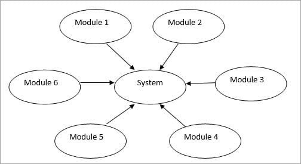
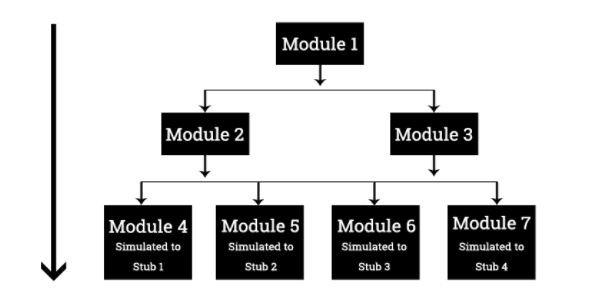
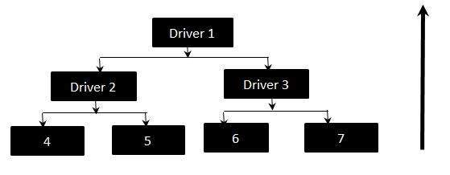

# Integration Testing

Integration testing is a software testing methodology used to determine how well individually developed components, or modules of a system communicate with each other. This method of testing confirms that an aggregate of a system, or sub-system, works together correctly or otherwise exposes erroneous behavior between two or more units of code.

## Why Integration Testing

Because one component of a system may be developed independently or in isolation of another it is important to verify the interaction of some or all components. A complex system may be composed of databases, APIs, interfaces, and more, that all interact with each other or additional external systems. Integration tests expose system-level issues such as broken database schemas or faulty third-party API integration. It ensures higher test coverage and serves as an important feedback loop throughout development.

## Integration Testing Design Blocks

Consider a banking application with three modules: login, transfers, and current balance, all developed independently. An integration test may verify when a user logs in they are re-directed to their current balance with the correct amount for the specific mock user. Another integration test may perform a transfer of a specified amount of money. The test may confirm there are sufficient funds in the account to perform the transfer, and after the transfer the current balance is updated appropriately for the mock user. The login page may be mocked with a test user and mock credentials if this module is not completed when testing the transfers module.

Integration testing is done by the developer or QA tester. In the past, integration testing always happened after unit and before system and E2E testing. Compared to unit-tests, integration tests are fewer in qunatity, usually run slower, and are more expensive to set up and develop. Now, if a team is following agile principles, integration tests can be performed before or after unit tests, early and often, as there is no need to wait for sequential processes. Additionally, integration tests can utilize mock data in order to simulate a complete system. There is an abundance of language-specific testing frameworks that can be used throughout the entire development lifecycle.

\*\* It is important to note the difference between integration and acceptance testing. Integration testing confirms a group of components work together as intended from a technical perspective, while acceptance testing confirms a group of components work together as intended from a business scenario.

## Applying Integration Testing

Prior to writing integration tests, the engineers must identify the different components of the system and their intended behaviors and inputs and outputs. The architecture of the project must be fully documented or specified somewhere that can be readily referenced (e.g., the architecture diagram).

There are two main techniques for integration testing.

### Big Bang

Big Bang integration testing is when all components are tested as a single unit. This is best for small system as a system too large may be difficult to localize for potential errors from failed tests. This approach also requires all components in the system under test to be completed which may delay when testing begins.

### Incremental Testing

Incremental testing is when two or more components that are logically related are tested as a unit. After testing the unit, additional components are combined and tested all together. This process repeats until all necessary components are tested.

#### Top Down

Top down testing is when higher level components are tested following the control flow of a software system. In the scenario, what is commonly refered to as stubs are used to emulate the behavior of lower level modules not yet complete or merged in the integration test.

#### Bottom Up

Bottom up testing is when lower level modules are tested together. In the scenario, what is commonly refered to as drivers are used to emulate the behavior of higher level modules not yet complete or included in the integration test.

A third approach known as the sandwich or hybrid model combines the bottom up and town down approaches to test lower and higher level components at the same time.

### Things to Avoid

There is a tradeoff a developer must make between integration test code coverage and engineering cycles. With mock dependencies, test data, and multiple environments at test, too many integration tests are infeasible to maintain and become increasingly less meaningful. Too much mocking will slow down the test suite, make scaling difficult, and may be a sign the developer should consider other tests for the scenario such as acceptance or E2E.

Integration tests of complex systems require high maintenance. Avoid testing business logic in integration tests by keeping test suites separate. Do not test beyond the acceptance criteria of the task and be sure to clean up any resources created for a given test. Additionally, avoid writing tests in a production environment. Instead write them in a scaled-down copy environment.

## Integration Testing Frameworks and Tools

Many tools and frameworks can be used to write both unit and integration tests. The following tools are for automating integration tests.

- [JUnit](https://junit.org/junit5/)
- [Robot Framework](https://robotframework.org/)
- [moq](https://github.com/moq/moq4)
- [Cucumber](https://cucumber.io/)
- [Selenium](https://www.selenium.dev/)
- [Behave (Python)](https://behave.readthedocs.io/en/latest/tutorial.html)

## Conclusion

Integration testing demonstrates how one module of a system, or external system, interfaces with another. This can be a test of two components, a sub-system, a whole system, or a collection of systems. Tests should be written frequently and throughout the entire development lifecycle using an appropriate amount of mocked dependencies and test data. Because integration tests prove that independently developed modules inteerface as technically designed, it increases confidence in the development cycle providing a path for a system that deploys and scales.

## Resources

- [Integration testing approaches](https://www.softwaretestinghelp.com/what-is-integration-testing/)
- [Integration testing pros and cons](https://www.geeksforgeeks.org/software-engineering-integration-testing/)
- [Integration tests mocks and stubs](https://circleci.com/blog/how-to-test-software-part-i-mocking-stubbing-and-contract-testing/)
- [Software Testing: Principles and Practices](https://www.goodreads.com/book/show/21278464-software-testing)
- [Integration testing Behave test quick start](https://github.com/Nick287/Behave-Quick-Start)
