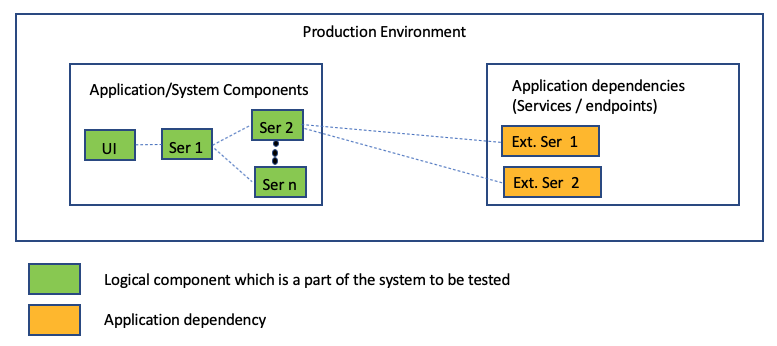
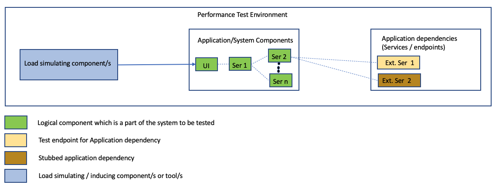

# Peformance Testing

Performance Testing is an overloaded term that is used to refer to several sub categories of performance related testing, each of which has different purpose. A good description of overall performance testing is as follows: 

"*Performance testing is a type of testing intended to determine the responsiveness, throughput, reliability, and/or scalability of a system under a given workload.* " -  [Performance Testing Guidance for Web Applications](https://docs.microsoft.com/en-us/archive/blogs/dajung/ebook-pnp-performance-testing-guidance-for-web-applications).

Before getting into the different subcategories of performance tests let us understand why is performance testing typically done.

## Why Performance Testing

Performance testing is commonly conducted to accomplish one or more the following:

* To help in accessing whether a **system is ready for Release**:
  * Estimating / Predicting the performance characteristics (such as response time, failure rate, throughput) which an application is likely to have when it is released in to production. The results can help in predicting the satisfaction level of the users when interacting with the system. The predicted values can also be compared with agreed values (success criteria) for the performance characteristics when available. 
  * To help in accessing the adequacy of the infrastructure / managed service sku's to meet the desired performance characteristics of a system
  * Identifying bottlenecks and issues with the application at different load levels
* To compare the **performance impact of application changes**
  * Comparing the performance characteristics of an application after a change to the values of performance characteristics during previous runs (or baseline values), can provide an indication of performance issues or enhancements introduced due to a change
* To **support system tuning**
  * Comparing performance characteristics of a system for different system configurations

## Key Performance Testing categories
* **Performance Testing** : This category is the super set of all sub categories of performance related testing. It validates/determines the speed, scalability or reliability characteristics of the system under test. Performance testing focusses on achieving the response times, throughput, and resource utilization levels which meet the performance objectives of a system
* **Load Testing** : This is the subcategory of performance testing which focusses on validating the performance characteristics of a system, when the system faces load volumes which are expected during production operation.
* **Stress Testing** : This is the subcategory of performance testing which focusses on validating the performance characteristics of a system, when the system faces load volumes or conditions beyond those expected during production operations. This could include tests which limit the memory, disk available to the system.

## Sample performance testing scenario
To understand performance testing better, let us consider a sample scenario where we want to asses whether a web application can handle the expected production peak load in the coming months.
The logical component view of the production application is as follows :

It is simple micro services based web application. Some of the internal services consume external third party services for their functionality.

A Load test is planned for this application. This is carried out in a dynamically provisioned performance test environment. 

This environment has :
* The application which we need to test deployed
* One of the external dependecies for this application provides a test endpoint, and the application in this environment is configured to hit that end point. The other external dependency does not provide a test endpoint so as part of the performance test activity scope an intellegent test stub was created which returns data in the expected format, and response latency delays can be configured for the stub.
* It has the load simulating components deployed. This component/s simulates end user requests which hit the UI component of the application for different user journeys.

## Key Performance testing activities

* Understand the [motivation for the tests](#why-performance-testing)
* Understanding the Environment: The Production application environment which includes the infrastructure, the network, the software, different application integrations, etc needs to be understood in detail. If there are constraints that an existing perpetual performance testing environment needs to be used for the testing, then understand that environment, and the differences with the production environment (like test systems for certain integrations not being available)
* Identify and Define the Acceptance criteria for the tests:
  * Identify goals and constraints with respect to response times, throughput, resource utilization etc
  * For performance tuning related performance tests the success criteria may be a little different. For instance the success criteria could be to compare the performance impact of variations to combination of specific configuration setting values of the system and identify the best combination of those configuration setting values. 
* Plan and design the tests
  * Come up with the workload model for the tests. For an ecommerce application the activities in defining a workload model could include :
    * Identifying the types of user profiles (users browsing the site, or users purchasing products, etc) their relative percentages and the actions the users can perform like registering, logging in, searching for a product, adding a product to basket, checking out, etc. 
    * Then for a user profile identifying on an average the number of time a particular action is  performed in one session, this would include details of the average wait time between actions
    * Understand the seasonality of the traffic, i.e peaks during the day, week, month and year
    * Identifying test data
  * Defining the load the application would be tested with
  * Establishing the metrics to be collected
  * Which tools will be used for the perform tests
    * How will the load be generated (from within the network or from the internet)
    * How will the tool be configured, i.e. single load inducing mode or multiple load inducers?
  * Establish the performance test frequency : whether the performance tests be done as a part of the feature development sprints, or only prior to release to a major environment?
  * For the test environment establish :
    * If the performance test environment be dynamically be provisioned, or a perpetual environment needs to be used
    * How the environment will be monitored
    * How will the interfaces be tested, the answer this could be that the interfaces have a test endpoint, or they will be stubbed, or the interface will not be tested, etc
    * If the test environment has similar capacity as the production environment, or if it has lower capacity and the tests need to occur with the load scaled down?
* Test Environment configuration : configure the test environment as per the plan 
* Test Execution , Result analysis and re-testing :
  * The test are executed, the results are collected and the environments are monitored
  * The results are analysed
  * Depending on the scenario, modification of application or configuration are done and tests are executed again. For instance in case of a load test if the earlier execution shows that the performance targets for response time are not met and this is corelated with a component (say database) responding slowly, then optimizations to that component are made, and the tests are executed again
  

## Performance testing Frameworks and Tools
Some of the performance testing tools are :
* [JMeter](https://jmeter.apache.org/)
* [Locust](https://locust.io/)
* [Gatling](https://gatling.io/)
  
  The post "[Comparison of performance testing tools](https://www.blazemeter.com/blog/open-source-load-testing-tools-which-one-should-you-use?utm_source=blog&utm_medium=BM_blog&utm_campaign=jmeter-vs-locust-which-one-should-you-choose)" gives a nice comparison of some of the performance testing tools

## Resources
* Most of the guidance on this page is based on the awesome performance testing book [Patters and Practices: Performance Testing Guidance for Web Applications](https://docs.microsoft.com/en-us/archive/blogs/dajung/ebook-pnp-performance-testing-guidance-for-web-applications)

