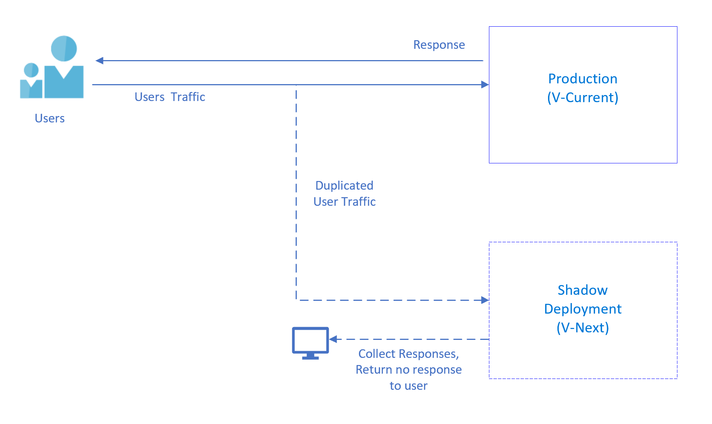

# Shadow Testing

Shadow testing is one of the useful approaches to reduce risks when you consider to replace the current environment (V-Current) with candidate environment with new feature (V-Next). This approach is monitoring and capturing differences between two environments then compare and reduces all risks before you introduce a new feature/release.

This approach is also known as "Shadow Deployment" or "Shadowing Traffic" and similarities with "Dark launching"

In our test cases, code coverage is very important however sometimes providing code coverage can be tricky to replicate real-life combinations and possibilities. In this approach, to test V-Next environment we have side by side deployment, we're replicating the same traffic with V-Current environment and directing same traffic to V-Next environment, the only difference is we don't return any response from V-Next environment to users.

 Referencing back to one of the [Principles of Chaos Engineering](https://principlesofchaos.org/), mentions importance of sampling real traffic like below:

> Systems behave differently depending on environment and traffic patterns. Since the behavior of utilization can change at any time, sampling real traffic is the only way to reliably capture the request path. To guarantee both authenticity of the way in which the system is exercised and relevance to the current deployed system, Chaos strongly prefers to experiment directly on production traffic.

With this Shadow Testing approach we're leveraging real customer behavior in V-Next environment with sampling real traffic and mitigating the risks which users may face on production.

We're testing actual behavior of the product and this cause zero impact to production to test new features since traffic is replicated to V-next environment.

There're some similarities with [Dark Launching](https://martinfowler.com/bliki/DarkLaunching.html), Dark Launching propose to integrate new feature into production release code and users are not able to see this feature, on the backend you can test your feature and improve the performance until it's acceptable. Also [Feature Toggle](https://martinfowler.com/bliki/FeatureToggle.html) approach is providing you an ability to enable/disable your new feature on the production on UI level, with this approach your new feature will be visible to users and you can collect feedback. Using Dark Launching with Feature Toggle approach can be very useful for introducing a new feature.

## Shadow Testing Frameworks and Tools

There are some tools to implement shadow testing, the most popular one is [Diffy](https://github.com/opendiffy/diffy). It was created and used at Twitter then original author and a former Twitter employee maintains their own version of this project, called [Opendiffy](https://github.com/opendiffy/diffy). Twitter announced this tool on the blog as "[Testing services without writing tests](https://blog.twitter.com/engineering/en_us/a/2015/diffy-testing-services-without-writing-tests.html)".

 As of today Diffy is used in production by Twitter, Airbnb, Airbnb, Baidu and Bytedance companies.

> Diffy finds potential bugs in your service using running instances of your new code and your old code side by side. Diffy behaves as a proxy and multicasts whatever requests it receives to each of the running instances. It then compares the responses, and reports any regressions that may surface from those comparisons. The premise for Diffy is that if two implementations of the service return “similar” responses for a sufficiently large and diverse set of requests, then the two implementations can be treated as equivalent and the newer implementation is regression-free.

Diffy architecture

## References  

- [Martin Fowler - Dark Launching](https://martinfowler.com/bliki/DarkLaunching.html)
- [Martin Fowler - Feature Toggle](https://martinfowler.com/bliki/FeatureToggle.html)
- [Traffic Shadowing/Mirroring](https://istio.io/latest/docs/tasks/traffic-management/mirroring/#:~:text=Traffic%20mirroring%2C%20also%20called%20shadowing,path%20for%20the%20primary%20service.)
- [Diffy](https://github.com/opendiffy/diffy)
