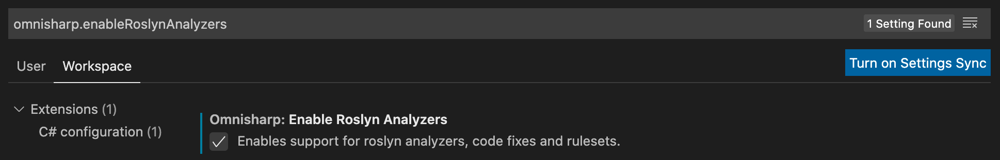

# C# Code Reviews

## Style Guide

[CSE](../../CSE.md) developers follow Microsoft's [C# Coding Conventions](https://docs.microsoft.com/en-us/dotnet/csharp/programming-guide/inside-a-program/coding-conventions) and, where applicable, Microsoft's [Secure Coding Guidelines](https://docs.microsoft.com/en-us/dotnet/standard/security/secure-coding-guidelines).

## Code Analysis / Linting

We strongly believe that consistent style increases readability and maintainability of a code base. Hence we are recommending analyzers / linters to enforce consistency and style rules.

### Project Setup

We recommend using a common setup for your solution that you can refer to in all the projects that are part of the solution. Create a common.props file that contains the defaults for all of your projects:

```xml
<Project>
...
    <ItemGroup>
        <PackageReference Include="Microsoft.CodeAnalysis.FxCopAnalyzers" Version="2.9.8">
          <PrivateAssets>all</PrivateAssets>
          <IncludeAssets>runtime; build; native; contentfiles; analyzers; buildtransitive</IncludeAssets>
        </PackageReference>
        <PackageReference Include="StyleCop.Analyzers" Version="1.1.118">
          <PrivateAssets>all</PrivateAssets>
          <IncludeAssets>runtime; build; native; contentfiles; analyzers; buildtransitive</IncludeAssets>
        </PackageReference>
    </ItemGroup>
    <PropertyGroup>
        <TreatWarningsAsErrors>true</TreatWarningsAsErrors>
    </PropertyGroup>
    <ItemGroup Condition="Exists('$(MSBuildThisFileDirectory)../.editorconfig')" >
        <AdditionalFiles Include="$(MSBuildThisFileDirectory)../.editorconfig" />
    </ItemGroup>
...
</Project>
```

You can then reference the common.props in your other project files to ensure a consistent setup.

```xml
<Project Sdk="Microsoft.NET.Sdk.Web">
  <Import Project="..\common.props" />
</Project>
```

The [.editorconfig](https://docs.microsoft.com/en-us/visualstudio/ide/editorconfig-code-style-settings-reference?view=vs-2019) allows for configuration and overrides of rules. You can have an .editorconfig file at project level to customize rules for different projects (test projects for example).

[Details about the configuration of different rules](https://docs.microsoft.com/en-us/visualstudio/code-quality/use-roslyn-analyzers?view=vs-2019).

### FxCop analyzers

Microsoft's FxCop analyzers check your code for security, performance, and design issues, among others. [Install FxCop analyzers in Visual Studio](https://docs.microsoft.com/en-us/visualstudio/code-quality/install-fxcop-analyzers?view=vs-2019).

You can install the FxCop analyzers using nuget or a VSIX extension. We recommend using the nuget package ([see Project setup](#project-setup)). Which allows for consistent use across all developers on a project as well as CI validation.

### StyleCop analyzer

The StyleCop analyzer is a nuget package (StyleCop.Analyzers) that can be installed in any of your projects. It's mainly around code style rules and makes sure the team is following the same rules without having subjective discussions around braces and spaces. Detailed information can be found here: [StyleCop Analyzers for the .NET Compiler Platform](https://github.com/DotNetAnalyzers/StyleCopAnalyzers).

The minimum rules set teams should adopt is the [Managed Recommended Rules](https://msdn.microsoft.com/en-us/library/dd264893.aspx) rule set.

## Automatic Code Formatting

Use .editorconfig to configure code formatting rules in your project.

## Build validation

It's important that you enforce your code style and rules in the CI to avoid any team member merging code that does not comply with your standards into your git repo.

If you are using FxCop analyzers and StyleCop analyzer, it's very simple to enable those in the CI. You have to make sure you are setting up the project using nuget and .editorconfig ([see Project setup](#project-setup)). Once you have this setup, you will have to configure the pipeline to build your code. That's pretty much it. The FxCop analyzers will run and report the result in your build pipeline. If there are rules that are violated, your build will be red.

```yaml
    - task: DotNetCoreCLI@2
      displayName: 'Style Check & Build'
      inputs:
        command: 'build'
        projects: '**/*.csproj'
```

## Enable Roslyn Support in Visual Studio Code

The above steps also work in VS Code provided you enable Roslyn support for Omnisharp. The setting is `omnisharp.enableRoslynAnalyzers` and must be set to `true`. After enabling this setting you must "Restart Omnisharp" (this can be done from the Command Palette in VS Code or by restarting VS Code).



## Code Review Checklist

In addition to the [Code Review Checklist](../process-guidance/reviewer-guidance.md) you should also look for these C# specific code review items

* [ ] Does this code make correct use of [asynchronous programming constructs](https://docs.microsoft.com/en-us/dotnet/csharp/programming-guide/concepts/async/#BKMK_AsyncandAwait), including proper use of ```await``` and ```Task.WhenAll``` including CancellationTokens?
* [ ] Is the code subject to concurrency issues? Are shared objects properly protected?
* [ ] Is dependency injection (DI) used? Is it setup correctly?
* [ ] Are [middlewares](https://docs.microsoft.com/en-us/aspnet/core/fundamentals/middleware/index?view=aspnetcore-2.1&tabs=aspnetcore2x) included in this project configured correctly?
* [ ] Are resources released deterministically using the IDispose pattern? Are all disposable objects properly disposed ([using pattern](https://docs.microsoft.com/en-us/dotnet/csharp/language-reference/keywords/using-statement))?
* [ ] Is the code creating a lot of short-lived objects. Could we optimize GC pressure?
* [ ] Is the code written in a way that causes boxing operations to happen?
* [ ] Does the code [handle exceptions correctly](https://docs.microsoft.com/en-us/dotnet/standard/exceptions/best-practices-for-exceptions)?
* [ ] Is package management being used (NuGet) instead of committing DLLs?
* [ ] Does this code use LINQ appropriately? Pulling LINQ into a project to replace a single short loop or in ways that do not perform well are usually not appropriate.
* [ ] Does this code properly validate arguments sanity (i.e. [CA1062](https://docs.microsoft.com/en-us/dotnet/fundamentals/code-analysis/quality-rules/ca1062))? Consider leveraging extensions such as [Ensure.That](https://github.com/danielwertheim/Ensure.That)
* [ ] Does this code include telemetry ([metrics, tracing](https://docs.microsoft.com/en-us/azure/azure-monitor/app/app-insights-overview) and [logging](https://serilog.net/)) instrumentation?
* [ ] Does this code leverage the [options design pattern](https://docs.microsoft.com/en-us/aspnet/core/fundamentals/configuration/options?view=aspnetcore-3.1) by using classes to provide strongly typed access to groups of related settings?
