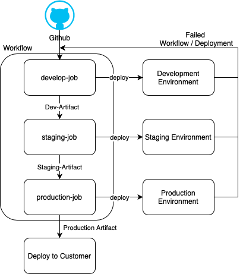

# GitHub Workflows

A workflow is a configurable automated process made up of one or more jobs where each of these jobs can be an action in GitHub. Currently a YAML file format is supported for defining a workflow in GitHub.

Additional information on GitHub actions and GitHub Workflows in the links posted in the [references](#References) section below.

## Workflow Per Environment

The general approach is to have one pipeline, where the code is built, tested and deployed and the artifact is then promoted to the next environment, eventually to be deployed into production.

There are multiple ways in GitHub that an environment setup can be achieved. One way it can be done is to have one workflow for multiple environments, but the complexity increases as additional processes and jobs are added to a workflow, which does not mean it cannot be done for small pipelines. The plus point of having one workflow is that, when an artifact flows from one environment to another the state and environment values between the deployment environments can be passed easily.

One way to get around the complexity of a single workflow is to have separate workflows for different environments, making sure that only the artifacts created and validated are promoted from one environment to another, as well as, the workflow is small enough, to debug any issues seen in any of the workflows. In this case, the state and environment values need to be passed from one deployment environment to another. Multiple workflows also helps to keep the deployments to the environments independent thus reducing the time to deploy and find issues earlier than later in the process. Also, since the environments are independent of each other, any failures in deploying to one environment does not block deployments to other environments. One tradeoff in this method, is that with different workflows for each environment, the maintenance increases as the complexity of workflows increase over time.

## References

- [GitHub Actions](https://docs.github.com/en/actions)
- [GitHub Workflows](https://docs.github.com/en/actions/reference/workflow-syntax-for-github-actions)
