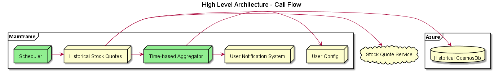
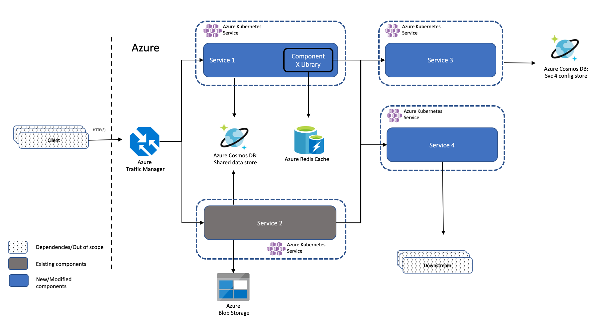

# High Level / Game Plan Design Recipe

## Why is this valuable?

Design at macroscopic level shows the interactions between systems and services that will be used to accomplish the project. It is intended to ensure there is high level understanding of the plan for what to build, which off-the-shelf components will be used, and which external components will need to interact with the deliverable.

## Things to keep in mind

* As with all other aspects of the project, design reviews must provide a friendly and safe environment so that any team member feels comfortable proposing a design for review and can use the opportunity to grow and learn from the constructive / non-judgemental feedback from peers and subject matter experts (see [Team Agreements](../../agile-development/team-agreements/readme.md)).
* Attempt to illustrate different personas involved in the use cases and how/which boxes are their entry points.
* Prefer pictures over paragraphs. The diagrams aren't intended to generate code so they should be fairly high level.
  * Artifacts should indicate the direction of calls (are they outbound, inbound, or bidirectional?) and call out system boundaries where ports might need to be opened or additional infrastructure work may be needed to allow calls to be made.
  * Sequence diagrams are helpful to show the flow of calls among components + systems.
  * Generic box diagrams depicting data flow or call origination/destination are useful. However, the title should clearly define what the arrows show indicate. In most cases, a diagram will show either data flow or call directions but not both.
  * Visualize the contrasting aspects of the system/diagram for ease of communication. e.g. differing technologies employed, modified vs. untouched components, or internet vs. local cloud components. Colors, grouping boxes, and iconography can be used for differentiating.
  * Prefer ease-of-understanding for communicating ideas over strict UML correctness.
* Design reviews should be lightweight and should not feel like an additional process overhead.

## Examples

