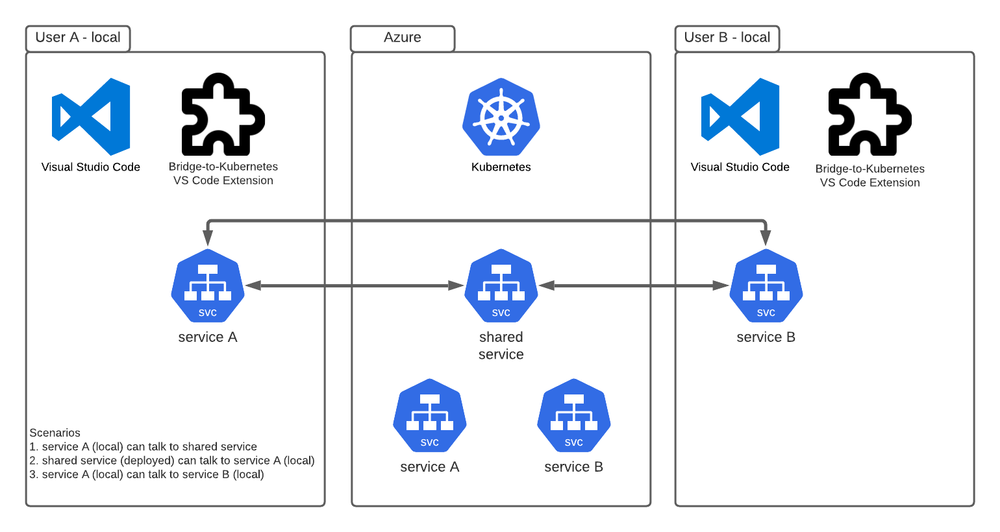

# Bridge to Kubernetes

[[_TOC_]]

## Overview

Bridge to Kubernetes allows developers to seamlessly work on services both in a shared cluster and locally in debug mode.

The main use case is to ease end-to-end (E2E) test/debug of a new or changed service against an ecosystem of services. E2E debugging requires integration with external services on the same cluster. Rather than running those services locally which may not even be possible, Bridge to Kubernetes enables you to debug your service in the cluster these external services are already running.

Bridge to Kubernetes can run in:
- [Visual Studio Code](https://code.visualstudio.com/) with VS code extension [Bridge to Kubernetes](https://marketplace.visualstudio.com/items?itemName=mindaro.mindaro)
- [Visual Studio](https://docs.microsoft.com/en-us/visualstudio/containers/bridge-to-kubernetes?view=vs-2019)

## Use Cases

When developing a service locally, the Bridge to Kubernetes extension can be configured so that traffic is redirected between the cluster and the user' local environments. Upon setup, the environment variables and dependencies are replicated which allows them to work against a set of already deployed services without having to configure them.

The diagram shows the following 3 scenarios that are supported:

- `Service A (local) can talk to a shared service`:  Service A running on User A's local and the shared service that is deployed to the cluster, communicate as if they are in the same cluster.
- `Shared service (deployed) can talk to service A (local)`: Traffic from the deployed shared service can be redirected to service A that is running on User A's local.
- `Service A (local) can talk to a service B (local) through the cluster`: Service A running on User A's local, can talk to service B running on User B's local through the cluster.

With Bridge to Kubernetes, you have the option of running in isolated mode. If you run in isolated mode, only your requests are routed to your local process. Other developers can continue using the cluster without being affected. If you don't run in isolated mode, all traffic is redirected to your local process.

## Usage

The technology can be used for a wide variety of cases with minimal setup and training. For more details on using Bridge to Kubernetes in VSCode please see [recipe here](bridge-to-kubernetes/bridge-to-kubernetes-setup.md).

## Limitations

Some of the limitations with this tool are listed below. Bridge to Kubernetes cannot be used if:

- A services need to have replicas. Your service needs to be backed by a single pod.
- There are more than 1 containers in the pod (e.g. sidecars, Istio)
- You are using WSL and dev containers

A complete and up to date list of the known limitations can be found [here](https://docs.microsoft.com/en-us/visualstudio/containers/overview-bridge-to-kubernetes?view=vs-2019#limitations).

## References

- [Bridge to Kubernetes Github repo](https://github.com/Microsoft/mindaro)
- [Use Bridge to Kubernetes with VS code](https://code.visualstudio.com/docs/containers/bridge-to-kubernetes)
- [Use Bridge to Kubernetes with Visual Studio](https://docs.microsoft.com/en-us/visualstudio/containers/bridge-to-kubernetes?view=vs-2019)
- [How Bridge to Kubernetes works](https://docs.microsoft.com/en-us/visualstudio/containers/overview-bridge-to-kubernetes)
- [Limitations](https://docs.microsoft.com/en-us/visualstudio/containers/overview-bridge-to-kubernetes?view=vs-2019#limitations)