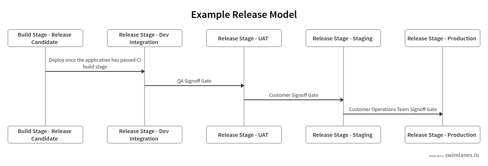
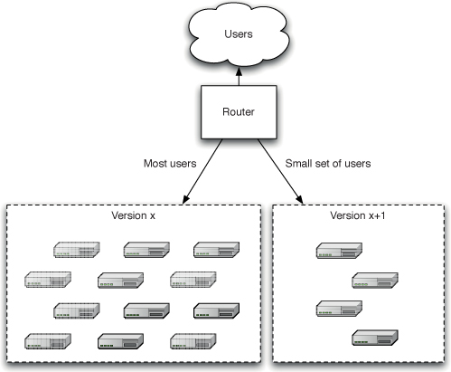

# Continuous Delivery

The inspiration behind continuous delivery is constantly delivering valuable software to users and developers more frequently. Applying the principles and practices laid out in this readme will help you reduce risk, eliminate manual operations and increase quality and confidence.

Deploying software involves the following principles:

1. Provision and manage the cloud environment runtime for your application (cloud resources, infrastructure, hardware, services, etc).
1. Install the target application version across your cloud environments.
1. Configure your application, including any required data.

A continuous delivery pipeline is an automated manifestation of your process to streamline these very principles in a consistent and repeatable manner.

## Goal

* Follow industry best practices for delivering software changes to customers and developers.
* Establish consistency for the guiding principles and best practices when assembling continuous delivery workflows.

## General Guidance

### Define a Release Strategy

It's important to establish a common understanding between the Dev Lead and application stakeholder(s) around the release strategy / design  during the planning phase of a project. This common understanding includes the deployment and maintenance of the application throughout its SDLC.

#### Release Strategy Principles

*Continuous Delivery* by Jez Humble, David Farley cover the key considerations to follow when creating a release strategy:

* Parties in charge of deployments to each environment, as well as in charge of the release.
* An asset and configuration management strategy.
* An enumeration of the environments available for acceptance, capacity, integration, and user acceptance testing, and the process by which builds will be moved through these environments.
* A description of the processes to be followed for deployment into testing and production environments, such as change requests to be opened and approvals that need to be granted.
* A discussion of the method by which the application’s deploy-time and runtime configuration will be managed, and how this relates to the automated deployment process.
* _Description of the integration with any external systems. At what stage and how are they tested as part of a release? How does the technical operator communicate with the provider in the event of a problem?
* _A disaster recovery plan so that the application’s state can be recovered following a disaster. Which steps will need to be in place to restart or redeploy the application should it fail.
* _Production sizing and capacity planning: How much data will your live application create? How many log files or databases will you need? How much bandwidth and disk space will you need? What latency are clients expecting?
* How the initial deployment to production works.
* How fixing defects and applying patches to the production environment will be handled.
* How upgrades to the production environment will be handled, including data migration. How will upgrades be carried out to the application without destroying its state.

### Application Release and Environment Promotion

Your release manifestation process should take the deployable build artifact created from your commit stage and deploy them across all cloud environments, starting with your test environment.

The test environment (*often called Integration*) acts as a gate to validate if your test suite completes successfully for all release candidates. This validation should always begin in a test environment while inspecting the deployed release integrated from the feature / release branch containing your code changes.

Code changes released into the *test* environment typically targets the main branch (when doing [trunk](https://devblogs.microsoft.com/devops/release-flow-how-we-do-branching-on-the-vsts-team/#why-trunk-based-development)) or release branch (when doing [gitflow](https://www.atlassian.com/git/tutorials/comparing-workflows/gitflow-workflow)).

#### The First Deployment

The very first deployment of any application should be showcased to the customer in a production-like environment (*UAT*) to solicit feedback early. The UAT environment is used to obtain product owner sign-off acceptance to ultimately promote the release to production.

#### Criteria for a production-like environment

* Runs the same operating system as production.
* Has the same software installed as production.
* Is sized and configured the same way as production.
* Mirrors production's networking topology.
* Simulated production-like load tests are executed following a release to surface any latency or throughput degradation.

#### Modeling your Release Pipeline

It's critical to model your test and release process to establish a common understanding between the application engineers and customer stakeholders. Specifically aligning expectations for how many cloud environments need to be pre-provisioned as well as defining sign-off gate roles and responsibilities.

##### Release Pipeline Modeling Considerations

* Depict all stages an application change would have to go through before it is released to production.
* Define all release gate controls.
* Determine customer-specific Cloud RBAC groups which have the authority to approve release candidates per environment.

#### Release Pipeline Stages

The stages within your release workflow are ultimately testing a version of your application to validate it can be released in accordance to your acceptance criteria. The release pipeline should account for the following conditions:

* Release Selection: The developer carrying out application testing should have the capability to select which release version to deploy to the testing environment.
* Deployment - Release the application deployable build artifact (*created from the CI stage*) to the target cloud environment.
* Configuration - Applications should be configured consistently across all your environments. This configuration is applied at the time of deployment.  Sensitive data like app secrets and certificates should be mastered in a fully managed PaaS key and secret store (eg [Key Vault](https://azure.microsoft.com/en-us/services/key-vault/), [KMS](https://aws.amazon.com/kms/)). Any secrets used by the application should be sourced internally within the application itself. Application Secrets should not be exposed within the runtime environment. We encourage 12 Factor principles, especially when it comes to [configuration management](https://12factor.net/config).
* Data Migration - Pre populate application state and/or data records which is needed for your runtime environment. This may also include test data required for your end-to-end integration test suite.
* Deployment smoke test. Your smoke test should also verify that your application is pointing to the correct configuration (e.g. production pointing to a UAT Database).
* Perform any manual or automated acceptance test scenarios.
* Approve the release gate to promote the application version to the target cloud environment. This promotion should also include the environment's configuration state (e.g. new env settings, feature flags, etc).

#### Live Release Warm Up

A release should be running for a period of time before it's considered live and allowed to accept user traffic. These *warm up* activities may include application server(s) and database(s) pre-fill any dependent cache(s) as well as establish all service connections (eg *connection pool allocations, etc*).

#### Pre-production releases

Application release candidates should be deployed to a staging environment similar to production for carrying out final manual/automated tests (*including capacity testing*). Your production and staging / pre-prod cloud environments should be setup at the beginning of your project.

Application warm up should be a quantified measurement that's validated as part of your pre-prod smoke tests.

### Rolling-Back Releases

Your release strategy should account for rollback scenarios in the event of unexpected failures following a deployment.

Rolling back releases can get tricky, especially when database record/object changes occur in result of your deployment (*either inadvertently or intentionally*). If there are no data changes which need to be backed out, then you can simply trigger a new release candidate for the last known production version and promote that release along your CD pipeline.

For rollback scenarios involving data changes, there are several approaches to mitigating this which fall outside the scope of this guide. Some involve database record versioning, time machining database records / objects, etc. All data files and databases should be backed up prior to each release so they could be restored. The mitigation strategy for this scenario will vary across our projects. The expectation is that this mitigation strategy should be covered as part of your release strategy.

Another approach to consider when designing your release strategy is [deployment rings](https://learn.microsoft.com/en-us/azure/devops/migrate/phase-rollout-with-rings?view=azure-devops). This approach simplifies rollback scenarios while limiting the impact of your release to end-users by gradually deploying and validating your changes in production.

### Zero Downtime Releases

A hot deployment follows a process of switching users from one release to another with no impact to the user experience. As an example, Azure managed app services allows developers to validate app changes in a staging deployment slot before swapping it with the production slot. App Service slot swapping can also be fully automated once the source slot is fully warmed up (and [auto swap](https://learn.microsoft.com/en-us/azure/app-service/deploy-staging-slots#configure-auto-swap) is enabled). Slot swapping also simplifies release rollbacks once a technical operator restores the slots to their pre-swap states.

Kubernetes natively supports [rolling updates](https://kubernetes.io/docs/tutorials/kubernetes-basics/update/update-intro/).

### Blue-Green Deployments

Blue / Green is a deployment technique which reduces downtime by running two identical instances of a production environment called *Blue* and *Green*.

Only one of these environments accepts live production traffic at a given time.

In the above example, live production traffic is routed to the Green environment. During application releases, the new version is deployed to the blue environment which occurs independently from the Green environment. Live traffic is unaffected from Blue environment releases. You can point your end-to-end test suite against the Blue environment as one of your test checkouts.

Migrating users to the new application version is as simple as changing the router configuration to direct all traffic to the Blue environment.

This technique simplifies rollback scenarios as we can simply switch the router back to Green.

Database providers like Cosmos and Azure SQL natively support data replication to help enable fully synchronized Blue Green database environments.

### Canary Releasing

Canary releasing enables development teams to gather faster feedback when deploying new features to production. These releases are rolled out to a subset of production nodes (*where no users are routed to*) to collect early insights around capacity testing and functional completeness and impact.

Once smoke and capacity tests are completed, you can route a small subset of users to the production nodes hosting the release candidate.

Canary releases simplify rollbacks as you can avoid routing users to bad application versions.

Try to limit the number of versions of your application running parallel in production, as it can complicate maintenance and monitoring controls.

### Low code solutions

Low code solutions have increased their participation in the applications and processes and because of that it is required that a proper conjunction of disciplines improve their development.

Here is a guide for [continuous deployment for Low Code Solutions](recipes/cd-on-low-code-solutions.md).

## References

* [Continuous Delivery](https://www.continuousdelivery.com/) by Jez Humble, David Farley.
* [Continuous integration vs. continuous delivery vs. continuous deployment](https://www.atlassian.com/continuous-delivery/principles/continuous-integration-vs-delivery-vs-deployment)
* [Deployment Rings](https://learn.microsoft.com/en-us/azure/devops/migrate/phase-rollout-with-rings?view=azure-devops)

### Tools

Check out the below tools to help with some CD best practices listed above:

* [Flux](https://fluxcd.io/docs/concepts/) for gitops
* [CI/CD workflow using GitOps](https://learn.microsoft.com/en-us/azure/azure-arc/kubernetes/conceptual-gitops-ci-cd#example-workflow)
* [Tekton](https://github.com/tektoncd) for Kubernetes native pipelines
  * Note Jenkins-X uses Tekton under the hood.
* [Argo Workflows](https://github.com/argoproj/argo-workflows)
* [Flagger](https://github.com/fluxcd/flagger) for powerful, Kubernetes native releases including blue/green, canary, and A/B testing.
* Not quite CD related, but checkout [jsonnet](https://jsonnet.org/), a templating language to reduce boilerplate and increase sharing between your yaml/json manifests.
