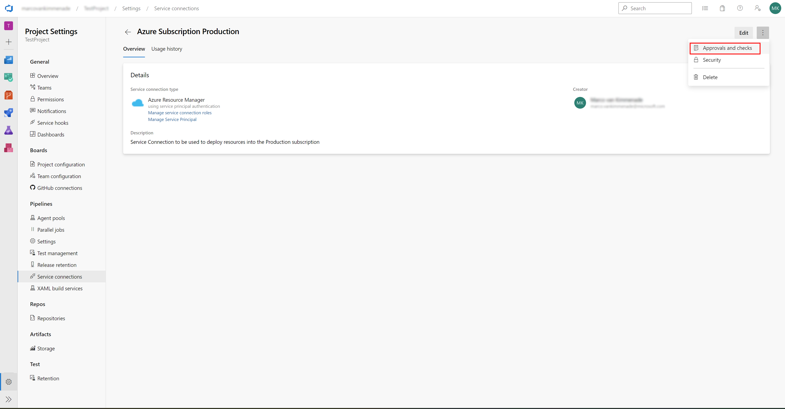
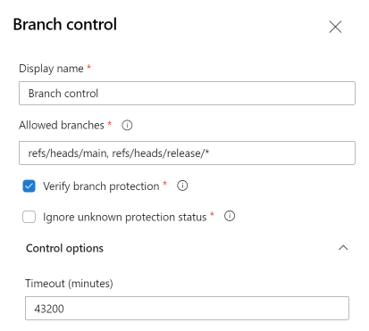

# Azure DevOps Service Connection Security

Service Connections are used in Azure DevOps Pipelines to connect to external services, like Azure, GitHub, Docker, Kubernetes, and many other services. Service Connections can be used to authenticate to these external services and to invoke diverse types of commands, like create and update resources in Azure, upload container images to Docker, or deploy applications to Kubernetes.

To be able to invoke these commands, Service Connections need to have the right permissions to do so, for most types of Service Connections the permissions can be scoped to a subset of resources to limit the access they have. To improve the principle of least privilege, it's often very common to have separate Service Connections for different environments like Dev/Test/QA/Prod.

## Secure Service Connection

Securing Service Connections can be achieved by using several methods.

- [User permissions](https://learn.microsoft.com/en-us/azure/devops/pipelines/library/service-endpoints#user-permissions) can be configured to ensure only the correct users can create, view, use, and manage the Service Connection.
- [Pipeline-level permissions](https://learn.microsoft.com/en-us/azure/devops/pipelines/library/service-endpoints#pipeline-permissions) can be configured to ensure only approved YAML pipelines are able to use the Service Connection.
- [Project permissions](https://learn.microsoft.com/en-us/azure/devops/pipelines/library/service-endpoints#project-permissions---cross-project-sharing-of-service-connections) can be configured to ensure only certain Azure DevOps projects are able to use the Service Connection.

After using the above methods, what is secured is **who** can use the Service Connections.
What still *isn't* secured however, is **what** can be done with the Service Connections.

Because Service Connections have all the necessary permissions in the external services, it is crucial to secure Service Connections so they cannot be misused by accident or by malicious users.
An example of this is a Azure DevOps Pipeline that uses a Service Connection to an Azure Resource Group (or entire subscription) to list all resources and then delete those resources.  Without the correct security in place, it could be possible to execute this Pipeline, without any validation or reviews being done.

```yaml
pool:
  vmImage: ubuntu-latest

steps:
- task: AzureCLI@2
  inputs:
    azureSubscription: 'Production Service Connection'
    scriptType: 'pscore'
    scriptLocation: 'inlineScript'
    inlineScript: |
      $resources = az resource list
      foreach ($resource in $resources) {
        az resource delete --ids $resource.id
      }
```

## Pipeline Security Caveat

YAML pipelines can be triggered without the need for a pull request, this introduces a security risk.

In good practice, [Pull Requests](../../code-reviews/pull-requests.md) and Code Reviews should be used to ensure the code that is being deployed, is being reviewed by a second person and potentially automatically being checked for vulnerabilities and other security issues.
However, YAML Pipelines can be executed without the need for a Pull Request and Code Reviews. This allows the (malicious) user to make changes using the Service Connection which would normally require a reviewer.

The configuration of *when* a pipeline should be triggered is specified in the YAML Pipeline itself and therefore a pipeline can be configured to execute on changes in a temporary branch. In this temporary branch, any changes made to the pipeline itself will be executed without being reviewed.

If the given pipeline has been granted [Pipeline-level permissions](https://learn.microsoft.com/en-us/azure/devops/pipelines/library/service-endpoints#pipeline-permissions) to use a specific Service Connection, any command can be executed using that Service Connection, without anyone reviewing the command.
Since Service Connections can have a lot of permissions in the external service, executing any pipeline without review could potentially have big consequences.

## Service Connection Checks

To prevent accidental mis-use of Service Connections there are several checks that can be configured. These checks are configured on the Service Connection itself and therefore can only be configured by the owner or administrator of that Service Connection. A user of a certain YAML Pipeline cannot modify these checks since the checks are not defined in the YAML file itself.
Configuration can be done in the Approvals and Checks menu on the Service Connection.


### Branch Control

By configuring Branch Control on a Service Connection, you can control that the Service Connection can only be used in a YAML Pipeline if the pipeline is running from a specific branch.

By configuring Branch Control to only allow the main branch (and potentially release branches) you can ensure a YAML Pipeline can only use the Service Connection after any changes to that pipeline have been merged into the main branch, and therefore has passed any Pull Requests checks and Code Reviews.
As an additional check, Branch Control can verify if Branch Protections (like required Pull Requests and Code Reviews) are actually configured on the allowed branches.

With Branch Control in place, in combination with Branch Protections, it is not possible anymore to run any commands against a Service Connection without having multiple persons review the commands. Therefore accidental, or malicious, mis-use of the permissions a Service Connection has is not possible anymore.

> **Note:** When setting a wildcard for the Allowed Branches, anyone could still create a branch matching that wildcard and would be able to use the Service Connection. Using [git permissions](https://learn.microsoft.com/en-us/azure/devops/repos/git/require-branch-folders#enforce-permissions) it can be configured so only administrators are allowed to create certain branches, like release branches.*


