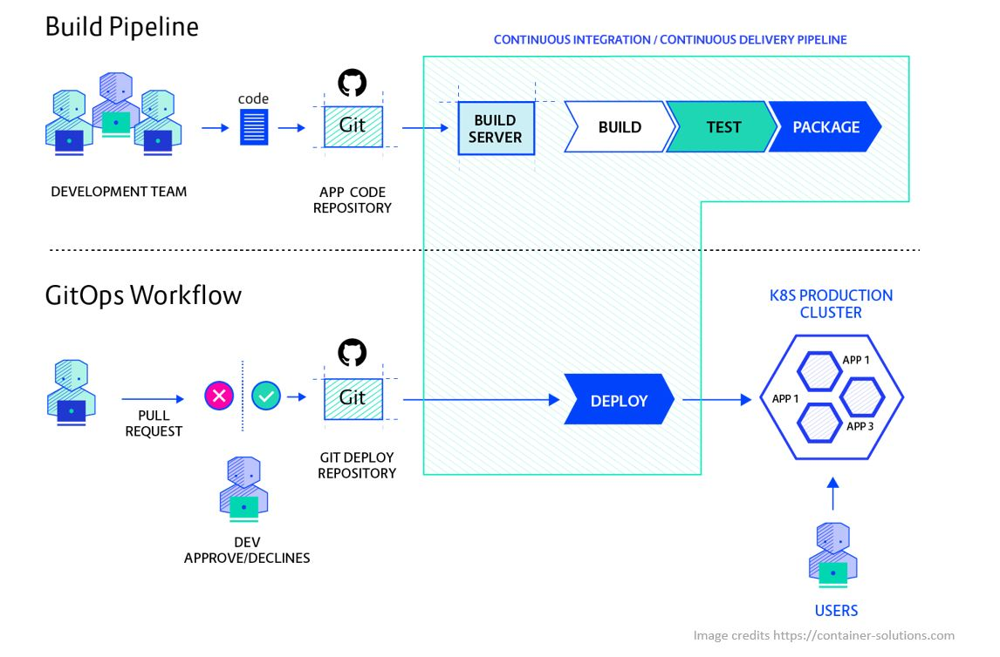

# Deploying with GitOps

## What is GitOps?

"GitOps is an operational framework that takes DevOps best practices used for application development such as version control, collaboration, compliance, and CI/CD, and applies them to infrastructure automation." See [GitLab: What is GitOps?](https://about.gitlab.com/topics/gitops/).

## Why should I use GitOps?

GitOps simply allows faster deployments by having git repositories in the center offering a clear audit trail via git commits and no direct environment access. Read more on [Why should I use GitOps?](https://www.gitops.tech/#why-should-i-use-gitops)

The below diagram compares traditional CI/CD vs GitOps workflow:

## Tools for GitOps

Some popular GitOps frameworks for Kubernetes backed by [CNCF](https://landscape.cncf.io/card-mode?category=continuous-integration-delivery) community:

- [Flux V2](https://fluxcd.io/docs/get-started/)
- [Argo CD](https://argo-cd.readthedocs.io/en/stable/)
- [Rancher Fleet](https://fleet.rancher.io/)

## Deploying Using GitOps

GitOps with Flux v2 can be enabled in Azure Kubernetes Service (AKS) managed clusters or Azure Arc-enabled Kubernetes connected clusters as a cluster extension. After the microsoft.flux cluster extension is installed, you can create one or more fluxConfigurations resources that sync your Git repository sources to the cluster and reconcile the cluster to the desired state. With GitOps, you can use your Git repository as the source of truth for cluster configuration and application deployment.

- [Tutorial: Deploy configurations using GitOps on an Azure Arc-enabled Kubernetes cluster](https://learn.microsoft.com/en-us/azure/azure-arc/kubernetes/tutorial-use-gitops-connected-cluster)
- [Tutorial: Implement CI/CD with GitOps](https://learn.microsoft.com/en-us/azure/azure-arc/kubernetes/tutorial-gitops-flux2-ci-cd)
- [Multi-cluster and multi-tenant environment with Flux v2](https://github.com/microsoft/multicluster-gitops)
