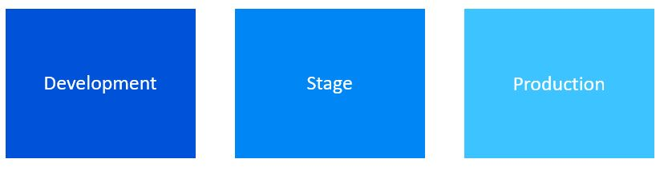

# Continuous Delivery on Low-Code and No-Code Solutions

Low-code and no-code platforms have taken a spot in a wide variety of Business Solutions involving process automation, AI models, Bots, Business Applications and Business Intelligence. The scenarios enabled by these platforms are constantly evolving and opening a spot for productive roles. This has been exactly the reason why bringing more professional tools to their development have become necessary such as controlled and automated delivery.

In the case of Power Platform products, the adoption of a CI/CD process may seem to increase the development complexity to a solution oriented to [Citizen Developers](https://www.gartner.com/en/information-technology/glossary/citizen-developer) it is more important to make the development process more scalable and capable of dealing with new features and bug corrections in a faster way.

## Environments in Power Platform Solutions

Environments are spaces where Power Platform Solutions exists. They store, manage and share everything related to the solution like data, apps, chat bots, flows and models. They also serve as containers to separate apps that might have different roles, security requirements or just target audiences. They can be used to create different stages of the solution development process, the expected model of working with environments in a CI/CD process will be as the following image suggests.

### Environments Considerations

Whenever an environment has been created, its resources can be only accessed by users within the same tenant which is an Azure Active Directory tenant in fact. When you create an app in an environment that app can only interact with data sources that are also deployed in that same environment, this includes connections, flows and Dataverse databases. This is an important consideration when dealing with a CD process.

## Deployment Strategy

With three environments already created to represent the stages of the deployment, the goal now is to automate the deployment from one environment to another. Each environment will require the creation of its own solution: business logic and data.

### Step 1

Development team will be working in a **Dev** environment. These environments according to the team could be one for the team or one for each developer.

Once changes have been made, the first step will be packaging the solution and export it into source control.

### Step 2

Second step is about the solution, you need to have a managed solution to deploy to other environments such as **Stage** or **Production** so now you should use a JIT environment where you would import your unmanaged solution and export them as managed. These solution files won't be checked into source control but will be stored as a build artifact in the pipeline making them available to be deployed in the release pipeline. This is where the second environment will be used. This second environment will be responsible of receiving the output managed solution coming from the artifact.

### Step 3

Third and final step will import the solution into the production environment, this means that this stage will take the artifact from last step and will export it. When working in this environment you can also version your product in order to make a better trace of the product.

## Tools

Most used tools to get this process completed are:

* [Power Platform Build Tools](https://marketplace.visualstudio.com/items?itemName=microsoft-IsvExpTools.PowerPlatform-BuildTools)
* There is also a non graphical tool that could be used to work with this CD process. The [Power CLI](https://aka.ms/PowerAppsCLI) tool.

## Resources

[Application lifecycle management with Microsoft Power Platform](https://learn.microsoft.com/en-us/power-platform/alm/)
