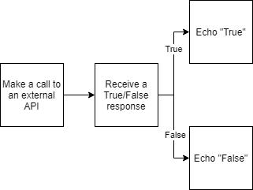
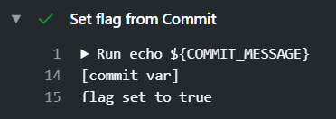
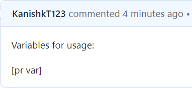
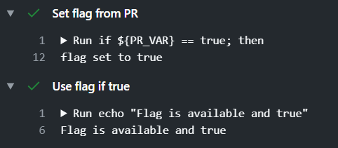
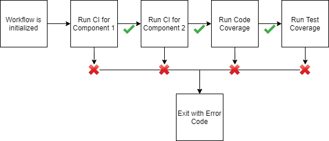

# Runtime Variables in GitHub Actions

## Objective

While GitHub Actions is a popular choice for writing and running CI/CD pipelines, especially for open source projects hosted on GitHub, it lacks specific quality of life features found in other CI/CD environments. One key feature that GitHub Actions has not yet implemented is the ability to **mock and inject runtime variables** into a workflow, in order to test the pipeline itself.

This provides a bridge between a pre-existing feature in Azure DevOps, and one that has not yet released inside GitHub Actions.

## Target Audience

This guide assumes that you are familiar with CI/CD, and understand the security implications of CI/CD pipelines. We also assume basic knowledge with GitHub Actions, including how to write and run a basic CI/CD pipeline, checkout repositories inside the action, use Marketplace Actions with version control, etc.

We assume that you, as a CI/CD engineer, want to inject environment variables or environment flags into your pipelines and workflows in order to test them, and are using GitHub Actions to accomplish this.

## Usage Scenario

Many integration or end-to-end workflows require specific environment variables that are only available at runtime. For example, a workflow might be doing the following:



In this situation, testing the pipeline is extremely difficult without having to make external calls to the resource. In many cases, making external calls to the resource can be expensive or time-consuming, significantly slowing down inner loop development.

Azure DevOps, as an example, offers a way to define pipeline variables on a manual trigger:


GitHub Actions does not do so yet.

## Solution

To workaround this, the easiest solution is to add runtime variables to either commit messages or the PR Body, and `grep` for the variable. GitHub Actions provides `grep` functionality natively using a `contains` function, which is what we shall be specifically using.

In scope:

- We will scope this to injecting a single environment variable into a pipeline, with a previously known key and value.

Out of Scope:

- While the solution is obviously extensible using shell scripting or any other means of creating variables, this solution serves well as the proof of the basic concept. No such scripting is provided in this guide.
- Additionally, teams may wish to formalize this process using a PR Template that has an additional section for the variables being provided. This is not however included in this guide.

> Security Warning:
> **This is NOT for injecting secrets** as the commit messages and PR body can be retrieved by a third party, are stored in `git log`, and can otherwise be read by a malicious individual using a variety of tools. Rather, this is for testing a workflow that needs simple variables to be injected into it, as above.
> **If you need to retrieve secrets or sensitive information**, use the [GitHub Action for Azure Key Vault](https://github.com/marketplace/actions/get-secrets-from-azure-key-vault) or some other similar secret storage and retrieval service.

## Commit Message Variables

How to inject a single variable into the environment for use, with a **specified key and value.** In this example, the key is `COMMIT_VAR` and the value is `[commit var]`.

Pre-requisites:

- Pipeline triggers are correctly set up to trigger on pushed commits (Here we will use `actions-test-branch` as the branch of choice)

Code Snippet:

```yaml
on:
  push:
    branches:
      - actions-test-branch

jobs:
  Echo-On-Commit:
    runs-on: ubuntu-latest
    steps:
      - name: "Checkout Repository"
        uses: actions/checkout@v2

      - name: "Set flag from Commit"
        env:
          COMMIT_VAR: ${{ contains(github.event.head_commit.message, '[commit var]') }}
        run: |
          if ${COMMIT_VAR} == true; then
            echo "flag=true" >> $GITHUB_ENV
            echo "flag set to true"
          else
            echo "flag=false" >> $GITHUB_ENV
            echo "flag set to false"
          fi

      - name: "Use flag if true"
        if: env.flag
        run: echo "Flag is available and true"
```

Code Explanation:

The first part of the code is setting up Push triggers on the working branch and checking out the repository, so we will not explore that in detail.

```yaml
- name: "Set flag from Commit"
  env:
    COMMIT_VAR: ${{ contains(github.event.head_commit.message, '[commit var]') }}
```

This is a named step inside the only Job in our GitHub Actions pipeline. Here, we set an environment variable for the step: Any code or action that the step calls will now have the environment variable available.

`contains` is a GitHub Actions function that is available by default in all workflows. It returns a Boolean `true` or `false` value. In this situation, it checks to see if the commit message on the last push, accessed using `github.event.head_commit.message`. The `${{...}}` is necessary to use the GitHub Context and make the functions and `github.event` variables available for the command.

```yaml
run: |
  if ${COMMIT_VAR} == true; then
    echo "flag=true" >> $GITHUB_ENV
    echo "flag set to true"
  else
    echo "flag=false" >> $GITHUB_ENV
    echo "flag set to false"
  fi
```

The `run` command here checks to see if the `COMMIT_VAR` variable has been set to `true`, and if it has, it sets a secondary flag to true, and echoes this behavior. It does the same if the variable is `false`.

The specific reason to do this is to allow for the `flag` variable to be used in further steps instead of having to reuse the `COMMIT_VAR` in every step. Further, it allows for the flag to be used in the `if` step of an action, as in the next part of the snippet.

```yaml
- name: "Use flag if true"
  if: env.flag
  run: echo "Flag is available and true"
```

In this part of the snippet, the next step in the same job is now using the `flag` that was set in the previous step. This allows the user to:

1. Reuse the flag instead of repeatedly accessing the GitHub Context
2. Set the flag using multiple conditions, instead of just one. For example, a different step might ALSO set the flag to `true` or `false` for different reasons.
3. Change the variable in exactly one place instead of having to change it in multiple places

Shorter Alternative:

The "Set flag from commit" step can be simplified to the following in order to make the code much shorter, although not necessarily more readable:

```yaml
- name: "Set flag from Commit"
  env:
    COMMIT_VAR: ${{ contains(github.event.head_commit.message, '[commit var]') }}
  run: |
    echo "flag=${COMMIT_VAR}" >> $GITHUB_ENV
    echo "set flag to ${COMMIT_VAR}"
```

Usage:

Including the Variable

1. Push to branch `master`:

   ```cmd
   > git add.
   > git commit -m "Running GitHub Actions Test [commit var]"
   > git push
   ```

2. This triggers the workflow (as will any push). As the `[commit var]` is in the commit message, the `${COMMIT_VAR}` variable in the workflow will be set to `true` and result in the following:

   

Not Including the Variable

1. Push to branch `master`:

   ```cmd
   > git add.
   > git commit -m "Running GitHub Actions Test"
   > git push
   ```

2. This triggers the workflow (as will any push). As the `[commit var]` is **not** in the commit message, the `${COMMIT_VAR}` variable in the workflow will be set to `false` and result in the following:

   

## PR Body Variables

When a PR is made, the PR Body can also be used to set up variables. These variables can be made available to all the workflow runs that stem from that PR, which can help ensure that commit messages are more informative and less cluttered, and reduces the work on the developer.

Once again, this for an expected key and value. In this case, the key is `PR_VAR` and the value is `[pr var]`.

Pre-requisites:

- Pipeline triggers are correctly set up to trigger on a pull request into a specific branch. (Here we will use master as the destination branch.)

Code Snippet:

```yaml
on:
  pull_request:
    branches:
      - master

jobs:
  Echo-On-PR:
    runs-on: ubuntu-latest
    steps:
      - name: "Checkout Repository"
        uses: actions/checkout@v2

      - name: "Set flag from PR"
        env:
          PR_VAR: ${{ contains(github.event.pull_request.body, '[pr var]') }}
        run: |
          if ${PR_VAR} == true; then
            echo "flag=true" >> $GITHUB_ENV
            echo "flag set to true"
          else
            echo "flag=false" >> $GITHUB_ENV
            echo "flag set to false"
          fi

      - name: "Use flag if true"
        if: env.flag
        run: echo "Flag is available and true"
```

Code Explanation:

The first part of the YAML file simply sets up the Pull Request Trigger. The majority of the following code is identical, so we will only explain the differences.

```yaml
- name: "Set flag from PR"
  env:
    PR_VAR: ${{ contains(github.event.pull_request.body, '[pr var]') }}
```

In this section, the `PR_VAR` environment variable is set to `true` or `false` depending on whether the `[pr var]` string is in the PR Body.

Shorter Alternative:

Similarly to the above, the YAML step can be simplified to the following in order to make the code much shorter, although not necessarily more readable:

```yaml
- name: "Set flag from PR"
  env:
    PR_VAR: ${{ contains(github.event.pull_request.body, '[pr var]') }}
  run: |
  echo "flag=${PR_VAR}" >> $GITHUB_ENV
  echo "set flag to ${PR_VAR}"
```

Usage:

1. Create a Pull Request into `master`, and include the expected variable in the body somewhere:

   

2. The GitHub Action will trigger automatically, and since `[pr var]` is present in the PR Body, it will set the `flag` to true, as shown below:

   

## Real World Scenarios

There are many real world scenarios where controlling environment variables can be extremely useful. Some are outlined below:

### Avoiding Expensive External Calls

Developer A is in the process of writing and testing an integration pipeline. The integration pipeline needs to make a call to an external service such as Azure Data Factory or Databricks, wait for a result, and then echo that result. The workflow could look like this:


The workflow inherently takes time and is expensive to run, as it involves maintaining a Databricks cluster while also waiting for the response. This external dependency can be removed by essentially mocking the response for the duration of writing and testing other parts of the workflow, and mocking the response in situations where the actual response either does not matter, or is not being directly tested.

### Skipping Long CI processes

Developer B is in the process of writing and testing a CI/CD pipeline. The pipeline has multiple CI stages, each of which runs sequentially. The workflow might look like this:



In this case, each CI stage needs to run before the next one starts, and errors in the middle of the process can cause the entire pipeline to fail. While this might be intended behavior for the pipeline in some situations (Perhaps you don't want to run a more involved, longer build or run a time-consuming test coverage suite if the CI process is failing), it means that steps need to be commented out or deleted when testing the pipeline itself.

Instead, an additional step could check for a `[skip ci $N]` tag in either the commit messages or PR Body, and skip a specific stage of the CI build. This ensures that the final pipeline does not have changes committed to it that render it broken, as sometimes happens when commenting out/deleting steps. It additionally allows for a mechanism to repeatedly test individual steps by skipping the others, making developing the pipeline significantly easier.
