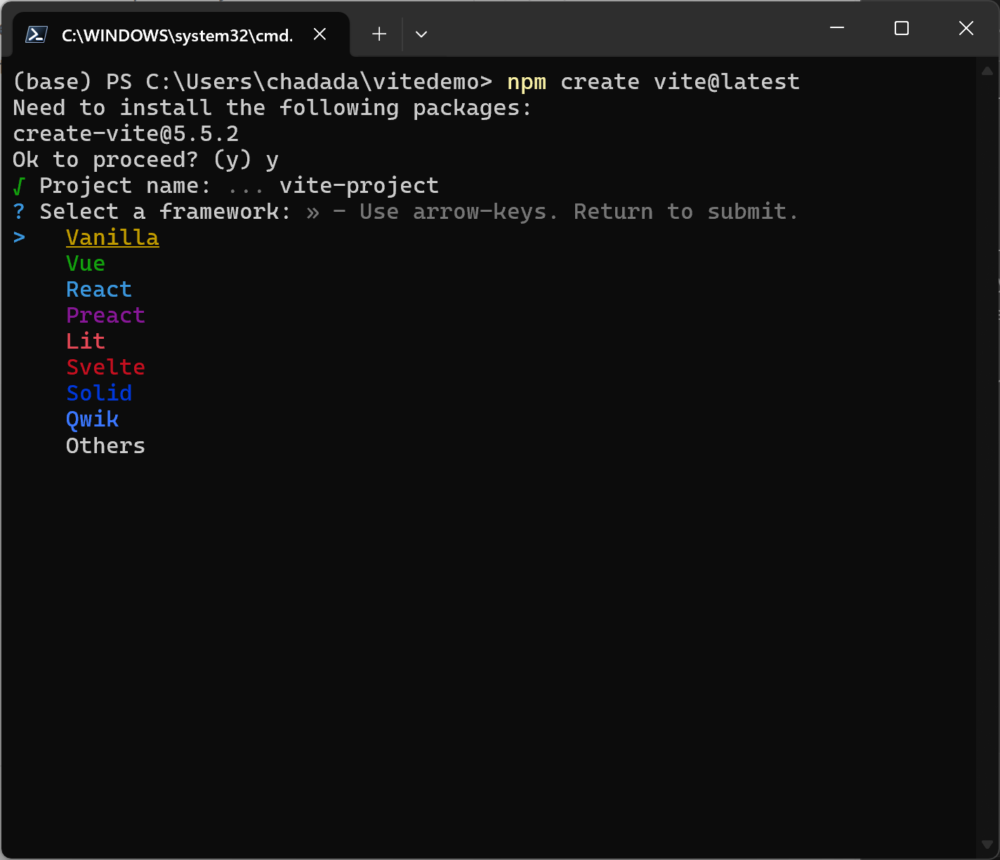

# Recommended Technologies

## Table of Contents

- [TypeScript](#typescript)
    - [Guidance on types and interfaces](#guidance-on-types-and-interfaces)
        - [Example](#example)
- [Bootstrapping Web Projects](#bootstrapping-web-projects)
    - [Vite](#vite)
        - [Documentation & Recommended Resources](#documentation--recommended-resources)
            - [Installing Vite](#installing-vite)
            - [Bootstrapping a project](#bootstrapping-a-project)
- [React](#react)
    - [Quick note on create-react-app](#quick-note-on-create-react-app)
    - [Documentation & Using older React coding patterns](#documentation--using-older-react-coding-patterns)
    - [Best Practices to Organize Your React Codebase](#best-practices-to-organize-your-react-codebase)
        - [Project Structure](#project-structure)
        - [Key Directories and Files](#key-directories-and-files)
        - [Directory Best Practices](#directory-best-practices)
    - [Using React with Entra ID](#using-react-with-entra-id)
        - [Resources](#resources)
- [Managing Secrets with Environmental Variables in React Projects Using Vite](#managing-secrets-with-environmental-variables-in-react-projects-using-vite)
    - [Setting Up Environmental Variables](#setting-up-environmental-variables)
    - [Best Security Practices](#best-security-practices)
    - [Resources](#resources-1)
- [Common Security Pitfalls in React Applications](#common-security-pitfalls-in-react-applications)
    - [Resources](#resources-2)
- [Incorporating Axios for REST API Calls in React with Bearer Tokens and MSAL](#incorporating-axios-for-rest-api-calls-in-react-with-bearer-tokens-and-msal)
    - [Setting Up Axios](#setting-up-axios)
    - [Making API Calls](#making-api-calls)
    - [Resources](#resources-3)


---

The purpose of this page is to review the commonly selected technology options when developing user interface applications. To reiterate from the general guidance section:

> Keep in mind that like all software, there is no "right way" to build a user interface application. Leverage and trust your team's or your customer's experience and expertise for the best development experience.

Additionally, while some of these technologies are presented as alternate options, many can be combined together. For example, you can use React in a basic HTML/CSS/JS workflow by inline-importing React along with Babel. See the [Add React to a Website](https://reactjs.org/docs/add-react-to-a-website.html) for more details. Similarly, any [Fast](https://www.fast.design/) web component can be [integrated into any existing React application](https://fast.design/docs/integrations#react). And of course, every JavaScript technology can also be used with TypeScript!

## TypeScript

> TypeScript is JavaScript with syntax for types. TypeScript is a strongly typed programming language that builds on JavaScript, giving you better tooling at any scale.
> [typescriptlang.org](https://www.typescriptlang.org/)

TypeScript is __highly recommended__ for all new web application projects. The stability it provides for teams is unmatched, and can make it easier for folks with C# backgrounds to work with web technologies.

There are many ways to integrate TypeScript into a web application. The easiest way to get started is by reviewing the [TypeScript Tooling in 5 Minutes](https://www.typescriptlang.org/docs/handbook/typescript-tooling-in-5-minutes.html) guide from the official TypeScript docs. The other sections on this page contain information regarding integration with TypeScript.


## Guidance on types and interfaces

In TypeScript, both `type` and `interface` can be used to define the shape of an object. However, it is generally recommended to prefer `type` over `interface` for most use cases due to its simplicity and flexibility.  It also prevents inheritance when using a `type` which can badly scale overtime unless explicitly declared.

### Example

Using `type`:

```typescript
type User = {
    name: string;
    age: number;
};
```

Using `interface`:

```typescript
interface User {
    name: string;
    age: number;
}
```

While both achieve the same result, `type` can also be used for other TypeScript features like union types, which makes it more versatile.

For more details, refer to the [TypeScript Handbook](https://www.typescriptlang.org/docs/handbook/2/everyday-types.html).

## Bootstrapping Web Projects

There are many different ways to bootstrap web applications. Two great tool sets to use are [create-react-app](https://create-react-app.dev/) and [vite](https://vitejs.dev/guide).

### Vite

[Vite](https://vitejs.dev/) is a modern build tool that provides a fast and optimized development experience for engineers. It leverages native ES modules in the browser to deliver lightning-fast hot module replacement (HMR) and instant server start. [Vite](https://vitejs.dev/) also offers a highly optimized build process using [Rollup](https://rollupjs.org/introduction/), ensuring efficient and performant production builds. By simplifying the setup and configuration, [Vite](https://vitejs.dev/) allows developers to focus more on writing code and less on tooling, making it an excellent choice for modern web development. For more details, visit the [Vite project](https://vitejs.dev/) and [Vite GitHub repository](https://github.com/vitejs/vite).

#### Documentation & Recommended Resources

- [Vite Documentation](https://vitejs.dev/guide/)
- [Vite GitHub Repository](https://github.com/vitejs/vite)
- [Vite Rollup Plugin](https://vitejs.dev/guide/api-plugin.html)
- [Vite HMR](https://vitejs.dev/guide/features.html#hot-module-replacement)
- [Vite Configuration](https://vitejs.dev/config/)
- [Vite Plugins](https://vitejs.dev/plugins/)
- [Vite Troubleshooting](https://vitejs.dev/guide/troubleshooting.html)

From [Scaffolding your First Vite Project](https://vitejs.dev/guide/#scaffolding-your-first-vite-project)

##### Installing Vite

```sh
# Install Vite
npm install -D vite
```
##### Bootstrapping a project
```sh
npm create vite@latest
```
This will start a CLI interface that will create multiple types of projects that Vite supports: React, Angular, Svelte, Solid, Vue, or even Vanilla HTML and JavaScript.




## React

React is a framework developed and maintained by Meta (Formerly Facebook). React is used throughout Microsoft's product stack and has a vast open source community.

### Quick note on create-react-app

> __create-react-app is deprecated as of January 2023 and should be avoided for new projects.__ It is recommended to use more modern tools like [Vite](#vite) for better performance and flexibility. For more details, refer to the [official React blog](https://react.dev/blog) and [Vite documentation](https://vitejs.dev/guide/why.html).


From [Adding TypeScript](https://create-react-app.dev/docs/adding-typescript/)

```sh
npx create-react-app my-app --template typescript
```

### Documentation & Using older React coding patterns

One can expect to find a multitude of guides, answers, and posts on how to work with React; don't take everything at face value. The best place to review React concepts is the React documentation. From there, you can review articles from various sources such as [React Community Articles](https://reactjs.org/community/articles.html), [Kent C Dodd's Blog](https://kentcdodds.com/blog?q=react), [CSS Tricks Articles](https://css-tricks.com/?s=react), and [Awesome React](https://github.com/enaqx/awesome-react).

The React API has changed dramatically over time. Older resources may contain solutions or patterns that have since been changed and improved upon. Modern React development uses the [React Hooks](https://reactjs.org/docs/hooks-intro.html) pattern. Rarely will you have to implement something using [React Class](https://reactjs.org/docs/react-component.html) pattern. If you're reading an article/answer/docs that instruct you to use the class pattern you may be looking at an out-of-date resource.


## Best Practices to Organize Your React Codebase

Organizing your React codebase effectively can improve maintainability, scalability, and collaboration. Here are some best practices to follow:

#### Project Structure

A well-structured project can make it easier to navigate and manage your codebase. Here's a recommended project structure:

```
my-react-app/
├── public/
│   ├── index.html
│   └── assets/
│       ├── favicon.ico
│       └── logo.png
├── src/
│   ├── assets/
│   │   └── styles/
│   │       └── main.css
│   ├── components/
│   │   ├── Button/
│   │   │   ├── Button.tsx
│   │   │   └── Button.test.tsx
│   │   └── Header/
│   │       ├── Header.tsx
│   │       └── Header.test.tsx
│   ├── hooks/
│   │   └── useAuth.ts
│   ├── pages/
│   │   ├── Home/
│   │   │   ├── Home.tsx
│   │   │   └── Home.test.tsx
│   │   └── About/
│   │       ├── About.tsx
│   │       └── About.test.tsx
│   ├── services/
│   │   └── apiClient.ts
│   ├── types/
│   │   └── index.ts
│   ├── utils/
│   │   └── helpers.ts
│   ├── App.tsx
│   ├── index.tsx
│   └── vite-env.d.ts
├── .env
├── .gitignore
├── package.json
├── tsconfig.json
└── vite.config.ts
```

#### Key Directories and Files

- **public/**: Contains static assets like HTML and images.
- **src/**: Contains the source code of your application.
    - **assets/**: Contains global assets like styles and images.
    - **components/**: Contains reusable UI components, each in its own folder.
    - **hooks/**: Contains custom React hooks.
    - **pages/**: Contains page components, each in its own folder.
    - **services/**: Contains service modules for API calls and other business logic.
    - **types/**: Contains TypeScript type definitions.
    - **utils/**: Contains utility functions.
    - **App.tsx**: The root component of your application.
    - **index.tsx**: The entry point of your application.
    - **vite-env.d.ts**: TypeScript definitions for Vite-specific features.

#### Directory Best Practices

1. **Component-Based Structure**: Organize your code into small, reusable components.
2. **Type Safety**: Use TypeScript to define types and interfaces for your components and data structures.
3. **Custom Hooks**: Encapsulate reusable logic in custom hooks.
4. **Service Layer**: Abstract API calls and business logic into service modules.
5. **Consistent Naming**: Follow a consistent naming convention for files and directories.
6. **Environment Variables**: Use environment variables to manage configuration settings.
7. **Testing**: Write unit tests for your components, hooks, and services.


### Using React with Entra ID

Integrating [React](https://reactjs.org/) applications with __Entra ID__ (formerly Azure Active Directory) allows you to secure your web applications with enterprise-grade authentication and authorization. This can be achieved using the [Microsoft Authentication Library (MSAL)](https://learn.microsoft.com/azure/active-directory/develop/msal-overview).

To get started with Entra ID in your React application, follow these steps:

1. **Install MSAL**:
    ```sh
    npm install @azure/msal-browser @azure/msal-react
    ```

2. **Configure MSAL**:
    Create a configuration file to set up your MSAL instance with your Entra ID credentials.

        ```typescript
        import { PublicClientApplication, Configuration } from "@azure/msal-browser";

        const msalConfig: Configuration = {
            auth: {
                clientId: "your-client-id",
                authority: "//login.microsoftonline.com/your-tenant-id",
                redirectUri: "//localhost:3000",
            },
        };

        export const msalInstance = new PublicClientApplication(msalConfig);
        ```


3. **Wrap Your Application**:
    Use the `MsalProvider` to wrap your React application.

        ```typescript
        import React from "react";
        import ReactDOM from "react-dom";
        import { MsalProvider } from "@azure/msal-react";
        import { msalInstance } from "./authConfig";
        import App from "./App";

        ReactDOM.render(
            <MsalProvider instance={msalInstance}>
                <App />
            </MsalProvider>,
            document.getElementById("root")
        );
        ```

## Managing Secrets with Environmental Variables in React Projects Using Vite

When developing React applications, it's crucial to manage sensitive information such as API keys, database credentials, and other secrets securely. Vite provides a straightforward way to handle environmental variables.

### Setting Up Environmental Variables

1. **Create an `.env` File**:
    In the root of your project, create a file named `.env`. This file will store your environmental variables.

    ```plaintext
    VITE_API_KEY=[sample API Key]
    VITE_API_URL=[sample URL]
    ```

2. **Access Environmental Variables in Your Code**:
    Vite prefixes all environmental variables with `VITE_` to ensure they are exposed to your client-side code. You can access these variables using `import.meta.env`.

    ```typescript
    const apiKey: string = import.meta.env.VITE_API_KEY as string;
    const apiUrl: string = import.meta.env.VITE_API_URL as string;

    fetch(`${apiUrl}/endpoint`, {
        headers: {
            'Authorization': `Bearer ${apiKey}`
        }
    })
    .then(response => response.json())
    .then(data => console.log(data))
    .catch(error => console.error('Error fetching data:', error));
    ```

### Best Security Practices

- **Do Not Commit `.env` Files**:
    Ensure your `.env` file is added to `.gitignore` to prevent it from being committed to your version control system.

    ```plaintext
    # .gitignore
    .env
    ```

- **Use Environment-Specific Files**:
    Vite supports multiple environment files for different stages of development. For example, you can create `.env.development` and `.env.production` files to manage variables for development and production environments, respectively.

    ```plaintext
    # .env.development
    VITE_API_URL=[example value]

    # .env.production
    VITE_API_URL=[example value]
    ```

- **Validate Environmental Variables**:
    Consider using a validation library like `zod` ( https://github.com/colinhacks/zod ) or `joi` ( joi.dev ) to validate your environmental variables at runtime, ensuring they meet the required format and constraints.


## Common Security Pitfalls in React Applications

When developing React applications, it's crucial to follow best practices to safeguard your application from common security vulnerabilities. Here are some key things to avoid:

### 1. **Do Not Store Sensitive Data in Local Storage**

Local storage is accessible from any JavaScript code running on the same domain, making it a potential target for attackers. Avoid storing sensitive information like tokens or user data in local storage.  

**Bearer Tokens in sessionStorage and localStorage should be strictly avoided!**

### 2. **Avoid Using `dangerouslySetInnerHTML`**

Using `dangerouslySetInnerHTML` can expose your application to XSS attacks. Always sanitize any HTML content before rendering it.

    ```typescript
    // Avoid this
    <div dangerouslySetInnerHTML={{ __html: userContent }} />

    // Prefer this
    import DOMPurify from 'dompurify';

    const sanitizedContent: string = DOMPurify.sanitize(userContent);
    <div dangerouslySetInnerHTML={{ __html: sanitizedContent }} />
    ```

### 3. **Do Not Expose API Keys in the Frontend**

Exposing API keys in your frontend code can lead to unauthorized access to your backend services. Use environment variables and server-side code to keep your API keys secure.

### 4. **Do Not Ignore Security Updates**

Regularly update your dependencies to include the latest security patches. Use tools like `npm audit` to identify and fix vulnerabilities in your project.

### 5. **Avoid Using Untrusted Third-Party Libraries**

Only use third-party libraries from trusted sources. Review the library's code and check for any known vulnerabilities before including it in your project.

## Incorporating Axios for REST API Calls in React with Bearer Tokens and MSAL

When building React applications that interact with REST APIs, [Axios](https://axios-http.com/docs/intro) is a popular library for making HTTP requests. Combined with MSAL, you can securely call APIs using Bearer tokens for authentication.

### Setting Up Axios

1. **Install Axios**:
    ```sh
    npm install axios
    ```

2. **Create an Axios Instance**:
    Configure an Axios instance to include the Bearer token in the Authorization header for all requests.

    ```typescript
    import axios, { AxiosRequestConfig } from 'axios';
    import { msalInstance } from './authConfig';
    import { AuthenticationResult } from '@azure/msal-browser';

    const apiClient = axios.create({
        baseURL: '[sample URL]',
    });

    apiClient.interceptors.request.use(async (config: AxiosRequestConfig) => {
        const accounts = msalInstance.getAllAccounts();
        if (accounts.length > 0) {
            const request = {
                scopes: ['api://your-api-scope/.default'],
                account: accounts[0],
            };
            const response: AuthenticationResult = await msalInstance.acquireTokenSilent(request);
            if (response && response.accessToken) {
                config.headers = {
                    ...config.headers,
                    Authorization: `Bearer ${response.accessToken}`,
                };
            }
        }
        return config;
    });

    export default apiClient;
    ```


### Making API Calls

Use the configured Axios instance to make API calls within your React components.

```typescript
import React, { useEffect, useState } from 'react';
import apiClient from './apiClient';

interface DataType {
    // Define the shape of your data here
    id: number;
    name: string;
    // Add other fields as necessary
}

const MyComponent: React.FC = () => {
    const [data, setData] = useState<DataType | null>(null);

    useEffect(() => {
        const fetchData = async () => {
            try {
                const response = await apiClient.get<DataType>('/endpoint');
                setData(response.data);
            } catch (error) {
                console.error('Error fetching data', error);
            }
        };

        fetchData();
    }, []);

    return (
        <div>
            {data ? <pre>{JSON.stringify(data, null, 2)}</pre> : 'Loading...'}
        </div>
    );
};

export default MyComponent;
```
