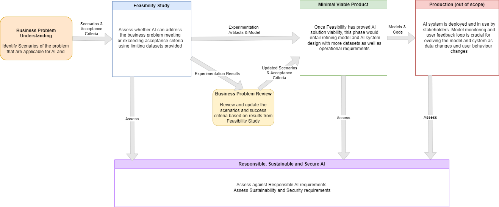

# Artificial Intelligence(AI) System Design

## Overview

A New Era of Artificial Intelligence(AI) started and increased the demand for AI Systems to solve complex problems in various industries.
AI Systems are designed to learn, predict and support decision making process all based on data that is available. A Design centered on best engineering practices and responsible AI processes is a fundamental approach for sustainability and reliability of these systems.

The design steps suggested in this document were based on our learnings from developing and deploying AI Systems to industry scenarios.
As so, this design should be considered as guidelines and best practices to follow more than a prescriptive design to be adopted as is in every AI Design system development.

## AI Design Macro Steps

1. Business Problem Understanding: Initial phase with the purpose of identifying the real problem to be solved with AI, understand the data available or to be created based on the business needs, define the target AI scenarios and the acceptance criteria, such as performance metrics.

    `Input`: Business Requirements, Problem Description and Data History

    `Output`: Documented AI scenario with acceptance criteria such as expected performance metrics
1. Assess Responsible AI: Responsible AI should be assessed to identify potential flaws on the design that need to be addressed earlier. It can occur in parallel with all phases of the AI System Design. Impact assessment document is completed with customer. Assessment on Sustainability and Security is also executed to evaluate the resources consumption and the potential security flaws to be mitigated.

    `Input`: TBD

    `Output`: Assessment report with risks, recommendations, action items and blockers
1. Feasibility Study: Mini-engagement (3-6 weeks). It defines and checks the datasets you need. Document the findings and check if it is feasible to continue with the project. A mini-devcrew with TPM can spike on hypothesis, identify work, figure out some complexity on compute. It Depends on the scope of the engagement. Depends on data and scenarios that we want to predict. If not successful, recommendations are provided to the customer. One of more PoC can be executed. Validate if hypothesis meet acceptance criteria.
In this phase, you can define User interaction patterns: AI accuracy, explain how AI works, user control of AI's performance
You also experiment and evaluate a prototyped model to explore each hypothesis and validate them against the criteria defined.

    `Input`: Documented AI scenario with acceptance criteria such as expected performance metrics

    `Output`: Experimentation artifacts (i.e. prototyped model, dataset, pipeline) and results

    > Access [Feasibility Study AI System Design Steps](./ai_feasibility_study.md) for additional details.
1. Business Problem Review: Feasibility Study results may change initial scenarios and assumptions and may require review. This phase has the purpose of revisiting the AI scenarios previously and acceptance criteria identified from the real problem to be solved with AI, new data may also be available to consider.

    `Input`: Experimentation Results

    `Output`: Revised and updated AI scenario with acceptance criteria
1. Minimum Viable Product: Once Feasibility Study has proved AI solution viability, this phase would entail refining model and AI system design with more datasets as well as operational requirements

    `Input`: Revised and updated AI scenario with acceptance criteria, experimentation artifacts and models

    `Output`:  Artifacts (i.e. MVP model, dataset, pipeline, test results and repository) and results.

    > Access [Minimum Viable Product AI System Design Steps](./ai_mvp.md) for additional details.
1. Production: Once the model has been validated and the acceptance criteria has been achieved, the model can be put in production. This phase is in the scope of AI engineers from the production teams.
