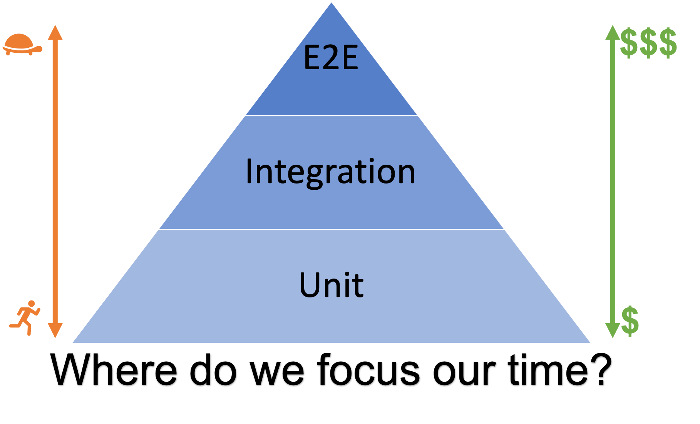
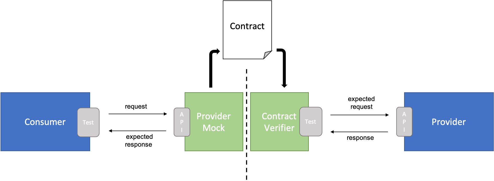
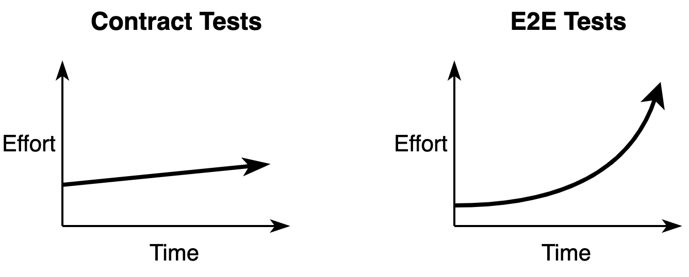

# Consumer-driven Contract Testing (CDC)

Consumer-driven Contract Testing (or CDC for short) is a software testing methodology used to test components of a system in isolation while ensuring that provider components are compatible with the expectations that consumer components have of them.

## Why Consumer-driven Contract Testing

CDC tries to overcome the [several painful drawbacks](https://pactflow.io/blog/proving-e2e-tests-are-a-scam) of automated E2E tests with components interacting together:

* E2E tests are complex
* E2E tests are slow
* E2E tests break easily
* E2E tests are expensive and hard to maintain

Although testing best practices suggest to write just a few E2E tests compared to the cheaper, faster and more stable integration and unit tests as pictured in the testing pyramid below, experience shows [many teams end up writing too many E2E tests](https://testing.googleblog.com/2015/04/just-say-no-to-more-end-to-end-tests.html). A reason for this is that E2E tests give developers the highest confidence to release as they are testing the "real" system.

CDC addresses these issues by testing interactions between components in isolation using mocks that conform to a shared understanding documented in a "contract". Contracts are agreed between consumer and provider, and are regularly verified against a real instance of the provider component. This leads to simpler, fast and stable tests that also give confidence to release.

E2E tests are still required to verify the system as a whole when deployed in the real environment, but most functional interactions between components can be covered with CDC tests.

## Consumer-driven Contract Testing Design Blocks

In a [consumer-driven approach](https://martinfowler.com/articles/consumerDrivenContracts.html) the consumer drives changes to contracts. This may sound counterintuitive but it helps providers create APIs that fit the real requirements of the consumers rather than trying to guess these in advance. Next we describe the CDC building blocks ordered by their occurrence in the development cycle.

### Consumer Tests with Provider Mock

Consumers start by creating integration tests against a provider mock and running them as part of its CI pipeline. Expected responses are defined in the provider mock for requests fired from the tests. Through this, the consumer is essentially defining the contract they expect the provider to fulfill.

### Contract

Contracts are generated from the expectations defined in the provider mock as a result of a successful test run. CDC frameworks like [Pact](https://docs.pact.io/) provide a [specification for contracts](https://github.com/pact-foundation/pact-specification) in json format consisting of the list of request/responses generated from the consumer tests plus some additional metadata.

Contracts are not a replacement for a discussion between the consumer and provider team. This is the moment where this discussion should take place (if not already done before). The consumer tests and generated contract are refined with the feedback and cooperation of the provider team. Lastly the finalized contract is versioned and stored in a central place accessible by both consumer and provider.

### Provider Contract Verification

On the provider side tests are also executed as part of a separate pipeline which verifies contracts against real responses of the provider. Contract verification fails if real responses differ from the expected responses as specified in the contract. The cause of this can be:

1. Invalid expectations on the consumer side leading to incompatibility with the current provider implementation 
2. Broken provider implementation due to some missing functionality or a regression 

Either way, thanks to CDC it is easy to pinpoint integration issues down to the consumer/provider of the affected interaction. This is a big advantage in front of the debugging pain this could have been with an E2E test approach. 

## CDC Testing Frameworks and Tools

[Pact](https://docs.pact.io/) is an implementation of CDC testing that allows mocking of responses in the consumer codebase, and verification of the interactions in the provider codebase, while defining a [specification for contracts](https://github.com/pact-foundation/pact-specification). It was originally written in Ruby but has available wrappers for multiple languages. Pact is the de-facto utility to use when working with CDC.

TBD

## Conclusion

CDC has several benefits that make it an approach worth considering when dealing with systems composed of multiple components interacting together.

Maintenance efforts can be reduced by testing consumer-provider interactions in isolation without the need of a complex integrated environment, specially as the interactions between components grow in number and become more complex.

Additionally, a close collaboration between consumer and provider teams is strongly encouraged through the CDC development process, which can bring many other benefits. Contracts offer a formal way to document the shared understanding how components should interact with each other, and serve as a base for the communication between teams. In a way, the contract repository serves as a live documentation of all consumer-provider interactions of a system.

CDC has some drawbacks as well. An extra layer of testing is added requiring a proper investment in education for team members to properly understand and use CDC correctly. 

Additionally [considering the CDC test scope](https://docs.pact.io/getting_started/testing-scope) should be done carefully to prevent blurring CDC with other higher level functional testing layers. Contract tests are not the place to verify internal business logic and correctness of the consumer.

## References

* Testing pyramid from [Kent C. Dodd’s blog](https://blog.kentcdodds.com/write-tests-not-too-many-mostly-integration-5e8c7fff591c)
* [Pact](https://docs.pact.io/), a code-first consumer-driven contract testing tool with support for several different programming languages.