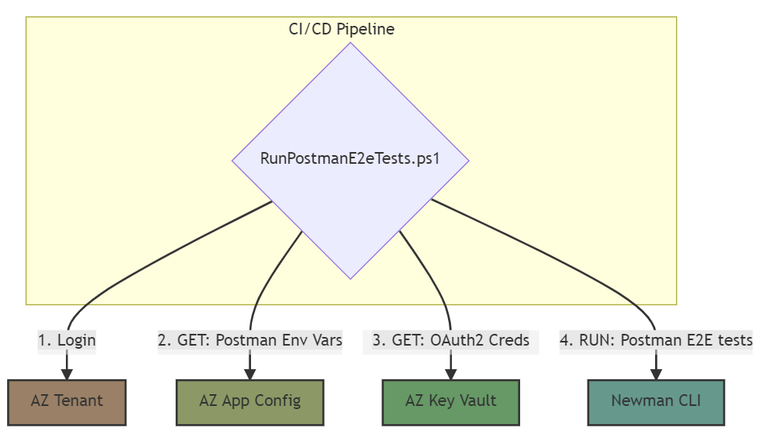

# Postman Testing

This purpose of this document is to provide guidance on how to use Newman in your CI/CD pipeline to run End-to-end (E2E) tests defined in Postman Collections while following security best practices.

First, we'll introduce Postman and Newman and then outline several Postman testing use cases that answer why you may want to go beyond local testing with Postman Collections.

In the final use case, we are looking to use a shell script that references the Postman Collection file path and Environment file path as inputs to Newman. Below is a flow diagram representing the outcome of the final use case:



## Postman and Newman

[Postman](https://www.postman.com/) is a free API platform for testing APIs. Key features highlighted in this guidance include:

- Postman Collections
- Postman Environment Files
- Postman Scripts

[Newman](https://github.com/postmanlabs/newman) is a command-line Collection Runner for Postman. It enables you to run and test a Postman Collection directly from the command line. Key features highlighted in this guidance include:

- Newman Run Command

### What is a Collection

A Postman Collection is a group of executable saved requests. A collection can be exported as a json file.

### What is an Environment File

A Postman Environment file holds environment variables that can be referenced by a valid Postman Collection.

### What is a Postman Script

A Postman Script is Javascript hosted within a Postman Collection that can be written to execute against your Postman Collection and Environment File.

### What is the Newman Run Command

A Newman CLI command that allows you to specify a Postman Collection to be run.

### Installing Postman and Newman

For specific instruction on installing Postman, visit the [Downloads Postman](https://www.postman.com/downloads/) page.

For specific instruction on installing Newman, visit the [NPMJS Newman package](https://www.npmjs.com/package/newman) page.

## Implementing Automated End-to-end (E2E) Tests With Postman Collections

In order to provide guidance on implementing automated E2E tests with Postman, the section below begins with a use case that explains the trade-offs a dev or QA analyst might face when intending to use Postman for early testing. Each use case represents scenarios that facilitate the end goal of automated E2E tests.

### Use Case - Hands-on Functional Testing Of Endpoints

A developer or QA analyst would like to locally test input data against API services all sharing a common oauth2 token. As a result, they use Postman to craft an API test suite of Postman Collections that can be locally executed against individual endpoints across environments. After validating that their Postman Collection works, they share it with their team.

Steps may look like the following:

1. For each of your existing API services, use the Postman IDE's import feature to import its OpenAPI Spec (Swagger) as a Postman Collection.

    If a service is not already using Swagger, look for language specific guidance on how to use Swagger to generate an OpenAPI Spec for your service. Finally, if your service only has a few endpoints, read Postman docs for guidance on how to manually build a Postman Collection.

2. Provide extra clarity about a request in a Postman Collection by using Postman's Example feature to save its responses as examples. You can also simply add an example manually. Please read Postman docs for guidance on how to specify examples.
3. Combine each Postman Collection into a centralized Postman Collection.
4. Build Postman Environment files (local, Dev and/or QA) and parameterize all saved requests of the Postman Collection in a way that references the Postman Environment files.
5. Use the Postman Script feature to create a shared prefetch script that automatically refreshes expired auth tokens per saved request. This would require referencing secrets from a Postman Environment file.

    ```javascript
    // Please treat this as pseudocode, and adjust as necessary.

    /* The request to an oauth2 authorization endpoint that will issue a token 
    based on provided credentials.*/
    const oauth2Request = POST {...};
    var getToken = true;
    if (pm.environment.get('ACCESS_TOKEN_EXPIRY') <= (new Date()).getTime()) {
        console.log('Token is expired')
    } else {
        getToken = false;
        console.log('Token and expiry date are all good');
    }
    if (getToken === true) {
        pm.sendRequest(oauth2Request, function (_, res) {
                console.log('Save the token')
                var responseJson = res.json();
                pm.environment.set('token', responseJson.access_token)
                console.log('Save the expiry date')
                var expiryDate = new Date();
                expiryDate.setSeconds(expiryDate.getSeconds() + responseJson.expires_in);
                pm.environment.set('ACCESS_TOKEN_EXPIRY', expiryDate.getTime());
        });
    }
    ```

6. Use Postman IDE to exercise endpoints.
7. Export collection and environment files then remove any secrets before committing to your repo.

Starting with this approach has the following upsides:

- You've set yourself up for the beginning stages of an E2E postman collection by aggregating the collections into a single file and using environment files to make it easier to switch environments.
- Token is refreshed automatically on every call in the collection. This saves you time normally lost from manually having to request a token that expired.
- Grants QA/Dev granular control of submitting combinations of input data per endpoint.
- Grants developers a common experience via Postman IDE features.

Ending with this approach has the following downsides:

- Promotes unsafe sharing of secrets. Credentials needed to request JWT token in the prefetch script are being manually shared.
- Secrets may happen to get exposed in the git commit history for various reasons (ex. Sharing the exported Postman Environment files).
- Collections can only be used locally to hit APIs (local or deployed). Not CI based.
- Each developer has to keep both their Postman Collection and Postman environment file(s) updated in order to keep up with latest changes to deployed services.

### Use Case - Hands-on Functional Testing Of Endpoints with Azure Key Vault and Azure App Config

A developer or QA analyst may have an existing API test suite of Postman Collections, however, they now want to discourage unsafe sharing of secrets. As a result, they build a script that connects to both Key Vault and Azure App Config in order to automatically generate Postman Environment files instead of checking them into a shared repository.

Steps may look like the following:

1. Create an Azure Key Vault and store authentication secrets per environment:
    - `"Key:value"` (ex. `"dev-auth-password:12345"`)
    - `"Key:value"` (ex. `"qa-auth-password:12345"`)
2. Create a shared Azure App Configuration instance and save all your Postman environment variables. This instance will be dedicated to holding all your Postman environment variables:
    > NOTE: Use the Label feature to delineate between environments.
    - `"Key:value" -> "apiRoute:url"` (ex. `"servicename:https://servicename.net" & Label = "QA"`)
    - `"Key:value" -> "Header:value"`(ex. `"token: " & Label = "QA"`)
    - `"Key:value" -> "KeyVaultKey:KeyVaultSecret"` (ex. `"authpassword:qa-auth-password" & Label = "QA"`)
3. Install Powershell or Bash. Powershell works for both Azure Powershell and Azure CLI.
4. Download Azure CLI, login to the appropriate subscription and ensure you have access to the appropriate resources. Some helpful commands are below:

    ```powershell
    # login to the appropriate subscription
    az login
    # validate login
    az account show
    # validate access to Key Vault
    az keyvault secret list --vault-name "$KeyvaultName"
    # validate access to App Configuration
    az appconfig kv list --name "$AppConfigName"
    ```

5. Build a script that automatically generates your environment files.
    > **Note:** App Configuration references Key Vault, however, your script is responsible for authenticating properly to both App Configuration and Key Vault. The two services don't communicate directly.

    ```powershell (CreatePostmanEnvironmentFiles.ps1)
    # Please treat this as pseudocode, and adjust as necessary.
    ############################################################

    env = $arg1
    # 1. list app config vars for an environment
    envVars = az appconfig kv list --name PostmanAppConfig --label $env | ConvertFrom-Json
    # 2. step through envVars array to get Key Vault uris
    keyvaultURI = ""
    $envVars | % {if($_.key -eq 'password'){keyvaultURI = $_.value}} 
    # 3. parse uris for Key Vault name and secret names
    # 4. get secret from Key Vault
    kvsecret = az keyvault secret show --name $secretName --vault-name $keyvaultName --query "value"
    # 5. set password value to returned Key Vault secret
    $envVars | % {if($_.key -eq 'password'){$_.value=$kvsecret}}  
    # 6. create environment file
    envFile = @{ "_postman_variable_scope" = "environment", "name" = $env, values = @() }
    foreach($var in $envVars){
            $envFile.values += @{ key = $var.key; value = $var.value; }
    }
    $envFile | ConvertTo-Json -depth 50 | Out-File -encoding ASCII -FilePath .\$env.postman_environment.json
    ```

6. Use Postman IDE to import the Postman Environment files to be referenced by your collection.

This approach has the following upsides:

- Inherits all the upsides of the previous case.
- Discourages unsafe sharing of secrets. Secrets are now pulled from Key Vault via Azure CLI. Key Vault Uri also no longer needs to be shared for access to auth tokens.
- Single source of truth for Postman Environment files. There's no longer a need to share them via repo.
- Developer only has to manage a single Postman Collection.

Ending with this approach has the following downsides:

- Secrets may happen to get exposed in the git commit history if .gitIgnore is not updated to ignore Postman Environment files.
- Collections can only be used locally to hit APIs (local or deployed). Not CI based.

### Use Case - E2E Testing with Continuous Integration and Newman

A developer or QA analyst may have an existing API test suite of local Postman Collections that follow security best practices for development, however, they now want E2E tests to run as part of automated CI pipeline. With the advent of Newman, you can now more readily use Postman to craft an API test suite executable in your CI.

Steps may look like the following:

1. Update your Postman Collection to use the Postman Test feature in order to craft test assertions that will cover all saved requests E2E. Read Postman docs for guidance on how to use the Postman Test feature.
2. Locally use Newman to validate tests are working as intended

    ```powershell
    newman run tests\e2e_Postman_collection.json -e qa.postman_environment.json
    ```

3. Build a script that automatically executes Postman Test assertions via Newman and Azure CLI.
    > NOTE: An Azure Service Principal must be setup to continue using azure cli in this CI pipeline example.

    ```powershell (RunPostmanE2eTests.ps1)
    # Please treat this as pseudocode, and adjust as necessary.
    ############################################################

    # 1. login to Azure using a Service Principal
    az login --service-principal -u $APP_ID -p $AZURE_SECRET --tenant $AZURE_TENANT
    # 2. list app config vars for an environment
    envVars = az appconfig kv list --name PostmanAppConfig --label $env | ConvertFrom-Json
    # 3. step through envVars array to get Key Vault uris
    keyvaultURI = ""
    @envVars | % {if($_.key -eq 'password'){keyvaultURI = $_.value}}
    # 4. parse uris for Key Vault name and secret names
    # 5. get secret from Key Vault
    kvsecret = az keyvault secret show --name $secretName --vault-name $keyvaultName --query "value"
    # 6. set password value to returned Key Vault secret
    $envVars | % {if($_.key -eq 'password'){$_.value=$kvsecret}}
    # 7. create environment file
    envFile = @{ "_postman_variable_scope" = "environment", "name" = $env, values = @() }
    foreach($var in $envVars){
            $envFile.values += @{ key = $var.key; value = $var.value; }
    }
    $envFile | ConvertTo-Json -depth 50 | Out-File -encoding ASCII $env.postman_environment.json
    # 8. install Newman
    npm install --save-dev newman
    # 9. run automated E2E tests via Newman
    node_modules\.bin\newman run tests\e2e_Postman_collection.json -e $env.postman_environment.json
    ```

4. Create a yaml file and define a step that will run your test script. (ex. A yaml file targeting Azure Devops that runs a Powershell script.)

    ```yaml
    # Please treat this as pseudocode, and adjust as necessary.
    ############################################################
    displayName: 'Run Postman E2E tests'
    inputs:
        targetType: 'filePath'
        filePath: RunPostmanE2eTests.ps1
    env:
        APP_ID: $(environment.appId) # credentials for az cli
        AZURE_SECRET: $(environment.secret)
        AZURE_TENANT: $(environment.tenant)
    ```

This approach has the following upside:

- E2E tests can now be run automatically as part of a CI pipeline.

Ending with this approach has the following downside:

- Postman Environment files are no longer being output to a local environment for hands-on manual testing. However, this can be solved by managing 2 scripts.
