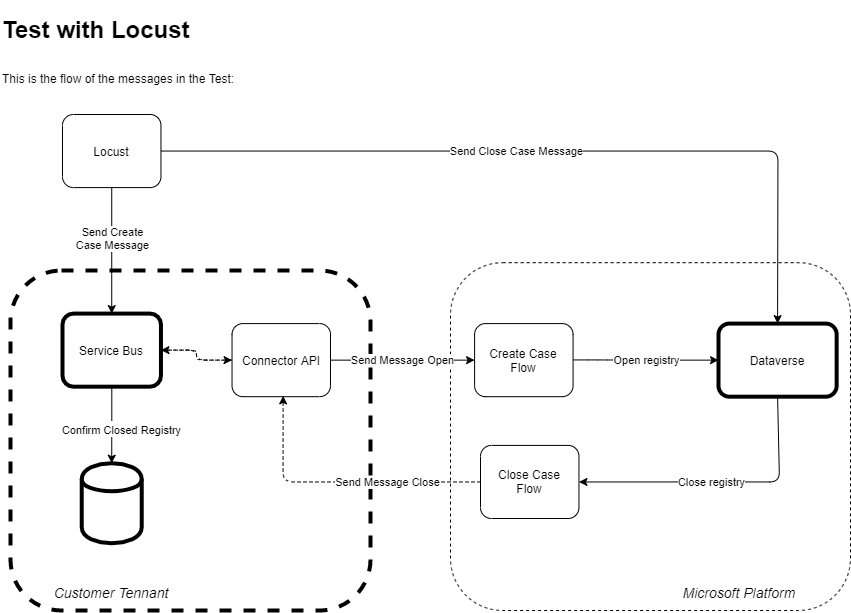

# Using Locust to Run Tests in Power Platform

This document determines the approach for writing automated tests for Power Platform,
Power Automate and Dataverse.

## Challenges

Testing Power Apps and Power Automate flows can be as simple as running the test
from the User Interface (UI). But for a more robust test, when there are different
parts of the application running in different services there is a need to add some
tooling that is able to handle that.

## Overcoming the challenges

The tool used in this case was Locust. Because it would allow different tests to
run with few changes to the tests cases created to test a part of the application.

Considering there is an entry point ready to receive REST calls that will trigger
the Power Automate flows it is possible to insert data into Dataverse and confirm
the data is there.

It is also possible to make changes to Dataverse that would trigger Power Automate
flows to update data in a data set (Azure Tables, Database, Files) outside Dataverse.

## Tests in Power Platform and Dataverse

The diagram below demonstrates **in high level** how tests can be executed for Power
Platform and Dataverse:



In the next sections it will be described the overall process as shown in the diagram:

- [Message to Open](#message-to-open)
- [Message to Close](#message-to-close)

A more detailed guide is available as a [recipe](https://github.com/squassina/dataverse-locust-tests/blob/main/locustfile_py.md),
where a sample [source code](https://github.com/squassina/dataverse-locust-tests/blob/main/locustfile_py.md/#source-code)
is published.

### Message to Open

Locust starts the process by sending a request to Service Bus (in this case Service
Bus was available in the solution, but any other tool to call the API can be used,
even a REST call to the API directly).

This message is routed to the Connector API developed in Power Platform. This connector
will traffic the message between the customer tenant and the Microsoft Platform.
So it will call the Power Automate flow, that has the logic to send the message to
be stored in Dataverse.

Notice that neither the connector API nor the flows are highlighted. This means that
these services do not provide messages to the testing tool. The flow is an asynchronous
and the HTTP reply will be, for example, `202` meaning it was accepted for processing.

Locust will then look for the message in Dataverse. If the message arrive there
it is assumed that the process was successful.

### Message to Close

In the current scenario, changing the status in Dataverse to **closed** using the Dataverse API
will trigger a flow that will send this message back to the customer tenant.

As this is an **update** operation in Dataverse, a `PATCH` request is sent to the API to
change the value in there. This change will trigger the Power Automate flow that will
process the message, doing any transformation needed, to the Connector API.

The connector API will send this message to the Service Bus, that will route it to
a Database or other data storage the customer considers in the solution.

The case could potentially be checked in the Service Bus, but its architecture does
not allow the test service to retrieve a specific message so three scenarios could
happen if the test is done like this:

1. The test service would retrieve the message in the first call and the case could
be considered successful;
1. The test service would retrieve several messages before finding the message for
for the registry closed in Dataverse. In this case the test will also be considered
successful;
1. The test service would retrieve several messages and the close registry could
not be found because the Service Bus already processed the message and sent it to
the database. In this case it would be a false-negative test, as the message was
successfully processed.

So the test will not check the Service Bus for the message and will go checking the
database directly if the registry was updated there.

## Prerequisites

- [Docker](https://docker.io)
- [Locust](https://locust.io)

## Using Locust

### Locust in Docker

In this case, Docker needs to be installed. In this document a `docker-compose`
version of this solution will be presented.

#### Configuring Docker and docker-compose

Locust is well documented regarding the
[installation and usage with Docker](https://docs.locust.io/en/stable/running-in-docker.html),
so that part will not be covered in this document.

### Alternative: run Locust locally

Locust is written in Python, so if one prefers to run it locally, without Docker,
a call in the command line would work:

```bash
locust -f locustfile.py --host http://127.0.0.1:8089 --headless -u 10 -t 120s Test
```

This will run `Test` for 120 seconds, using 10 users, without an User Interface. When the
time is up, the process will kill itself and returns to the command prompt.

Be aware that this process will not generate a report other the what is displayed in the
screen.

Other options can be found in the Locust
[documentation](https://docs.locust.io/en/0.13.2/running-locust-without-web-ui.html)

## Writing the locust test file for reuse

Considering that multiple tests are run in a project, it is smart to have as many tests
as possible. At the same time, it is also smart to have as few places to update
the tests as possible.

Therefore, Locust is a tool to write not only Load Tests, but also other types of tests,
like End-to-End and Integration tests.

Here is an example:

```python
def function1(self):
    // do something

def function2(self):
    // do something

def function3(self):
    // do something

class e2e_test(SequentialTaskSet):
    @task
    function1()
    function2()
    function3()

class integration_test1(SequentialTaskSet):
    @task
    function1()
    function2()

class integration_test2(SequentialTaskSet):
    @task
    function2()
    function3()

class load_test(SequentialTaskSet):
    @task
    function1()
    function3()

class ExecuteE2ETest(HttpUser):
    """Start test of the classes."""
    tasks = [e2e_test]
    wait_time = constant(30.0)

class ExecuteIntegrationTest1(HttpUser):
    """Start test of the classes."""
    tasks = [integration_test1]
    wait_time = constant(30.0)

class ExecuteIntegrationTest2(HttpUser):
    """Start test of the classes."""
    tasks = [integration_test2]
    wait_time = constant(30.0)

class ExecuteLoadTest(HttpUser):
    """Start test of the classes."""
    tasks = [load_test]
    wait_time = between(3.0, 9.0)
```

Then the tests can be called as `ExecuteE2ETest`, `ExecuteIntegrationTest`, or `ExecuteLoadTest`,
depending on what test is supposed to run.

The following will work for end-to-end tests in docker-compose:

```yml
version: '3'

services:
  master:
    image: locustio/locust
    ports:
     - "8089:8089"
    volumes:
      - ./:/mnt/locust
    environment:
        LOCUST_USERS: 1
        LOCUST_EXPECT_WORKERS: 1
        LOCUST_SPAWN_RATE: 1
        LOCUST_RUN_TIME: 120s
    command: -f /mnt/locust/locustfile.py --master -H http://master:8089 ExecuteE2ETest

  worker:
    image: locustio/locust
    volumes:
      - ./:/mnt/locust
    command: -f /mnt/locust/locustfile.py --worker --master-host master ExecuteE2ETest
```

This will run the integration test:

```yml
version: '3'

services:
  master:
    image: locustio/locust
    ports:
     - "8089:8089"
    volumes:
      - ./:/mnt/locust
    environment:
        LOCUST_USERS: 1
        LOCUST_EXPECT_WORKERS: 1
        LOCUST_SPAWN_RATE: 1
        LOCUST_RUN_TIME: 20s
    command: -f /mnt/locust/locustfile.py --master -H http://master:8089 ExecuteIntegrationTest1

  worker:
    image: locustio/locust
    volumes:
      - ./:/mnt/locust
    command: -f /mnt/locust/locustfile.py --worker --master-host master ExecuteIntegrationTest1
```

And the below will execute the load test:

```yml
version: '3'

services:
  master:
    image: locustio/locust
    ports:
     - "8089:8089"
    volumes:
      - ./:/mnt/locust
    environment:
        LOCUST_USERS: 10
        LOCUST_EXPECT_WORKERS: 1
        LOCUST_SPAWN_RATE: 10
        LOCUST_RUN_TIME: 300s
    command: -f /mnt/locust/locustfile.py --master -H http://master:8089 ExecuteLoadTest

  worker:
    image: locustio/locust
    volumes:
      - ./:/mnt/locust
    command: -f /mnt/locust/locustfile.py --worker --master-host master ExecuteLoadTest
```

All the 3 scripts are practically doing the same thing. There are two places to be updated:

1. The `environment` section handles the load of the test:
    - How many users and workers should be used?
    - What is the spawn rate? Should the test run will many users at the same time?
    - For how long should the test run?
1. The `command` line handles the command to run locust and which test should it
run. If `command` is specified, only one test will be executed, not the whole script.

By changing this values alone it is possible to reuse the test cases to cover different test
strategies.
