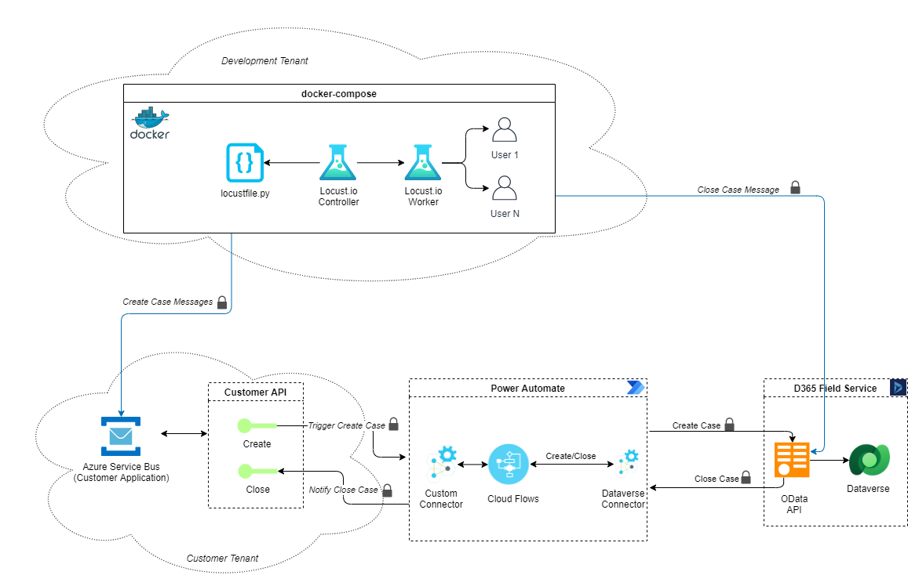

# Sample locustfile.py

This sample demonstrates how to connect to Dataverse using REST calls to execute
the tests as documented in the file [power-platform-dataverse-tests](../README.md).

The script will execute the load test using Locust.

There are two ways to run the tests:

1. Using Docker
1. Calling Locust in the command line

The following assumptions are made for this document:

1. The entry point is Azure Service Bus
1. The Dynamics 365 application is Field Services
1. The environment is dedicated for tests

>NOTE. The last assumption is important as Azure Service Bus does not allow filtering the
messages in a way that it is possible to retrieve a message directly, e.g.: via a key.

During the time this sample was written the following packages and versions were used:

| Package | Version |
| --- | --- |
| python | 3.9.4 |
| locust | 1.5.1 |
| docker | 20.10.7 |

## Setting up the environment

To improve maintainability, some variables should be set as environment variables.
It is possible to use a `.env` file to have them always handy. The file should have
the following values:

```bash
e2e_dyn_tenant_id= # TenantId for Dynamics where the Field Service is installed
e2e_dyn_client_id= # ClientId for Dynamics where the Field Service is installed
e2e_dyn_client_secret= # Client Secret for Dynamics where the Field Service is installed
e2e_dyn_resource= # Dynamics URL
e2e_sb_uri_close_case= # Azure Service Bus URI for Close Case
e2e_sb_subscription_close_case= # Azure Service Bus subscription for Close Case
e2e_sb_topic_close_case= # Azure Service Bus Topic for Close Case
e2e_sb_uri_create_case= # Azure Service Bus URI for Create Case
e2e_sb_subscription_create_case= # Azure Service Bus subscription for Create Case
e2e_sb_topic_create_case= # Azure Service Bus Topic for Create Case
e2e_sb_policy_create_case= # Azure Service Bus policy name for Create Case
e2e_sb_policy_key_create_case= # Azure Service Bus policy key for Create Case
e2e_sb_policy_close_case= # Azure Service Bus policy name for CLose Case
e2e_sb_policy_key_close_case= # Azure Service Bus policy key for Close Case
e2e_project_guid= # Project GUID when using multiple environments in Azure Service Bus, Power Platform and Dynamics
equipment_id= # Equipment Id to be used in the tests. This id should be created in Dynamics.
```

Other values used in the script, that are not required in the `.env` file as they
have defaults:

| Parameter | Default | Description |
| --- | --- | --- |
| time_to_wait_flows | 60 | Time to wait for the flows that create the case to run |
| dyn_api_version | 9.1 | Dynamics API version to use in the HTTP requests |
| max_time_to_wait | 30 | Max time to wait in the checks in Service Bus |
| wait_time_between_retries | 2.4 | Wait time between retries when checking case creation/close |
| service_bus_priority | High | Priority of the message in Azure Service Bus |
| service_case_priority | Medium | Priority of the Service Case to be created in Dynamics |

## To run in Docker

Make sure the `.env` file is in the same folder as the locustfile.py in use and run:

```bash
docker-compose down --remove-orphans; docker-compose up --build --abort-on-container-exit; docker-compose rm -f
```

[Here](dockerfile-docker-compose.md) is the example of the configuration files needed to run in Docker:

- Dockerfile
- docker-compose.yaml
- docker-compose.override.yaml

## To run in the command line

In this case it is needed to have the `.env` file _sourced_:

```bash
source .env
```

This will load the `.env` file to the memory.

It is required to have Python installed and Locust can be installed with `pip`

```bash
pip install locust==1.5.1
```

Validate the installation and check the version installed:

```bash
locust --version
```

This will install the required package to run locust. For more information head to [Locust Documentation](https://docs.locust.io/en/stable/installation.html)

To run:

```bash
locust -f locustfile.py --host <http://127.0.0.1:8089> --headless -u 10 -r 10 -t 900s
```

The parameters are:

- `--host`: Host to run the service
- `--headless`: Indicate that locust will run without UI
- `-u`: Number of users running at the same time
- `-r`: Re-spawn rate for the users
- `-t`: Time for Locust to run the process

## Test flow

The diagram below shows the flow of the messages for the tests of the *create* and *close* cases. It details the messaging
being transmitted from one component to the other in use in the solution.



The [source code](##Source%20code) in the coming section will do exactly the steps shown in the diagram.

## Source code explained

These are the required imports to the code to work:

```python
from gevent.lock import Semaphore
from locust import between, SequentialTaskSet, HttpUser, task, events, constant
from locust.exception import StopUser
# Uncomment this line if using Azure Service Bus SDK
# from azure.servicebus import ServiceBusClient, ServiceBusMessage
import json
import logging

# required to get the environment variables
import os

# required for API Token
import time
import hmac
import hashlib
import base64
from urllib.parse import quote_plus
import argparse

# required for Dynamics Token
import requests

# required to create the payload to Create Case
import datetime

# required to name the Service Case
import random
import string

from requests.models import CaseInsensitiveDict
```

Then the environment variables are read and some variables internal to the script are composed.

```python
dynTenantId = os.environ.get('e2e_dyn_tenant_id')
dynClientId = os.environ.get('e2e_dyn_client_id')
dynClientSecret = os.environ.get('e2e_dyn_client_secret')
dynResource = os.environ.get('e2e_dyn_resource')
sbUrlCloseCase = os.environ.get('e2e_sb_uri_close_case')
sbSubscriptionCloseCase = os.environ.get('e2e_sb_subscription_close_case')
sbTopicCloseCase = os.environ.get('e2e_sb_topic_close_case')
sbUrlCreateCase = os.environ.get('e2e_sb_uri_create_case')
sbTopicCreateCase = os.environ.get('e2e_sb_topic_create_case')
policyCreateCase = os.environ.get('e2e_sb_policy_create_case')
policyKeyCreateCase = os.environ.get('e2e_sb_policy_key_create_case')
policyCloseCase = os.environ.get('e2e_sb_policy_close_case')
policyKeyCloseCase = os.environ.get('e2e_sb_policy_key_close_case')
projectGUID = os.environ.get('e2e_project_guid')

APIServiceBusConnectionString = 'Endpoint=sb://{}/;SharedAccessKeyName={};SharedAccessKey={}'.format(
    sbUrlCreateCase, policyCloseCase, policyKeyCloseCase)

dynUrl = "https://login.microsoftonline.com/{}/oauth2/token".format(
    dynTenantId)

timeToWaitFlows = os.environ.get('time_to_wait_flows', 60)
dynApiVersion = os.environ.get('dyn_api_version', '9.1')
maxTimeToWait = os.environ.get('max_time_to_wait', 30)
waitTimeBetweenRetries = os.environ.get('wait_time_between_retries', 2.4)
serviceBusPriority = os.environ.get('service_bus_priority', 'High')
serviceCasePriority = os.environ.get('service_case_priority', 'Medium')
equipmentId = os.environ.get('equipment_id')

APIPriority = {'Low': '3', 'Medium': '2', 'High': '1'}

APIPriorityCode = APIPriority.get(serviceCasePriority, 2)


all_users_spawned = Semaphore()
all_users_spawned.acquire()
logger = logging.getLogger(__name__)
```

Now that the imports are done and the variables are set, the code starts.

The `GenerateAPIServiceBusToken` will generate a token so the tests can connect to Azure Service Bus.

```python
def GenerateAPIServiceBusToken(url, topic, policy, policyKey):
    uri = "{}/{}".format(url, topic)

    expiry = int(time.time() + 10000)

    signString = quote_plus(uri) + '\n' + str(expiry)

    signature = base64.b64encode(
                    hmac.HMAC(
                        policyKey.encode('utf-8'),
                        signString.encode('utf-8'),
                        hashlib.sha256
                    ).digest()
                )

    return('SharedAccessSignature sr=' +
           quote_plus(uri) + '&sig=' + quote_plus(signature) +
           '&se=' + str(expiry) + '&skn=' + policy)
```

The `GetDynamicsToken` will do a `GET` request to the Dynamics service to get the Dynamics token to be used in the script.

```python
def GetDynamicsToken():
    payload = {'grant_type': 'client_credentials',
               'client_id': dynClientId,
               'client_secret': dynClientSecret,
               'resource': dynResource}
    response = requests.request(
        "GET", dynUrl, data=payload)

    return(response.json().get("access_token"))
```

To create a case, it is needed to provide a payload. The payload can be defined as a `JSON` file and imported here.

The `JSON` would look like this:

```json
{
  "Case": [
      {
          "Operation": {
              "StaticValue": "Create"
          },
          "AnalystNotes": "",
          "DueDate": null,
          "Priority": "",
          "CaseCreateEid": "",
          "Eoi": [
              {
                  "EoiEventId": "",
                  "Description": "",
                  "RuleDescription": "",
                  "HwSite": "",
                  "Erpid": "",
                  "EquipmentId": "",
                  "EquipmentGroup": "",
                  "HwSourceSystem": "",
                  "Uri": "",
                  "Duration": "",
                  "RuleCost": "",
                  "RuleClassification": null,
                  "Location": "",
                  "EOITriggerDate": "",
                  "AutoFlag": ""
              }
          ],
          "CaseNumber": "",
          "SiteId": "",
          "ProjectGUID": "",
          "LastActionTime": ""
      }
  ]
}
```

And the call could be like this:

```python
def CreatePayloadForAzureServiceBus():
    """Create payload to be sent to Azure Service Bus that feeds a flow."""

    with open('payload.json','r') as file:
        jsonPayload = file.read()
    return('@base64Binar3http://schemas.microsoft.com/2003/10/Serialization/��'+ jsonPayload +'')
```

For testing purposes only the payload is composed directly in the code:

```python
def CreatePayloadForAzureServiceBus(triggerDate, APIServiceCaseNumber):
    """Create payload to be sent to Azure Service Bus that feeds API Create Case flow."""
    return('@base64Binar3http://schemas.microsoft.com/2003/10/Serialization/��{"samCaseXML":"{\"Case\": \
            [{\"Operation\":{\"StaticValue\":\"Create\"},\"AnalystNotes\":\"j\",\"DueDate\":null,\"Priority\":\"'
            + APIPriorityCode + '\",\"CaseCreateEid\":\"test_dev@test_dev.onmicrosoft.com\",\"Eoi\":[{\"EoiEventId\":\"'
            + equipmentId + '#Office\",\"Description\":\"TEST - Energy Point Issue\",\"RuleDescription\":\"Check Energy.\
            Logic:\\n1. Rule will check Energy.\\n\\nRecommendation Log:\\n1. Check readings\\n2. Check for broken \
            connection.\",\"HwSite\":\"Office\",\"Erpid\":\"Pulse_Test20\",\"EquipmentId\":\"' + equipmentId + '\", \
            \"EquipmentGroup\":\"Electrical\",\"HwSourceSystem\":\"API Analytics\",\"Uri\":\"https://test_energy.com\", \
            \"Duration\":\"1\",\"RuleCost\":\"0\",\"RuleClassification\":null,\"Location\":\"3rd_Floor\", \
            \"EOITriggerDate\":\"' + triggerDate + '\",\"AutoFlag\":\"0\"}],\"CaseNumber\":\"' + APIServiceCaseNumber +
           '\",\"SiteId\":\"00001\",\"ProjectGUID\":\"' + projectGUID + '\",\"LastActionTime\":\"' + triggerDate +
            '\"}]}"}')
```

The next function will create the listeners so all the users are spawned before the test starts. This is useful when there
are load cases that require that a number of users need to run simultaneously.

```python
@events.init.add_listener
def _(environment, **kw):
    @environment.events.spawning_complete.add_listener
    def on_spawning_complete(**kw):
        all_users_spawned.release()
```

Now the main class is created. This is a scenario where all the components of the solution are tested so it will create cases
and then close the same cases in the same process.

```python
class CreateCloseCaseTaskset(SequentialTaskSet):
```

`on_start` checks if all the users are online for the tests to start. It also gets the tokens for the Service Bus, both
for the open and close cases because there are different topics, and Dynamics.

```python
    def on_start(self):
        all_users_spawned.wait()
        global APIServiceBusTokenPolicyCreateCase
        APIServiceBusTokenPolicyCreateCase = GenerateAPIServiceBusToken(
            sbUrlCreateCase, sbTopicCreateCase, policyCreateCase, policyKeyCreateCase)
        global APIServiceBusTokenPolicyCloseCase
        APIServiceBusTokenPolicyCloseCase = GenerateAPIServiceBusToken(
            sbUrlCreateCase, sbTopicCreateCase, policyCloseCase, policyKeyCloseCase)
        global dynToken
        dynToken = GetDynamicsToken()

```

Now the process to create the case can start. For the case to be created an HTTP `POST` call is sent to the Service Bus along
with the payload created before.

As this is an asynchronous call it will return a `201` status code. If there is any issue with the Create Case token, a `401`
status code will return and be logged as error. Any other value is not expected and will also be logged as an error.

```python
    @ task
    def ServiceCaseCreateProcess(self):
        self.APIServiceCaseNumber = "LOCUST-TEST-{}".format(
            ''.join([random.choice(string.ascii_letters) for _ in range(8)]))

        triggerDate = datetime.datetime.now().strftime("%m/%d/%Y %H:%M:%S %p")

        self.APICreateCasePayload = CreatePayloadForAzureServiceBus(
            triggerDate=triggerDate, APIServiceCaseNumber=self.APIServiceCaseNumber)

        headersPostServiceBusCaseCreate = {'content-type': 'text/plain',
                                           'Authorization': APIServiceBusTokenPolicyCreateCase,
                                           'BrokerProperties': '{"Label":"API","State":"Active","TimeToLive":10}',
                                           'Priority': serviceBusPriority,
                                           'Customer': 'Load Testing'}

        dataServiceBusCreateCase = self.APICreateCasePayload.encode()

        logger.info("POST to create Service Case {} in Dynamics".format(
            self.APIServiceCaseNumber))

        with self.client.post("https://{}/{}/messages?timeout=60".format(sbUrlCreateCase, sbTopicCreateCase),
                                headers=headersPostServiceBusCaseCreate, data=dataServiceBusCreateCase,
                                name="Create Case in Service Bus", catch_response=True) as list_resp:
            if list_resp.status_code >= 200 and list_resp.status_code < 300:
                list_resp.success()
            elif list_resp.status_code == 401:
                logger.info(list_resp)
                list_resp.failure("Incorrect Token. Please check: {}".format(
                    list_resp.text))
            else:
                logger.info(list_resp)
                list_resp.failure("Unable to list: {}".format(list_resp.text))

```

The Service Bus request will trigger the Power Automate flows that will create the cases. Depending on the volume of cases
being created, the duration of the test can take some minutes until the cases are finally created in Dynamics 365. The
function below will run in a loop until the case is found in Dynamics or the maximum wait time is reached.

```python
    @ task
    def ConfirmCaseCreateAndStartResolveCaseProcess(self):
        headersGetDynamicsConfirmCaseCreated = {'Authorization': dynToken}

        respConfirmCaseCreated = ""
        finishConfirmCaseCreated = int(time.time()+maxTimeToWait)

        logger.info("GET to confirm Service Case {} was created in Dynamics".format(
            self.APIServiceCaseNumber))

        while len(respConfirmCaseCreated) == 0 or time.time() < finishConfirmCaseCreated:
            with self.client.request("GET", "{}/api/data/v{}/incidents?$filter=(ticketnumber%20eq%20%27{}%27)".format(dynResource,
                                        dynApiVersion, self.APIServiceCaseNumber), name="Confirm Case is Created in Dynamics",
                                        headers=headersGetDynamicsConfirmCaseCreated, catch_response=True) as list_resp:
                if list_resp.status_code >= 200 and
                   list_resp.status_code < 300 and
                   len(list_resp.json().get("value")) > 0:
                    for item in list_resp.json().get("value"):
                        respConfirmCaseCreated = item.get("ticketnumber")
            time.sleep(waitTimeBetweenRetries)

        if respConfirmCaseCreated == self.APIServiceCaseNumber:
            list_resp.success()
            logger.info("Service Case {} was created in Dynamics. The response returned was {}".format(
                self.APIServiceCaseNumber, respConfirmCaseCreated))

        else:
            list_resp.failure(
                "Unable to find Service Case in Dynamics: {}".format(list_resp.text))
```

Until now the case was being created in Dynamics, now the same cases created will be closed. The process below will do that.

In Dynamics, there are some options to close a case. The sample is considering **RESOLVE** cases.

To resolve a case, it is needed to have the `incidentId`. This value is stored in a entity named `incidents`. So the first
step is to do an HTTP `GET`  request in that entity. The code below does that:

```python
        headersGetDynamicsIncidentIdAndResolveCase = {
            'Authorization': dynToken}

        logger.info("GET the Incident ID for Service Case {} so it can be RESOLVED in Dynamics".format(
            self.APIServiceCaseNumber))

        with self.client.request("GET", "{}/api/data/v{}/incidents?$filter=(ticketnumber%20eq%20%27{}%27)".format(dynResource,
                                    dynApiVersion, self.APIServiceCaseNumber), headers=headersGetDynamicsIncidentIdAndResolveCase,
                                    name="Get Incident Id for Case in Dynamics", catch_response=True) as list_resp:

            if list_resp.status_code >= 200 and list_resp.status_code < 300 and len(list_resp.json().get("value")) > 0:
                self.incidentId = list_resp.json().get("value")[
                    0].get("incidentid")
                list_resp.success()
                logger.info("Service Case {} Incident Id in Dynamics is {}".format(
                    self.APIServiceCaseNumber, self.incidentId))
            else:
                list_resp.failure(
                    "Unable to retrieve Incident ID from Dynamics: {}".format(list_resp.text))
```

With the `incidentId` the process now is to set the case as `RESOLVED`. This is done with an HTTP `POST` call to `CloseIncident`
providing the `dataResolveCase` payload that is created below using the `incidentId`. Again, the process is async and the
response will be `20X` meaning the API acknowledges the message.

```python
        headersGetDynamicsIncidentIdAndCloseCase = {
            'Content-Type': 'application/json',
            'Authorization': dynToken}

        if self.incidentId == "":
            list_resp.failure(
                "No incident Id found when retrieving a list of cases from Dynamics.")
        else:
            dataResolveCase =
                '{"IncidentResolution": {"subject": "Resolved by Locust Test","incidentid@odata.bind": "/incidents(' + \
                self.incidentId + \
                ')","timespent": 60,"description": "Resolved via Locust Test"},"Status": -1}'

            logger.info(
                "POST Incident Id {} to be marked as RESOLVED".format(self.incidentId))

            with self.client.post("{}/api/data/v{}/CloseIncident".format(dynResource, dynApiVersion),
                                    headers=headersGetDynamicsIncidentIdAndCloseCase, data=dataResolveCase,
                                    name="Resolving Case in Dynamics", catch_response=True) as list_resp:
                if list_resp.status_code >= 200 and list_resp.status_code < 300:
                    list_resp.success()
                else:
                    list_resp.failure(
                        "Unable to Resolve Case in Dynamics: {}".format(list_resp.text))
```

The next two sections are related to the check in Azure Service Bus. Because of the Service Bus architecture, it is not possible
to directly retrieve a record, so a loop needs to be implemented to retrieve the message and check if that message is related
to the service case in use in the process.

The first option is to use the standard **Locust** libraries to do an HTTP `POST` request to retrieve the messages and continue
calling until the service case is found or the maximum wait time is reached.

```python
        headersGetServiceBusCloseCase = {
            "Authorization": APIServiceBusTokenPolicyCloseCase, "Content-Length": "0"}

        respServiceCase = ""
        finishServiceCase = int(time.time()+maxTimeToWait)

        logger.info("POST Service Case {} to Service Bus to confirm the message to RESOLVE the case is there".format(
            self.APIServiceCaseNumber))

        while respServiceCase != self.APIServiceCaseNumber or time.time() < finishServiceCase:
            with self.client.request("POST", "https://{}/{}/subscriptions/{}/messages/head?timeout=120".format(sbUrlCloseCase,
                                       sbTopicCloseCase, sbSubscriptionCloseCase),
                                     name="Checking Case is marked as Resolved in Service Bus",
                                     headers=headersGetServiceBusCloseCase, catch_response=True) as list_resp:
                if list_resp.status_code >= 200 and list_resp.status_code < 300:
                    respServiceCase = list_resp.json().get("CaseId")
            time.sleep(waitTimeBetweenRetries)
        if list_resp.status_code >= 200 and list_resp.status_code < 300 and respServiceCase == self.APIServiceCaseNumber:
            list_resp.success()
            logger.info("Service Case {} was marked RESOLVED in Service Bus. The response returned was {}".format(
                self.APIServiceCaseNumber, respServiceCase))

        else:
            list_resp.failure(
                "Error retrieving Resolved Case in Service Bus: {}".format(list_resp.text))

```

The next section would work better with Azure Service Bus as it would retrieve a series of messages and compare
the service case number resolved with what is in the messages.

On the other hand it would not log anything to locust as it is using the Azure Service Bus Python library to achieve
these results.

As a workaround, a timer is started in the beginning of the process and stopped once the closure is complete. This
event is logged to Locust as an event:

```python
        headersGetServiceBusCloseCase = {
            "Authorization": APIServiceBusTokenPolicyCloseCase,
            "Content-Length": "0"}
        respServiceCase = ""
        finishServiceCase = int(time.time()+30)
        task_start_time = time.time()
        with ServiceBusClient.from_connection_string(APIServiceBusConnectionString) as client:
            with client.get_subscription_receiver(sbTopicCloseCase, sbSubscriptionCloseCase) as receiver:
                isServiceBusClosed = False
                for msg in receiver:
                    msgJson = json.loads(str(msg))
                    if(msgJson.get("CaseId") == self.APIServiceCaseNumber and msgJson.get("Status") == "Closed"):
                        isServiceBusClosed = True
                        break
                if isServiceBusClosed:
                    task_total_time = int(
                        (time.time() - task_start_time) * 1000)
                    events.request_success.fire(
                        request_type="Service Bus", name="Verify case resolved in dynamics", response_time=task_total_time,
                        response_length=0)
                else:
                    task_total_time = int(
                        (time.time() - task_start_time) * 1000)
                    events.request_failure.fire(request_type="Service Bus", name="Verify case resolved in dynamics",
                                                response_time=task_total_time, response_length=0, exception=e)
```

In this case the process will run until the run time is done. So the process will loop until the time set in **Locust** via
the `-t` parameter is reached.

```python
    def stop(self):
        """Stop process when time is done."""
        self.interrupt(reschedule=False)

    def on_stop(self):
        """Stop users when time is done."""
        raise StopUser()
```

This is the name of the command used by **Locust**. In the example we are not using this as a parameter, but it can be added
to the command line: `locust -f locustfile.py --host <http://127.0.0.1:8089> --headless -u 10 -r 10 -t 900s TestSmallScaleCreateAndCloseCase`

```python
class TestSmallScaleCreateAndCloseCase(HttpUser):
    """Start test of the classes."""

    tasks = [CreateCloseCaseTaskset]
    wait_time = constant(30.0)
```

## Source code

The consolidated source code used in this example is this:

```python

from gevent.lock import Semaphore
from locust import between, SequentialTaskSet, HttpUser, task, events, constant
from locust.exception import StopUser
# Uncomment this line if using Azure Service Bus SDK
# from azure.servicebus import ServiceBusClient, ServiceBusMessage
import json
import logging

# required to get the environment variables
import os

# required for API Token
import time
import hmac
import hashlib
import base64
from urllib.parse import quote_plus
import argparse

# required for Dynamics Token
import requests

# required to create the payload to Create Case
import datetime

# required to name the Service Case
import random
import string

from requests.models import CaseInsensitiveDict


dynTenantId = os.environ.get('e2e_dyn_tenant_id')
dynClientId = os.environ.get('e2e_dyn_client_id')
dynClientSecret = os.environ.get('e2e_dyn_client_secret')
dynResource = os.environ.get('e2e_dyn_resource')
sbUrlCloseCase = os.environ.get('e2e_sb_uri_close_case')
sbSubscriptionCloseCase = os.environ.get('e2e_sb_subscription_close_case')
sbTopicCloseCase = os.environ.get('e2e_sb_topic_close_case')
sbUrlCreateCase = os.environ.get('e2e_sb_uri_create_case')
sbTopicCreateCase = os.environ.get('e2e_sb_topic_create_case')
policyCreateCase = os.environ.get('e2e_sb_policy_create_case')
policyKeyCreateCase = os.environ.get('e2e_sb_policy_key_create_case')
policyCloseCase = os.environ.get('e2e_sb_policy_close_case')
policyKeyCloseCase = os.environ.get('e2e_sb_policy_key_close_case')
projectGUID = os.environ.get('e2e_project_guid')


APIServiceBusConnectionString = 'Endpoint=sb://{}/;SharedAccessKeyName={};SharedAccessKey={}'.format(
    sbUrlCreateCase, policyCloseCase, policyKeyCloseCase)

dynUrl = "https://login.microsoftonline.com/{}/oauth2/token".format(
    dynTenantId)


timeToWaitFlows = os.environ.get('time_to_wait_flows', 60)
dynApiVersion = os.environ.get('dyn_api_version', '9.1')
maxTimeToWait = os.environ.get('max_time_to_wait', 30)
waitTimeBetweenRetries = os.environ.get('wait_time_between_retries', 2.4)
serviceBusPriority = os.environ.get('service_bus_priority', 'High')
serviceCasePriority = os.environ.get('service_case_priority', 'Medium')
equipmentId = os.environ.get('equipment_id')

APIPriority = {'Low': '3', 'Medium': '2', 'High': '1'}

APIPriorityCode = APIPriority.get(serviceCasePriority, 2)


all_users_spawned = Semaphore()
all_users_spawned.acquire()
logger = logging.getLogger(__name__)


def GenerateAPIServiceBusToken(url, topic, policy, policyKey):
    """Generate a token from the policyKey and policyName for the topics as needed."""
    uri = "{}/{}".format(url, topic)

    expiry = int(time.time() + 10000)

    signString = quote_plus(uri) + '\n' + str(expiry)

    signature = base64.b64encode(
                    hmac.HMAC(
                        policyKey.encode('utf-8'),
                        signString.encode('utf-8'),
                        hashlib.sha256
                    ).digest()
                )

    return('SharedAccessSignature sr=' +
           quote_plus(uri) + '&sig=' + quote_plus(signature) +
           '&se=' + str(expiry) + '&skn=' + policy)


def GetDynamicsToken():
    """GET the token for Dynamics."""
    payload = {'grant_type': 'client_credentials',
               'client_id': dynClientId,
               'client_secret': dynClientSecret,
               'resource': dynResource}
    response = requests.request(
        "GET", dynUrl, data=payload)

    return(response.json().get("access_token"))


def CreatePayloadForAzureServiceBus(triggerDate, APIServiceCaseNumber):
    """Create payload to be sent to Azure Service Bus that feeds API Create Case flow."""
    return('@base64Binar3http://schemas.microsoft.com/2003/10/Serialization/��{"samCaseXML":"{\"Case\": \
            [{\"Operation\":{\"StaticValue\":\"Create\"},\"AnalystNotes\":\"j\",\"DueDate\":null,\"Priority\":\"'
            + APIPriorityCode + '\",\"CaseCreateEid\":\"test_dev@test_dev.onmicrosoft.com\",\"Eoi\":[{\"EoiEventId\":\"'
            + equipmentId + '#Office\",\"Description\":\"TEST - Energy Point Issue\",\"RuleDescription\":\"Check Energy.\
            Logic:\\n1. Rule will check Energy.\\n\\nRecommendation Log:\\n1. Check readings\\n2. Check for broken \
            connection.\",\"HwSite\":\"Office\",\"Erpid\":\"Pulse_Test20\",\"EquipmentId\":\"' + equipmentId + '\", \
            \"EquipmentGroup\":\"Electrical\",\"HwSourceSystem\":\"API Analytics\",\"Uri\":\"https://test_energy.com\", \
            \"Duration\":\"1\",\"RuleCost\":\"0\",\"RuleClassification\":null,\"Location\":\"3rd_Floor\", \
            \"EOITriggerDate\":\"' + triggerDate + '\",\"AutoFlag\":\"0\"}],\"CaseNumber\":\"' + APIServiceCaseNumber +
           '\",\"SiteId\":\"00001\",\"ProjectGUID\":\"' + projectGUID + '\",\"LastActionTime\":\"' + triggerDate +
            '\"}]}"}')

@events.init.add_listener
def _(environment, **kw):
    @environment.events.spawning_complete.add_listener
    def on_spawning_complete(**kw):
        all_users_spawned.release()


class CreateCloseCaseTaskset(SequentialTaskSet):
    """Create and Close tests for API/Dynamics."""

    def on_start(self):
        """Wait for all the users to be spawned and generate tokens needed."""
        all_users_spawned.wait()
        # Get Tokens - API and Dynamics
        global APIServiceBusTokenPolicyCreateCase
        APIServiceBusTokenPolicyCreateCase = GenerateAPIServiceBusToken(
            sbUrlCreateCase, sbTopicCreateCase, policyCreateCase, policyKeyCreateCase)
        global APIServiceBusTokenPolicyCloseCase
        APIServiceBusTokenPolicyCloseCase = GenerateAPIServiceBusToken(
            sbUrlCreateCase, sbTopicCreateCase, policyCloseCase, policyKeyCloseCase)
        global dynToken
        dynToken = GetDynamicsToken()

    @ task
    def ServiceCaseCreateProcess(self):
        """Generate the Service Case Number and the Payload used to create the Case."""
        self.APIServiceCaseNumber = "LOCUST-TEST-{}".format(
            ''.join([random.choice(string.ascii_letters) for _ in range(8)]))

        triggerDate = datetime.datetime.now().strftime("%m/%d/%Y %H:%M:%S %p")

        self.APICreateCasePayload = CreatePayloadForAzureServiceBus(
            triggerDate=triggerDate, APIServiceCaseNumber=self.APIServiceCaseNumber)

        '''
        Start the process to create the case
        task: to do the POST call to create the case in Service Bus
        '''
        headersPostServiceBusCaseCreate = {'content-type': 'text/plain',
                                           'Authorization': APIServiceBusTokenPolicyCreateCase,
                                           'BrokerProperties': '{"Label":"API","State":"Active","TimeToLive":10}',
                                           'Priority': serviceBusPriority,
                                           'Customer': 'Load Testing'}

        dataServiceBusCreateCase = self.APICreateCasePayload.encode()

        logger.info("POST to create Service Case {} in Dynamics".format(
            self.APIServiceCaseNumber))

        with self.client.post("https://{}/{}/messages?timeout=60".format(sbUrlCreateCase, sbTopicCreateCase),
                                headers=headersPostServiceBusCaseCreate, data=dataServiceBusCreateCase,
                                name="Create Case in Service Bus", catch_response=True) as list_resp:
            if list_resp.status_code >= 200 and list_resp.status_code < 300:
                list_resp.success()
            elif list_resp.status_code == 401:
                logger.info(list_resp)
                list_resp.failure("Incorrect Token. Please check: {}".format(
                    list_resp.text))
            else:
                logger.info(list_resp)
                list_resp.failure("Unable to list: {}".format(list_resp.text))

    @ task
    def ConfirmCaseCreateAndStartResolveCaseProcess(self):
        """Loop the request to GET the confirmation that the case was created in Dynamics."""
        headersGetDynamicsConfirmCaseCreated = {'Authorization': dynToken}

        respConfirmCaseCreated = ""
        finishConfirmCaseCreated = int(time.time()+maxTimeToWait)

        logger.info("GET to confirm Service Case {} was created in Dynamics".format(
            self.APIServiceCaseNumber))

        while len(respConfirmCaseCreated) == 0 or time.time() < finishConfirmCaseCreated:
            with self.client.request("GET", "{}/api/data/v{}/incidents?$filter=(ticketnumber%20eq%20%27{}%27)".format(dynResource,
                                        dynApiVersion, self.APIServiceCaseNumber), name="Confirm Case is Created in Dynamics",
                                        headers=headersGetDynamicsConfirmCaseCreated, catch_response=True) as list_resp:
                if list_resp.status_code >= 200 and
                   list_resp.status_code < 300 and
                   len(list_resp.json().get("value")) > 0:
                    for item in list_resp.json().get("value"):
                        respConfirmCaseCreated = item.get("ticketnumber")
            # Sleeping the process for 2.4 seconds so the process don't run continuously
            time.sleep(waitTimeBetweenRetries)

        if respConfirmCaseCreated == self.APIServiceCaseNumber:
            list_resp.success()
            logger.info("Service Case {} was created in Dynamics. The response returned was {}".format(
                self.APIServiceCaseNumber, respConfirmCaseCreated))

        else:
            list_resp.failure(
                "Unable to find Service Case in Dynamics: {}".format(list_resp.text))

        '''
        Start the process to close the cases created in the former process

        task: to GET the Dynamics IncidentId related to the Service Case Number
        '''

        headersGetDynamicsIncidentIdAndResolveCase = {
            'Authorization': dynToken}

        logger.info("GET the Incident ID for Service Case {} so it can be RESOLVED in Dynamics".format(
            self.APIServiceCaseNumber))

        with self.client.request("GET", "{}/api/data/v{}/incidents?$filter=(ticketnumber%20eq%20%27{}%27)".format(dynResource,
                                    dynApiVersion, self.APIServiceCaseNumber), headers=headersGetDynamicsIncidentIdAndResolveCase,
                                    name="Get Incident Id for Case in Dynamics", catch_response=True) as list_resp:

            if list_resp.status_code >= 200 and list_resp.status_code < 300 and len(list_resp.json().get("value")) > 0:
                self.incidentId = list_resp.json().get("value")[
                    0].get("incidentid")
                list_resp.success()
                logger.info("Service Case {} Incident Id in Dynamics is {}".format(
                    self.APIServiceCaseNumber, self.incidentId))
            else:
                list_resp.failure(
                    "Unable to retrieve Incident ID from Dynamics: {}".format(list_resp.text))

        '''
        task: to POST the message to RESOLVE the case in Dynamics
        '''

        headersGetDynamicsIncidentIdAndCloseCase = {
            'Content-Type': 'application/json',
            'Authorization': dynToken}

        if self.incidentId == "":
            list_resp.failure(
                "No incident Id found when retrieving a list of cases from Dynamics.")
        else:
            dataResolveCase =
                '{"IncidentResolution": {"subject": "Resolved by Locust Test","incidentid@odata.bind": "/incidents(' + \
                self.incidentId + \
                ')","timespent": 60,"description": "Resolved via Locust Test"},"Status": -1}'

            logger.info(
                "POST Incident Id {} to be marked as RESOLVED".format(self.incidentId))

            with self.client.post("{}/api/data/v{}/CloseIncident".format(dynResource, dynApiVersion),
                                    headers=headersGetDynamicsIncidentIdAndCloseCase, data=dataResolveCase,
                                    name="Resolving Case in Dynamics", catch_response=True) as list_resp:
                if list_resp.status_code >= 200 and list_resp.status_code < 300:
                    list_resp.success()
                else:
                    list_resp.failure(
                        "Unable to Resolve Case in Dynamics: {}".format(list_resp.text))

        '''
        task: to POST call to confirm Service Bus has received the request to close the case in API

        This task is temporary removed as sometimes there are false negatives as the Service Bus does not provide the message
        related to the Service Case on time, or the message may have already left the Service Bus queue by the time the
        test reach it.

        The best option would be to implement this check to the service that receive the message from the Service Bus (a
        Database, Blob storage, or other) and check there if the Service Case was closed and reach the final destination.
        '''

        '''
        The code below runs using standard Locust libraries and displays the message regarding how many calls are made to
        the Service Bus until it gets the message needed to confirm the case is created.

        There is an issue with this approach as the message with the service case number may never be retrieved as per how
        Azure Service Bus works.

        This piece of code will remain here for documentation purposes and future evaluation should it be used or not.
        '''

        headersGetServiceBusCloseCase = {
            "Authorization": APIServiceBusTokenPolicyCloseCase, "Content-Length": "0"}

        respServiceCase = ""
        finishServiceCase = int(time.time()+maxTimeToWait)

        logger.info("POST Service Case {} to Service Bus to confirm the message to RESOLVE the case is there".format(
            self.APIServiceCaseNumber))

        while respServiceCase != self.APIServiceCaseNumber or time.time() < finishServiceCase:
            with self.client.request("POST", "https://{}/{}/subscriptions/{}/messages/head?timeout=120".format(sbUrlCloseCase,
                                       sbTopicCloseCase, sbSubscriptionCloseCase),
                                     name="Checking Case is marked as Resolved in Service Bus",
                                     headers=headersGetServiceBusCloseCase, catch_response=True) as list_resp:
                if list_resp.status_code >= 200 and list_resp.status_code < 300:
                    respServiceCase = list_resp.json().get("CaseId")
            time.sleep(waitTimeBetweenRetries)
        if list_resp.status_code >= 200 and list_resp.status_code < 300 and respServiceCase == self.APIServiceCaseNumber:
            list_resp.success()
            logger.info("Service Case {} was marked RESOLVED in Service Bus. The response returned was {}".format(
                self.APIServiceCaseNumber, respServiceCase))

        else:
            list_resp.failure(
                "Error retrieving Resolved Case in Service Bus: {}".format(list_resp.text))

        '''
        The next section would work better with Azure Service Bus as it would retrieve a series of messages and compare
        the service case number resolved with what is in the messages.

        On the other hand it would not log anything to locust as it is using the Azure Service Bus Python library to achieve
        these results.

        As a work around, a timer is started in the beginning of the process and stopped once the closure is complete. This
        event is logged to Locust as an event:

        # events.request_success.fire

        '''

        # headersGetServiceBusCloseCase = {
        #     "Authorization": APIServiceBusTokenPolicyCloseCase,
        #     "Content-Length": "0"}
        # respServiceCase = ""
        # finishServiceCase = int(time.time()+30)
        # task_start_time = time.time()
        # with ServiceBusClient.from_connection_string(APIServiceBusConnectionString) as client:
        #     with client.get_subscription_receiver(sbTopicCloseCase, sbSubscriptionCloseCase) as receiver:
        #         isServiceBusClosed = False
        #         for msg in receiver:
        #             msgJson = json.loads(str(msg))
        #             if(msgJson.get("CaseId") == self.APIServiceCaseNumber and msgJson.get("Status") == "Closed"):
        #                 isServiceBusClosed = True
        #                 break
        #         if isServiceBusClosed:
        #             task_total_time = int(
        #                 (time.time() - task_start_time) * 1000)
        #             events.request_success.fire(
        #                 request_type="Service Bus", name="Verify case resolved in dynamics", response_time=task_total_time,
        #                 response_length=0)
        #         else:
        #             task_total_time = int(
        #                 (time.time() - task_start_time) * 1000)
        #             events.request_failure.fire(request_type="Service Bus", name="Verify case resolved in dynamics",
        #                                         response_time=task_total_time, response_length=0, exception=e)

    # @ task
    def stop(self):
        """Stop process when time is done."""
        self.interrupt(reschedule=False)

    def on_stop(self):
        """Stop users when time is done."""
        raise StopUser()


class TestSmallScaleCreateAndCloseCase(HttpUser):
    """Start test of the classes."""

    tasks = [CreateCloseCaseTaskset]
    wait_time = constant(30.0)
```
