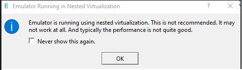
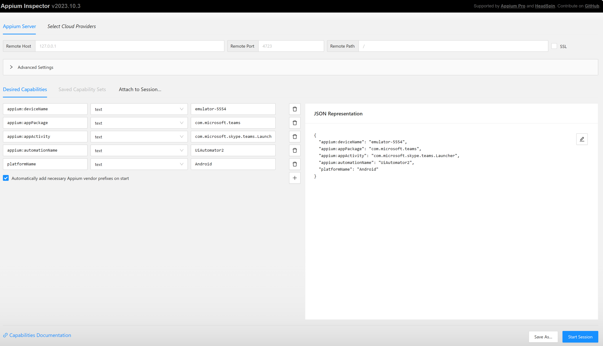

# Automated UI Tests for a Teams Application

## Overview

This is an overview on how you can implement UI tests for a custom Teams application. The insights provided can also be applied to automated end-to-end testing.

### General Observations

- Testing in a web browser is easier than on a native app.
- Testing a Teams app on a mobile device in an automated way is more challenging due to the fact that you are testing an app within an app:
  - There is no Android Application Package (APK) / iOS App Store Package (IPA) publicly available for Microsoft Teams app itself.
  - Mobile testing frameworks are designed with the assumption that you own the APK/IPA of the app under test.
  - Workarounds need to be found to first automate the installation of Teams.
- Should you choose working with emulators, testing in a local Windows box is more stable than in a CI/CD. The latter involves a CI/CD agent and an emulator in a VM.
- When deciding whether to implement such tests, consider the project requirements as well as the advantages and disadvantages. Manual UI tests are often an acceptable solution due to their low effort requirements.

The following are learnings from various engagements:

## Web Based UI Tests

To implement web-based UI tests for your Teams application, follow the same approach as you would for testing any other web application with a UI. UI testing provides valuable guidance in this regard. Your starting point for the test would be to automatically launch a browser (using Selenium or similar frameworks) and navigate to [https://teams.microsoft.com](https://teams.microsoft.com).

If you want to test a Teams app that hasn’t been published in the Teams store yet or if you’d like to test the DEV/QA version of your app, you can use the [Teams Toolkit](https://github.com/OfficeDev/TeamsFx) and package your app based on the [manifest.json](https://learn.microsoft.com/microsoftteams/platform/resources/schema/manifest-schema).

```javascript
npx teamsfx package --env dev --manifest-path ...
```

Once the app is installed, implement [selectors](https://www.browserstack.com/guide/css-selectors-in-selenium) to [access your custom app](https://learn.microsoft.com/microsoftteams/platform/concepts/deploy-and-publish/apps-upload#access-your-app) and to perform various actions within the app.

### Pipeline

If you are using Selenium and Edge as the browser, consider leveraging the [selenium/standalone-edge](https://hub.docker.com/r/selenium/standalone-edge) Docker image which contains a standalone Selenium server with the Microsoft Edge browser installed. By default, it will run in headless mode, but by setting `START_XVFB` variable to `True`, you can control whether to start a virtual framebuffer server (Xvfb) that allows GUI applications to run without a display. Below is a code snippet which illustrates the usage of the image in a Gitlab pipeline:

```yml
...
run-tests-dev:
  allow_failure: false
  image: ...
  environment:
    name: dev
  stage: tests
  services:
    - name: selenium/standalone-edge:latest
      alias: selenium
      variables:
        START_XVFB: "true"
        description: "Start Xvfb server"
...
```

When running a test, you need to use the Selenium server URL for remote execution. With the definition from above, the URL is: `http://selenium:4444/wd/hub`.

The code snippet below illustrates how you can initialize the Selenium driver to point to the remote Selenium server using JavaScript:

```javascript
var { Builder } = require("selenium-webdriver");
const edge = require("selenium-webdriver/edge");

var buildEdgeDriver = function () {
  let builder = new Builder().forBrowser("MicrosoftEdge");
  builder = builder.usingServer("http://selenium:4444/wd/hub");
  builder.setEdgeOptions(new edge.Options().addArguments("--inprivate"));
  return builder.build();
};
```

## Mobile Based UI Tests

Testing your custom Teams application on mobile devices is a bit more difficult than using the web-based approach as it requires usage of actual or simulated devices. Running such tests in a CI/CD pipeline can be more difficult and resource-intensive.

One approach is to use real devices or cloud-based emulators from vendors such as [BrowserStack](https://www.browserstack.com/) which requires a license. Alternatively, you can use virtual devices hosted in Azure Virtual Machines.

### Option 1: Using Android Virtual Devices (AVD)

This approach enables the creation of Android UI tests using virtual devices. It comes with the advantage of not requiring paid licenses to certain vendors. However, due to the nature of emulators, compared to real devices, it may prove to be less stable. Always choose the solution that best fits your project requirements and resources.

Overall setup:

[AVD - Android Virtual Devices](https://developer.android.com/studio/run/managing-avds) - which are virtual representation of physical Android devices.

[Appium](https://appium.io/) is an open-source project designed to facilitate UI automation of many app platforms, including mobile.

- Appium is based on the [W3C WebDriver specification](https://w3c.github.io/webdriver/).

    > Note: If you look at these commands in the WebDriver specification, you will notice that they are not defined in terms of any particular programming language. They are not Java commands, or JavaScript commands, or Python commands. Instead, they form part of an HTTP API which can be accessed from within any programming language.

- Appium implements a client-server architecture:
  - The server (consisting of Appium itself along with any drivers or plugins you are using for automation) is connected to the devices under test, and is actually responsible for making automation happen on those devices. [UiAutomator](https://github.com/appium/appium-uiautomator2-driver) driver is compatible with Android platform.
  - The [client](https://appium.io/docs/en/2.0/intro/clients/) is responsible for sending commands to the server over the network, and receiving responses from the server as a result. You can choose the language of your choice to write the commands. For example, for Javascript [WebDriverIO](https://webdriver.io/) can be used as client.

    > [Here](https://appium.io/docs/en/2.0/ecosystem/) you can read more about Appium ecosystem

  - The advantage of this architecture is that it opens the possibility of running the server in a VM, and the client in a pipeline, enabling the tests to be ran automatically on scheduled basis as part of CI/CD pipelines.

#### How to Run Mobile Tests Locally on a Windows Machine Using AVD?

This approach involves:

- An emulator ([AVD - Android Virtual Devices](https://developer.android.com/studio/run/managing-avds)), which will represent the physical device.
- [Appium server](https://appium.io/docs/en/2.1/), which will redirect the commands from the test to your virtual device.

##### Creating an Android Virtual Device

1. Install Android Studio from [official link](https://developer.android.com/studio).

    > Note: At the time of writing the documentation, the latest version available was Android Studio Giraffe, 2022.3.1 Patch 2 for Window.

    Set ANDROID_HOME environment variable to point to the installation path of Android SDK. i.e. `C:Users\<user-name>\AppData\Local\Android\Sdk`

1. Install Java Development Kit (JDK) from [official link](https://www.oracle.com/java/technologies/javase/jdk11-archive-downloads.html). For the most recent devices JDK 9 is required, otherwise JDK 8 is required. Make sure you get the JDK and not the JRE.

    Set JAVA_HOME environment variable to the installation path, i.e.`C:\Program Files\Java\jdk-11`

1. Create an AVD (Android Virtual Device):
- Open Android Studio. From the Android Studio welcome screen, select **More Action -> Virtual Device Manager**, as instructed [here](https://developer.android.com/studio/run/managing-avds#:~:text=1%20Open%20the%20AVD%20Manager%20by%20clicking%20Tools,%20settings%2C%20such%20as%20the%20skin.%20See%20More.)
- Click **Create Device**.
- **Choose a device definition with *Play Store* enabled**. This is important, otherwise Teams cannot be installed on the device.
- Choose a System image from the **Recommended** tab which includes access to Google Play services. You may need to install it before selecting it.
- Start the emulator by clicking on the Run button from the Device Manage screen.
- **Manually** install Microsoft Teams from Google Playstore on the device.

##### Setting up Appium

Install `appium`:

1. Download NodeJs, if it is not already installed on your machine: [Download | Node.js (nodejs.org)](https://nodejs.org/en/download)
1. Install Appium globally: [Install Appium - Appium Documentation](https://appium.io/docs/en/2.0/quickstart/install/)
1. Install the UiAutomator2 driver: [Install the UiAutomator2 Driver - Appium Documentation](https://appium.io/docs/en/2.0/quickstart/uiauto2-driver/). Go through the `Set up Android automation requirements` in the documentation, to make sure you have set up everything correctly. [Read more about Appium Drivers here](https://appium.io/docs/en/2.0/intro/drivers/).
- Start appium server by running `appium` command in a command prompt.


##### Useful commands

List emulators that you have previously created, without opening Android Studio:

```sh
emulator -list-avds
```

#### How to run Teams mobile tests in a pipeline using an Azure VM?

This approach leverages the fact that Appium implements a client-server architecture. In this approach, the Appium server as well as the AVD run on an Azure VM, while the client operates within a pipeline and sends commands to be executed on the device.

##### Configure the VM

This approach involves hosting a virtual device within a virtual machine. To set up the emulator (Android Virtual Device) in an Azure VM, the VM must support [nested virtualization](https://azure.microsoft.com/blog/nested-virtualization-in-azure/). Azure VM configuration which, at the time of writing the documentation, worked successfully with AVD and appium:

- Operating system: Windows (Windows-10 Pro)
- VM generation: V1
- Size: Standard D4ds v5 16 GiB memory

##### Enable connection from outside to Appium server on the VM

> **Note:** By default appium server runs on port 4723. The rest of the steps will assume that this is the port where your appium server runs.

In order to be able to reach appium server which runs on the VM from outside:

1. Create an [Inbound Rule](https://learn.microsoft.com/en-us/windows/security/operating-system-security/network-security/windows-firewall/create-an-inbound-port-rule) for port 4723 from within the VM.
1. Create an Inbound Security Rule in the NSG (Network Security Group) of the VM to be able to connect from that IP address to port 4723:
- Find out the IP of the machine on which the tests will run on.
- Replace the *Source IP Address* with the IP of your machine.

##### Installing Android Studio and create AVD inside the VM

1. Follow the instructions under the [end to end tests on a Windows machine section](#how-to-run-mobile-tests-locally-on-a-windows-machine-using-avd) to install Android Studio and create an Android Virtual Device.
1. When you launch the emulator, it may show a warning as below and will eventually crash:

    

Solution to fix it:
1. [Enable Windows Hypervisor Platform](https://devblogs.microsoft.com/visualstudio/hyper-v-android-emulator-support/)
1. [Enable Hyper-V](https://learn.microsoft.com/en-us/virtualization/hyper-v-on-windows/quick-start/enable-hyper-v#enable-the-hyper-v-role-through-settings) (if not enabled by default)
1. Restart the VM.
1. Restart the AVD.


#### How to inspect the Teams app in an Azure Virtual Device (AVD)?

Inspecting the app is highly valuable when writing new tests, as it enables you to identify the unique IDs of various elements displayed on the screen. This process is similar to using DevTools, which allows you to navigate through the Document Object Model (DOM) of a web page.

[Appium Inspector](https://inspector.appiumpro.com/) is a very useful tool that allows you to inspect an app runing on an emulator.

> Note: This section assumes that you have already performed the prerequisites from **How to run mobile test locally on a Windows machine using AVD?**

##### Steps

1. Run the appium server with [--alow-cors flag](https://appium.readthedocs.io/en/latest/en/writing-running-appium/server-args/) by running the following command in a terminal:

    ```cmd
    appium --allow-cors
    ```

2. Go to [https://inspector.appiumpro.com](https://inspector.appiumpro.com) and type in the following properties:

    ```json
    {
    "appium:deviceName": "your-emulator-name",
    "appium:appPackage": "com.microsoft.teams",
    "appium:appActivity": "com.microsoft.skype.teams.Launcher",
    "appium:automationName": "UiAutomator2",
    "platformName": "Android"
    }
    ```

- "appium:deviceName" - is the name of your emulator. In **Useful commands** sections from above, you can see how to get the name of your AVD.
- "appium:appPackage" - is the name of the package, should be kept to "**com.microsoft.teams**".
- "appium:appActivity"-  is the name of the activity in the app that you want to launch, should be kept to "**com.microsoft.skype.teams.Launcher**"
- "appium:automationName" - is the name of the driver you are using, in this case, "**UiAutomator2**"

If the appium server runs on your local machine at the default portal, then Remote Host and Remote Port can be kept to the default values.

The configuration should look similar to the printscren below:


3. Press on **Start Session**.
- In the browser, you should see a similar view as below:


- You can do any action on the emulator, and if you press on the "Refresh" button in the browser, the left hand side of the Appium Inspector will reflect your app. In the **App Source** you will be able to see the IDs of the elements, so you can write relevant selectors in your tests.

**Connecting to Appium server**

Below it is outlined how this can be achieved with JavaScript. A similar approach can be followed for other languages.
Assuming you are using [webdriverio](https://webdriver.io/) as the client, you would need to initialize the remote connection as follows:

```javascript
 const opts = {
      port: 4723,
      hostname: "your-hostname",
      capabilities: {
        platformName: "android",
        "appium:deviceName": "the-name-of-the-virtual-device",
        "appium:appPackage": "com.microsoft.teams",
        "appium:appActivity": "com.microsoft.skype.teams.Launcher",
        "appium:automationName": "the-name-of-the-driver",
      },
    };

    // Create a new WebDriverIO instance with the Appium server URL and capabilities
    await wdio.remote(opts);
```

- "port": the port on which the Appium server runs on. By default, it is 4723.
- "hostname": the IP of the machine where the Appium sever runs on. If it is running locally, that is 127.0.0.1. If it runs in an Azure VM, it would be the public IP address of the VM. Note: ensure you have followed the steps from **2. Enable connection from outside to Appium server on the VM**.
- "platformName": Appium can be used to connect to different platforms (Windows, iOS, Android). In our case, it would be "android".
- "appium:deviceName": the name of the Android Virtual Device. See **Useful commands** on how to find the name of the device.
- "appium:appPackage": the name of the app's package that you would like to launch. Teams' package name is "com.microsoft.teams".
- "appium:appActivity": the activity within Teams that you would like to launch on the device. In our case, we would like just to launch the app. The activity name for launching Teams is called "com.microsoft.skype.teams.Launcher".
- "appium:automationName": the name of the driver you are using. Note: Appium can communicate to different platforms. This is achieved by installing a dedicated driver, designed for each platform. In our case, it would be [UiAutomator2](https://github.com/appium/appium-uiautomator2-driver) or [Espresso](https://github.com/appium/appium-espresso-driver), since they are both designed for Android platform.

### Option 2: Using BrowserStack

BrowserStack serves as a cloud-based platform that enables developers to test both the web and mobile application across various browsers, operating systems, and real mobile devices. This can be seen as an alternative solution to the approach described earlier. The specific insights provided below relate to implementing such tests for a custom Microsoft Teams application:

- BrowserStack does not support out of the box the installation of Teams from the App Store or Play Store. However, there is a workaround, described in [their documentation](https://www.browserstack.com/support/faq/app-automate/app/can-i-install-an-app-from-the-app-store-or-play-store). Therefore, if you choose to go this way, you would first need to implement a step that installs Teams on the cloud-based device, by implementing the workaround described above.
- You may encounter issues with Google login, as it requires a newly created Google account, in order to log in to the store. To overcome this, make sure to disable 2FA from Google, further described in [Troubleshooting Google login issues](https://www.browserstack.com/docs/app-automate/appium/advanced-features/setup-google-account#nodejs).
