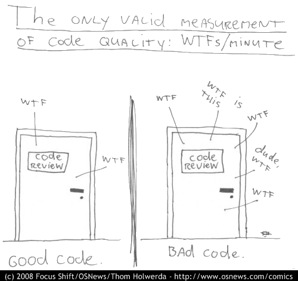

# Code Quality

*Code Quality* is a overarching term that encompasses a number of patterns and practices that are designed to help ensure that the code we write is elegant, efficient, and simple. It should be easy to read, without duplications, and written with care. While often subjective, there are a number of patterns and practices that are generally accepted as good practice.

> "Any fool can write code that a computer can understand. Good programmers write code that humans can understand." - Martin Fowler

## Clean Code

Robert C. Martin introduces Clean Code with a humorous anecdote about the number of WTFs/minute that a developer might experience when reading poorly written code.

Robert asks the reader to consider which door represents the code they write, or the code they wish to maintain or troubleshoot. The door on the left is clean, well-organised, and easy to navigate. The door on the right is cluttered, disorganised, and difficult to navigate.

Clean Code is fundamental to writing high-quality code - that is, understandable by humans, and maintainable. In Clean Code, Robert presents a set of principles and best practices for writing high-quality and maintainable code.

[Read more](./clean-code.md)