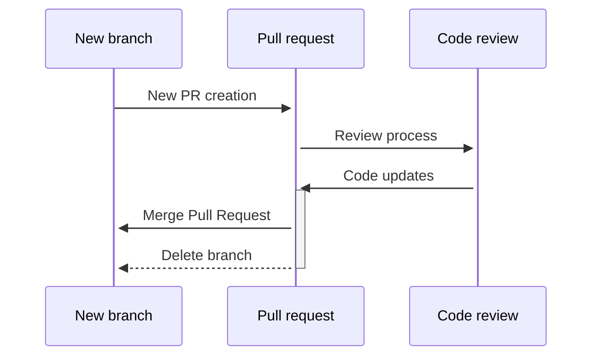

# Lessons shared for code reviews

There is a conversation about how to work with Code Reviews and Pull Requests, they are made to work together, not to compete each other.

We need to keep this simple. Code reviews are all about making code better. This is something easy to say  but really hard to move into
reality it requires balance between strictly documented processes and a collaborative environment. Let's start with the role of a Code review.

## The process of a Code Review

The following diagram is how the end-to-end pull request works.

- Process start with a new branch creation.
- With a new branch a pull request can be created.
- When the pull request has been created review process starts.
- Code review is being made with required team members.
- According to the review code updates can be uploaded.
- When code reviews have been completed pull request can be merged.
- After merging the pull request the branch created for this purpose can be deleted.

After looking at the process we can start with the recommendations about code reviews.

## Code reviews shouldn't include many lines of code

It's easy to say a developer can review 400 or more lines but when code surpasses certain amount of lines of code effectiveness of defects discovery can decrease and there is a chance of not having a good review or just letting bugs pass to main branch or another stage. Setting a line of code limit is as important as a time limit.

## Take your time to review but don't go beyond of the specific task

There is a small, very small gap when reviewing code talking about time, you shouldn't review code too quickly but neither take too long in one sitting. If you have many pull requests that could lead to many code reviews or complexity of code is demanding the recommendation is to not invest muc time, take a break, spend some minutes between reviews to recover.

Avoiding big files can prevent teams to spend a lot of time and to let bugs pass without being noticed.

But at the end, no matter how many lines of code or time you can invest on a code review. The important goal in a code review is to verify the specified task has been achieved, there is a common practice of analyzing tasks beyond the scope of a PR by suggesting improvements that are are not being considered for this you can raise a bug, an improvement or a technical debt but not postpone a review because of a different task.

## Code should have annotations before the review

If big files are something that can not be avoided then you need to include comments in order to make it easier to the teams to review, with clear comments developers can go faster in the process and also can identify goals for every code block.

## Use checklists

At the moment of creating a pull request it is a very good idea to put in the description of it a checklist of expected objectives to achieve in the PR. This way reviewers can be able to focus on specific areas and also consider some other tasks as secondary according to this list.

## Get a process for fixing found issues

Before getting started with any commit, your team should define how you will measure the effectiveness of peer review and get some goals. Using a [SMART criteria](https://en.wikipedia.org/wiki/SMART_criteria) the team can get this objectives in the most accurate way and not something very general like **fix more bugs**, the more precise a goal can be the easier it will be to hit the target.

Metrics can play a significant role in this part, you can include an **Inspection rate**(the speed with which review is performed), **Defect rate**(the number of bugs found within an hour of review) and **Defect density**(the number of bugs found per piece of code) as the most common ones to be considered.

## Foster a positive code review culture

This is the easiest recommendation to follow and yet the most absent form code reviews. Code reviews play a critical role in product quality and it should not represent an arena for long discussions or even worse a battle of egos. What matters is a bug caught not who made it, not who found it, not who solved it. The only thing that matters is having the best possible product.

## Automate whenever possible

Before doing any code review it's important to set automated builds, tests and checks (something achievable in the [CI process](../continuous-integration/README.md)), this can save human reviewers some time and focus in areas like design and functionality for proper evaluation. Reviewing code with some questions in mind can help team focus on the right things. One of the possible questions to ask when reviewing is **Do I understand what the code does?** and it's important to start from there in order to get the best qualified team reviewing the code.

This way of critical evaluation will ensure the team is checking the right things and it will reduce time when it comes to deal with human reviewing.
