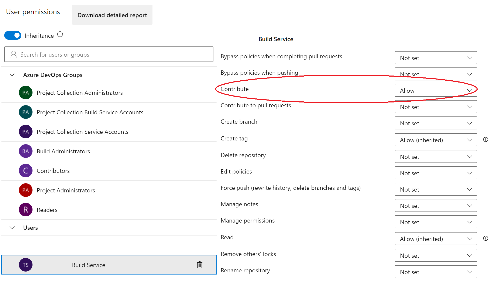

# Data Science Pipeline

As Azure DevOps doesn't allow code reviewers to comment directly in Jupyter Notebooks, Data Scientists(DSs) have
to convert the notebooks to scripts before they commit and push these files to the repository.

This document aims to automate this process in Azure DevOps, so the DSs don't need to execute anything locally.

## Problem statement

A Data Science repository has this folder structure:

```bash

    .
    ├── notebooks
    │   ├── Machine Learning Experiments - 00.ipynb
    │   ├── Machine Learning Experiments - 01.ipynb
    │   ├── Machine Learning Experiments - 02.ipynb
    │   ├── Machine Learning Experiments - 03.ipynb
    └── scripts
       ├── Machine Learning Experiments - 00.py
       ├── Machine Learning Experiments - 01.py
       ├── Machine Learning Experiments - 02.py
       └── Machine Learning Experiments - 03.py

```

The python files are needed to allow Pull Request reviewers to add comments to the notebooks, they can add comments
to the Python scripts and we apply these comments to the notebooks.

Since we have to run this process manually before we add files to a commit, this manual process is error prone, e.g.
If we create a notebook, generate the script from it, but later make some changes and forget to generate a new script
for the changes.

## Solution

One way to avoid this is to create the scripts in the repository from the commit. This document will describe this
process.

We can add a pipeline with the following steps to the repository to run in `ipynb` files:

1. Go to the *Project Settings* -> *Repositories* -> *Security* -> *User Permissions*
1. Add the *Build Service* in *Users* the permission to *Contribute*
    
1. Create a new pipeline.

In the newly created pipeline we add:

1. Trigger to run on ipynb files:

    ```yml
    trigger:
      paths:
      include:
        - '*.ipynb'
        - '**/*.ipynb'
    ```

1. Select the pool as Linux:

    ```yml
    pool:
      vmImage: ubuntu-latest
    ```

1. Set the directory where we want to store the scripts:

    ```yml
    variables:
      REPO_URL: # Azure DevOps URL in the format: dev.azure.com/<Organization>/<Project>/_git/<RepoName>
    ```

1. Now we will start the core of the pipeline:
    1. Upgrade pip

    ```yml
    - script: |
        python -m pip install --upgrade pip
      displayName: 'Upgrade pip'

    ```

    1. Install `nbconvert` and `ipython`:

    ```yml
    - script: |
        pip install nbconvert ipython
      displayName: 'install nbconvert & ipython'
    ```

    1. Install `pandoc`:

    ```yml
    - script: |
        sudo apt install -y pandoc
      displayName: "Install pandoc"
    ```

    1. Find the notebook files (`ipynb`) in the last commit to the repo and convert it to scripts (`py`):

    ```yml
    - task: Bash@3
        inputs:
          targetType: 'inline'
          script: |
            IPYNB_PATH=($(git diff-tree --no-commit-id --name-only -r $(Build.SourceVersion) | grep '[.]ipynb$'))
            echo $IPYNB_PATH
            [ -z "$IPYNB_PATH" ] && echo "Nothing to convert" || jupyter nbconvert --to script $IPYNB_PATH
        displayName: "Convert Notebook to script"
    ```

    1. Commit these changes to the repository:

    ```yml
    - bash: |
        git config --global user.email "build@dev.azure.com"
        git config --global user.name "build"
        git add .
        git commit -m 'Convert Jupyter notebooks' || echo "No changes to commit" && NO_CHANGES=1
        [ -z "$NO_CHANGES" ] || git push https://$(System.AccessToken)@$(REPO_URL) HEAD:$(Build.SourceBranchName)
      displayName: "Commit notebook to repository"
    ```

Now we have a pipeline that will generate the scripts as we commit our notebooks.
