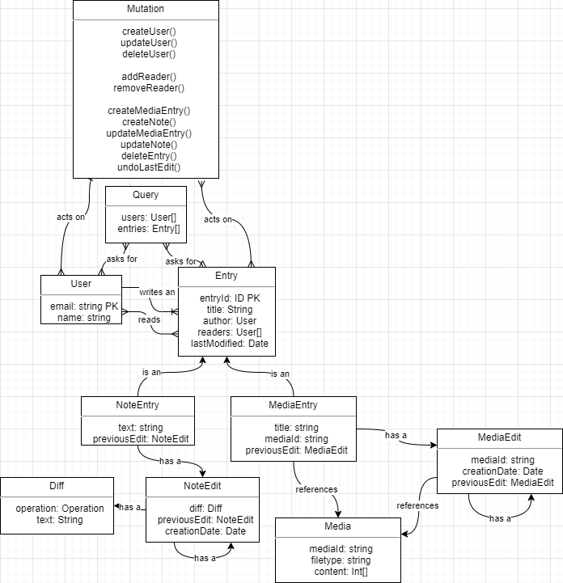

# API Contract

The API will implement the following relationship model:

The mutations, while not fully described in the model, are more visible in [the schema](../../api/src/graph/schema.graphqls).
