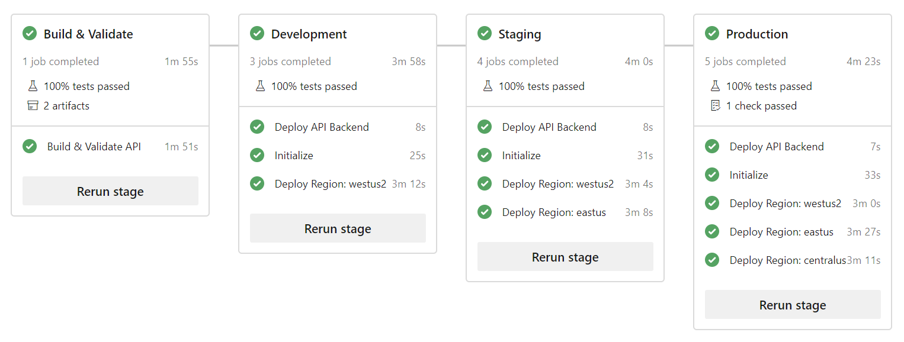
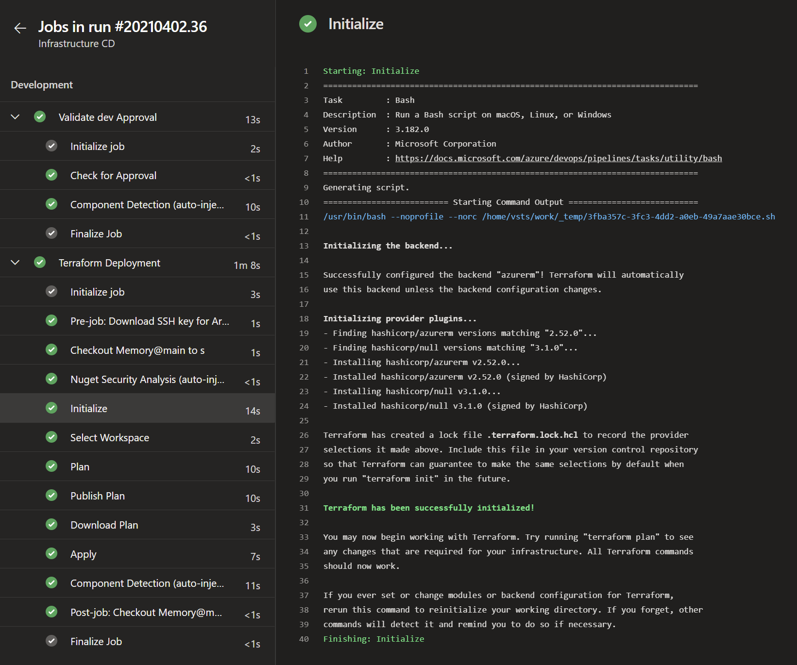
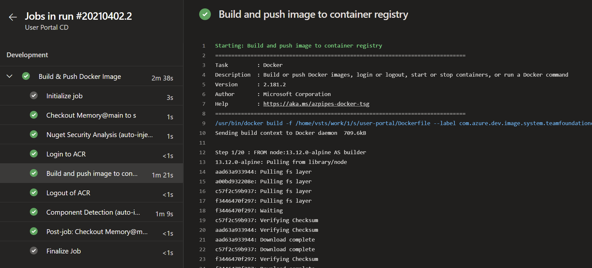
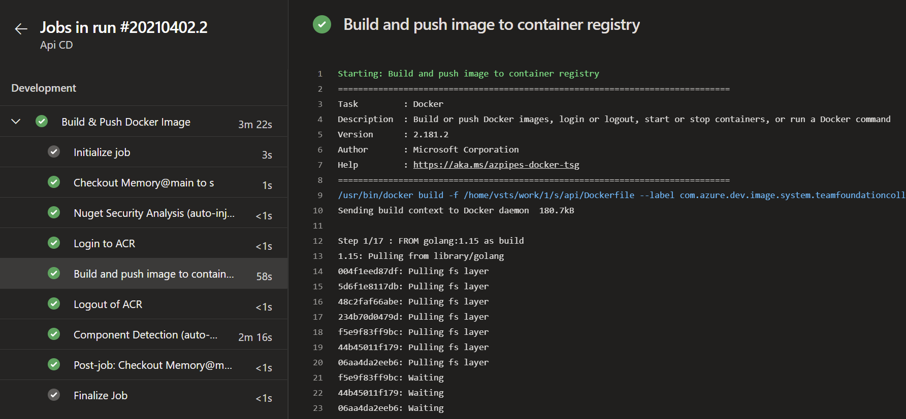

# Overview

This project leverages Azure DevOps pipelines for continues integration and deployment (CI/CD).

The following AzDO pipelines are in use for the Memory application.

| Name                      | Description                                                                  | Path                                        | Trigger              | Validation |
| ------------------------- | ---------------------------------------------------------------------------- | ------------------------------------------- | -------------------- | ---------- |
| Security Code Analysis CI | Runs static analysis including credential scan                               | /deployment/pipelines/ci-security.yml       | \*                   | main       |
| Markdown CI               | Runs markdown linting and spellcheck                                         | /deployment/pipelines/ci-markdown.yml       | \*                   | main       |
| Terraform CI              | Runs validation and linting on Terraform files                               | /deployment/pipelines/ci-terraform.yml      | \*                   | main       |
| Infrastructure CD         | Multi-stage pipeline using Terraform to deploy and configure Azure resources | /deployment/pipelines/cd-infrastructure.yml | main, deployment/\*  | main       |
| API CD                    | Multi-stage pipeline to generate and deploy API app to ACR                   | /deployment/pipelines/cd-api.yml            | main, api/\*         | N/A        |
| User Portal CD            | Multi-stage pipeline to generate and deploy User Portal app to ACR           | /deployment/pipelines/cd-user-portal.yml    | main, user-portal/\* | N/A        |

> \* : All Branches
> deployment/\* : any changes in deployment folder

## AzDO Pipelines

CD pipelines have been created and have been purposely split up to include the application infrastructure, user portal single page app and the backend GraphQL API service.

Each pipeline leverages [multi-stage deployment](https://docs.microsoft.com/en-us/azure/devops/pipelines/process/stages?view=azure-devops&tabs=yaml) where the stage is equivalent to an application environment.

Each environment is also associated with an Azure DevOps [variable group](https://docs.microsoft.com/en-us/azure/devops/pipelines/library/variable-groups?view=azure-devops&tabs=yaml).

Variable groups contain specific configuration properties valid for each environment.
They contains items such as database connection strings, dependency urls and more.

The pipelines define the top level stages and dependencies.
They are relatively thin and utilize [pipeline templates](https://docs.microsoft.com/en-us/azure/devops/pipelines/process/templates?view=azure-devops).
Templates allow us to reuse jobs and/or steps to reduce boilerplate configuration across stages and jobs.

## Infrastructure (deploy-iac)

The infrastructure pipeline handles the deployment of all Azure resources required to run the Memory application.
The pipeline leverages the [Terraform](Terraform.md) and [shell scripts](https://en.wikipedia.org/wiki/Shell_script).

Any changes to the Terraform templates that are checked into the `main` branch automatically invoke an incremental deployment update to bring your infrastructure to the desired end state.

## User Portal (user-portal)

The frontend pipelines handles the deployment of the frontend [React](https://reactjs.org/) single page web application container images.
The templates leverages [AzDO Docker Tasks](https://docs.microsoft.com/en-us/azure/devops/pipelines/tasks/build/docker?view=azure-devops) to login to the container registry, build the images and push them into the container registry within the `api` repository.
Internally the docker image hosts the application with  [Nginx](https://www.nginx.com/).

## Backend Graph API (api)

The backend pipeline handles the deployment of the backend [GraphQL](https://graphql.org/) API container images.
The templates leverage [AzDO Docker Tasks](https://docs.microsoft.com/en-us/azure/devops/pipelines/tasks/build/docker?view=azure-devops) to login to the container registry, build the images and push them into the container registry within the `user-profile` repository

