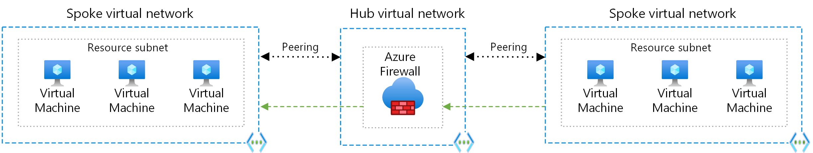

# Cloud artitechture Design Guidance

In the below documet best practices about how network resources and artitechtures should be used in Azure Cloud enviorments.

> **NOTE:** Always work with the relevant stakeholders to ensure that introducing new patterns provides the intended value.
>
> When working in an existing cloud environment, it is important to understand any current patterns and how they are used before making a change to them.

## Networking and Vnet setup

### Hub-and-Spoke topology

A Hub-and-Spoke network topology is a common architecture pattern used in Azure for organizing and managing network resources. It is based on the concept of a central hub that connects to various spoke networks. This model is particularly useful for organizing resources, maintaining security, and simplifying network management.

The Hub-and-Spoke model is implemented using Azure Virtual Networks (VNet) and VNet peering.

* The Hub: The central VNet acts as a hub, providing shared services such as network security, monitoring, and connectivity to on-premises or other cloud environments. Common components in the hub include Network Virtual Appliances (NVAs), Azure Firewall, VPN Gateway, and ExpressRoute Gateway.

* The Spokes: The spoke VNets represent separate units or applications within an organization, each with its own set of resources and services. They connect to the hub through VNet peering, which allows for communication between the hub and spoke VNets.

Implementing a Hub-and-Spoke model in Azure offers several benefits:

* Isolation and Segmentation: By dividing resources into separate spoke VNets, you can isolate and segment workloads, preventing any potential issues or security risks from affecting other parts of the network.
* Centralized Management: The hub VNet acts as a single point of management for shared services, making it easier to maintain, monitor, and enforce policies across the network.
* Simplified Connectivity: VNet peering enables seamless communication between the hub and spoke VNets without the need for complex routing or additional gateways, reducing latency and management overhead.
* Scalability: The Hub-and-Spoke model can easily scale to accommodate additional spokes as the organization grows or as new applications and services are introduced.
* Cost Savings: By centralizing shared services in the hub, organizations can reduce the costs associated with deploying and managing multiple instances of the same services across different VNets.

Read more about [Hub-And-Spoke topology](https://learn.microsoft.com/en-us/azure/architecture/reference-architectures/hybrid-networking/hub-spoke?tabs=cli)

It is recomended deploying hub/spoke in connection with [landing zones](https://learn.microsoft.com/en-us/azure/cloud-adoption-framework/ready/landing-zone/) to ensure consistency accross all enviorments as well as guiderails to ensure a high level of security while giving devopers freedom within development enviorments.

### Firewall and security

When using a Hub-and-Spoke topology it is possible to deploy a centralized Firewall instance in the Hub that all outgoing traffic or traffic to/from certain vnets, this allows for centralized threat protection while minimizaing costs.

### DNS

The best practice method for handling DNS in azure and in clouds in general means using the managed DNS services. There are quite a few benefits and resources designed to allow for secure and easy to implement and maintain configurations.

* **DNS forwarding:** Set up DNS forwarding between your on-premises DNS servers and Azure DNS servers for name resolution across environments.
* **Use Azure Private DNS zones for Azure resources:** Configure Azure Private DNS zones for your Azure resources to ensure name resolution is kept within the virtual network.

Read more about [Hybrid/Multi-Cloud DNS infrasurecture](https://learn.microsoft.com/en-us/azure/architecture/hybrid/hybrid-dns-infra) and [Azure DNS infrazureture](https://learn.microsoft.com/en-us/azure/dns/)

### IP allocation

When allocating IP address spaces to Azure Virtual Networks (VNets), it's essential to follow best practices for proper management, scalability, and to avoid potential issues. Here are some recommendations for IP allocation to VNets:

* **Reserve IP addresses:** Reserve IP addresses in your address space for critical resources or services.
* **Public IP allocation:** Minimize the use of public IP addresses and use Azure Private Link when possible to access services over a private connection.
* **IP address management (IPAM):** Use IPAM solutions to manage and track IP address allocation across your hybrid environment.
* **Plan your address space:** Choose an appropriate private address space (from RFC 1918) for your VNets that is large enough to accommodate future growth. Avoid overlapping with on-premises or other cloud networks.
* **Use CIDR notation:** Use Classless Inter-Domain Routing (CIDR) notation to define the VNet address space, which allows more efficient allocation and prevents wasting IP addresses.
* **Use subnets:** Divide your VNets into smaller subnets based on security, application, or environment requirements. This allows for better network management and security.
* **Consider leaving a buffer between VNets:** While it's not strictly necessary, leaving a buffer between VNets can be beneficial in some cases, especially when you anticipate future growth or when you might need to merge VNets. This can help avoid re-addressing conflicts when expanding or merging networks.
* **Reserve IP addresses:** Reserve a range of IP addresses within your VNet address space for critical resources or services. This ensures that they have a static IP address, which is essential for specific services or applications.
* **Plan for hybrid scenarios:** If you're working in a hybrid environment with on-premises or multi-cloud networks, ensure that you plan for IP address allocation across all environments. This includes avoiding overlapping address spaces and reserving IP addresses for specific resources like VPN gateways or ExpressRoute circuits.

Read more at [azure-best-practices/plan-for-ip-addressing](https://learn.microsoft.com/en-us/azure/cloud-adoption-framework/ready/azure-best-practices/plan-for-ip-addressing)