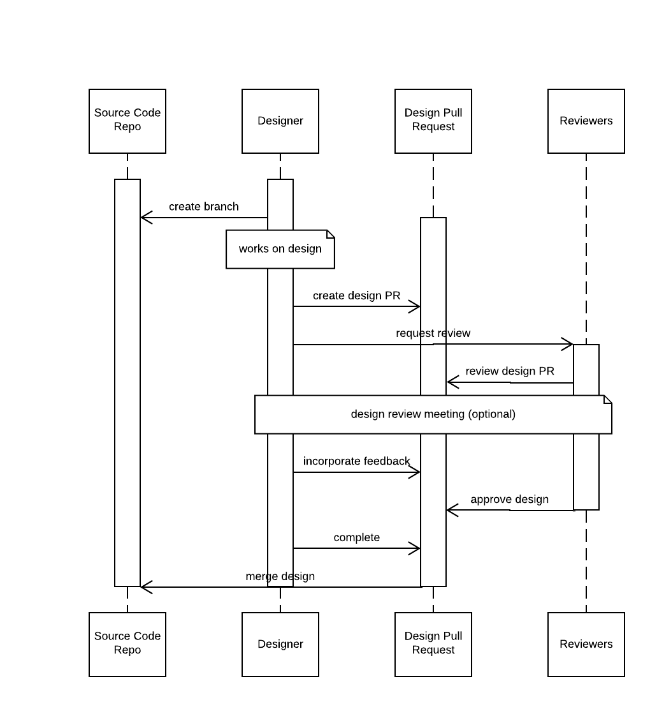

# Async Design Reviews

## Goals

Allow team members to review designs as their work schedule allows.

## Impact

This in turn results in the following benefits:

- **Higher Participation & Accessibility**. They do not need to be online and available at the same time as others to review.
- **Reduced Time Constraint**. Reviewers can spend longer than the duration of a single meeting to think through the approach and provide feedback.

## Measures

The metrics and/or KPIs used for design reviews overall would still apply. See [design reviews](../README.md#measures) for measures guidance.

## Participation

The participation should be same as any design review. See [design reviews](../README.md#participation) for participation guidance.

## Facilitation Guidance

The concept is to have the design follow the same workflow as any code changes to implement story or task. Rather than code however, the artifacts being added or changed are Markdown documents as well as any other supporting artifacts (prototypes, code samples, diagrams, etc).

### Prerequisites

#### Source Controlled Design Docs

Design documentation must live in a source control repository that supports pull requests (i.e. git). The following guidelines can be used to determine what repository houses the docs

1. Keeping docs in the same repo as the affected code allows for the docs to be updated atomically alongside code within the same pull request.
2. If the documentation represents code that lives in many different repositories, it may make more sense to keep the docs in their own repository.
3. Place the docs so that they do not trigger CI builds for the affected code (assuming the documentation was the only change). This can be done by placing them in an isolated directory should they live alongside the code they represent. See directory structure example below.

```sh
-root
  --src
  --docs <-- exclude from ci build trigger
    --design
```

### Workflow

1. The designer branches the repo with the documentation.
2. The designer works on adding or updating documentation relevant to the design.
3. The designer submits pull request and requests specific team members to review.
4. Reviewers provide feedback to Designer who incorporates the feedback.
5. (OPTIONAL) Design review meeting might be held to give deeper explanation of design to reviewers.
6. Design is approved/accepted and merged to main branch.



### Tips for Faster Review Cycles

To make sure a design is reviewed in a timely manner, it's important to directly request reviews from team members. If team members are assigned without asking, or if no one is assigned it's likely the design will sit for longer without review. Try the following actions:

1. Make it the designer's responsibility to find reviewers for their design
2. The designer should ask a team member directly (face-to-face conversation, async messaging, etc) if they are available to review. Only if they agree, then assign them as a reviewer.
3. Indicate if the design is ready to be merged once approved.

### Indicate Design Completeness

It helps the reviewer to understand if the design is ready to be accepted or if its still a work-in-progress. The level and type of feedback the reviewer provides will likely be different depending on its state. Try the following actions to indicate the design state

1. Mark the PR as a Draft. Some ALM tools support opening a pull request as a Draft such as Azure DevOps.
2. Prefix the title with "DRAFT", "WIP", or "work-in-progress".
3. Set the pull request to automatically merge after approvals and checks have passed. This can indicate to the reviewer the design is complete from the designer's perspective.

### Practice Inclusive Behaviors

The designated reviewers are not the only team members that can provide feedback on the design. If other team members voluntarily committed time to providing feedback or asking questions, be sure to respond. Utilize face-to-face conversation (in person or virtual) to resolve feedback or questions from others as needed. This aids in building team cohesiveness in ensuring everyone understands and is willing to commit to a given design. **This practice demonstrates inclusive behavior**; which will promote trust and respect within the team.

1. Respond to all PR comments **objectively and respectively** irrespective of the authors level, position, or title.
2. After two round trips of question/response, resort to synchronous communication for resolution (i.e. virtual or physical face-to-face conversation).
