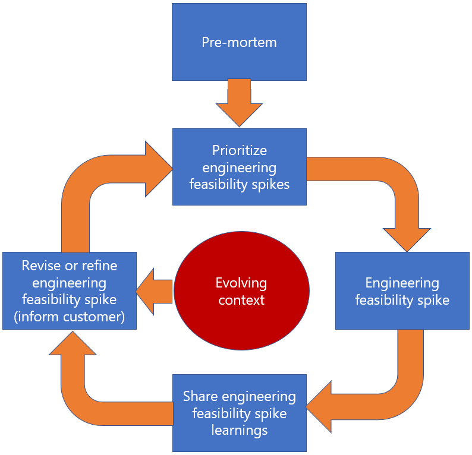

# Engineering Feasibility Spikes: Identifying and Mitigating Risk

## Introduction

Some engagements require more de-risking than others. Even after Architectural Design Sessions (ADS) an engagement may still have substantial technical unknowns. These types of engagements warrant an exploratory/validation phase where Engineering Feasibility Spikes can be conducted immediately after envisioning/ADS and before engineering sprints.

### Engineering Feasibility Spikes

- Are regimented yet collaborative time-boxed investigatory activities conducted in a feedback loop to capitalize on individual learnings to inform the team.
- Increase the team’s knowledge and understanding while minimizing engagement risks.

The following guidelines outline how Microsoft and the customer can incorporate engineering feasibility spikes into the day-to-day agile processes.

## Pre-Mortem

A good way to gauge what engineering spikes to conduct is to do a pre-mortem.

### What is a Pre-Mortem?

- A 90-minute meeting after envisioning/ADS that includes the entire team (and can also include the customer) which answers "Imagine the project has failed. What problems and challenges caused this failure?"
- Allows the entire team to initially raise concerns and risks early in the engagement.

This input is used to decide which risks to pursue as engineering spikes.

## Sharing Learnings & Current Progress

### Feedback Loop

The key element from conducting the engineering feasibility spikes is sharing the outcomes in-flight.

- The team gets together and shares learning on a weekly basis (or more frequently if needed).
- The sharing is done via a 30-minute call.
- Everyone on the Dev Crew joins the call (even if not everyone is assigned an engineering spike story or even if the spike work was underway and not fully completed).

The feedback loop is significantly tighter/shorter than in sprint-based agile process. Instead of using the Sprint as the forcing function to adjust/pivot/re-prioritize, the interim sharing sessions were the trigger.

### Re-Prioritizing the Next Spikes

After the team shares current progress, another round of planning is done. This allows the team to

- Establish a very tight feedback loop.
- Re-prioritize the next spike(s) because of the outcome from the current engineering feasibility spikes.

### Adjusting Based on Context

During the sharing call, and when the team believes it has enough information, the team sometimes comes to the realization that the original spike acceptance criteria is no longer valid. The team pivots into another area that provides more value.

A [decision log](../decision-log/README.md) can be used to track outcomes.

### Engineering Feasibility Sprints Diagram

The process is depicted in the diagram below.

## Benefits

### Creating Code Samples to Prove Out Ideas

It is important to note to be intentional about the spikes not aiming to produce production-level code.

- The team sometimes must write code to arrive at the technical learning.
- The team must be cognizant that the code written for the spikes is not going to serve as the code for the final solution.
- The code written is just enough to drive the investigation forward with greater confidence.

For example, supposed the team was exploring the API choreography of creating a Graph client with various Azure Active Directory (AAD) authentication flows and permissions. The code to demonstrate this is implemented in a console app, but it could have been done via an Express server, etc. The fact that it was a console app was not important, but rather the ability of the Graph client to be able to do operations against the Graph API endpoint with the minimal number of permissions is the main learning goal.

### Targeted Conversations

By sharing the progress of the spike, the team’s collective knowledge increases.

- The spikes allow the team to drive succinct conversations with various Product Groups (PGs) and other subject matter experts (SMEs).
- Rather than speaking at a hypothetical level, the team playbacks project/architecture concerns and concretely points out why something is a showstopper or not a viable way forward.

### Increased Customer Trust

This process leads to increased customer trust.

Using this process, the team

- Brings the customer along in the decision-making process and guides them how to go forward.
- Provides answers with confidence and suggests sound architectural designs.

Conducting engineering feasibility spikes sets the team and the customer up for success, especially if it highlights technology learnings that help the customer fully understand the feasibility/viability of an engineering solution.

## Summary of Key Points

- A pre-mortem can involve the whole team in surfacing business and technical risks.
- The key purpose of the engineering feasibility spike is learning.
- Learning comes from both conducting and sharing insights from spikes.
- Use new spike infused learnings to revise, refine, re-prioritize, or create the next set of spikes.
- When spikes are completed, look for new weekly rhythms like adding a ‘risk’ column to the retro board or raising topics at [daily standup](../../../agile-development/ceremonies.md#stand-up) to identify emerging risks.
