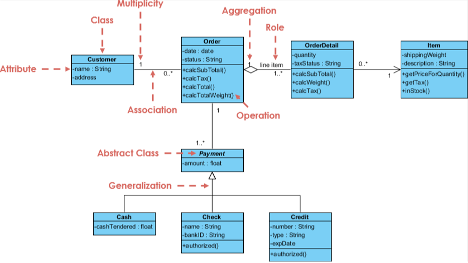
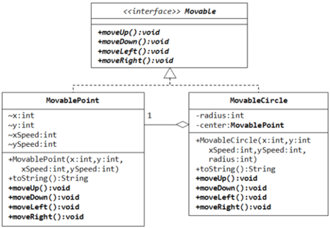

# Class Diagrams

## Purpose

This document is intended to provide a baseline understanding for what, why, and how to incorporate Class Diagrams as part of your engagement. Regarding the **how**, the section at the bottom will provide tools and plugins to automate as much as possible when generating Class Diagrams through VSCode.

[Wikipedia](https://en.wikipedia.org/wiki/Class_diagram) defines UML Class Diagrams as:

 > _a type of static structure diagram that describes the structure of a system by showing the system's classes, their attributes, operations (or methods), and the relationships among objects._

The key terms to make a note of here are:

- static structure
- showing the system's classes, attributes, operations, and relationships

Class Diagrams are a type of a static structure because it focuses on the properties, and relationships of classes. It is not supposed to inform about the data flow, the caller or callee responsibilities, the request flows, nor any other "behavior" related characteristics.

## Essential Takeaways

Each "Component" (Stand alone piece of software - think datastores, microservices, serverless functions, user interfaces, etc...) of a Product or System will have it's own Class Diagram.

Class Diagrams should tell a "story", where each Diagram will require Engineers to really think about:

- The responsibility / operations of each class. What can (should) the class perform?
- The class' attributes and properties. What can be set by an implementor of this class? What are all (if any) universally static properties?
- The visibility or accessibility that a class' operation may have to other classes
- The [relationship](https://en.wikipedia.org/wiki/Class_diagram#Relationships) between each class or the various instances

## When to Create?

Because Class Diagrams represent one of the more granular depiction of what a "product" or "system" is composed of, it is recommended to begin the creation of these diagrams at the beginning and throughout the engineering portions of an engagement.

This does mean that any code change (new feature, enhancement, code refactor) might involve updating one or many Class Diagrams. Although this might seem like a downside of Class Diagrams, it actually can become a very strong benefit.

Because Class Diagrams tell a "story" for each Component of a product (see the previous section), it requires a substantial amount of upfront thought and design considerations. This amount of upfront thought ultimately results in making more effective code changes, and may even minimize the level of refactors in future stages of the engagement.

Class Diagrams also provides quick "alert indicators" when a refactor might be necessary. Reasons could be due to seeing that a particular class might be doing too much, have too many dependencies, or when the codebase might produce a very "messy" or "chaotic" Class Diagram. **If the Class Diagram is unreadable, the code will probably be unreadable**

## Examples

One can find many examples online such as at [UML Diagrams](https://www.uml-diagrams.org/class-diagrams-examples.html).

Below are some basic examples:

## Versioning

Because Class Diagrams will be changing rapidly, essentially anytime a class is changed in the code, and because it might be very large in size, it's recommended to "publish" an image of the generated diagram periodically. The frequency might vary as the engagement proceeds.

The below approach can be used to assist the team on how often to update the published version of the diagram:

- Wait until the engagement progresses (maybe 10-20% completion) before publishing a Class Diagram. It is not worth publishing a Class Diagram from the beginning as it will be changing daily
- Once the most crucial classes are developed, update the published diagram periodically. Ideally whenever a large refactor or net new class is introduced. If the team uses an IDE plugin to automatically generate the diagram from their development environment, this becomes more of a documentation task rather than a necessity
- As the engagement approaches its end (90-100% completion), update the published diagram whenever a change to an existing class as part of a feature or story acceptance criteria

Depending on the tool being used, automatic versioning might be performed whenever an update to the Diagram is performed. If not, it is recommended to capture distinct versions whenever there is a particular customer need to have a snapshot of the project at a particular point in time. The hard requirement is that the latest diagram should be published and everyone should know how to access it as
the customer hand-off approaches.

## Resources

- [Wikipedia](https://en.wikipedia.org/wiki/Class_diagram)
- [Visual Paradigm](https://www.visual-paradigm.com/guide/uml-unified-modeling-language/uml-class-diagram-tutorial/#:~:text=A%20class%20diagram%20in%20the%20Unified%20Modeling%20Language,%28or%20methods%29%2C%204%20and%20the%20relationships%20among%20objects.)
- VS Code Plugins:
  - C#, Visual Basic, C++ using [Class Designer Component](https://marketplace.visualstudio.com/items?itemName=AlexShen.classdiagram-ts&ssr=false#overview)
  - TypeScript [classdiagram-ts](https://marketplace.visualstudio.com/items?itemName=AlexShen.classdiagram-ts&ssr=false#overview)
  - [PlantUML](https://marketplace.visualstudio.com/items?itemName=jebbs.plantuml) - requires a generator from code to PlantUML syntax to generate diagrams
    - [PlantUML Syntax](https://plantuml.com/class-diagram)
    - [C# to PlantUML](https://marketplace.visualstudio.com/items?itemName=pierre3.csharp-to-plantuml)
    - [Drawing manually](https://towardsdatascience.com/drawing-a-uml-diagram-in-the-vs-code-53c2e67deffe)
