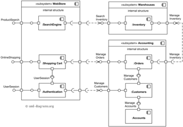
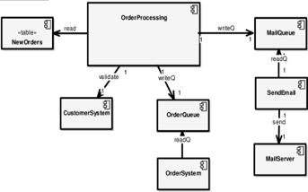
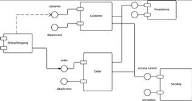

# Component Diagrams

## Purpose

This document is intended to provide a baseline understanding for what, why, and how to incorporate Component Diagrams
as part of your engagement. Regarding the **how**, the section at the bottom will provide tools and plugins to streamline as much as possible when generating Component Diagrams through VSCode.

[Wikipedia](https://en.wikipedia.org/wiki/Component_diagram) defines UML Component Diagrams as:

 > _a component diagram depicts how components are wired together to form larger components or software systems._

Component Diagrams are a type of a static structure because it focuses on the responsibility and relationships between components as part of the overall system or solution.

It is not supposed to inform about the data flow, the caller or callee responsibilities, the request flows, nor any other "behavior" related characteristics.

...Hold on a second... what is a Component?

A [Component](https://en.wikipedia.org/wiki/Component_(UML)) is a runnable solution that performs a set of operations and can possibly be interfaced through a particular API. One can think of Components as a "stand alone" piece of software - think datastores, microservices, serverless functions, user interfaces, etc...

## Essential Takeaways

The primary two takeaways from a Component Diagram should be:

- A quick view of all the various components (User Interface, Service, Data Storage) involved in the system
- The immediate "touch points" that a particular Component has with other Components, including how that "touch point" is accomplished (HTTP, FTP, etc...)

Depending on the complexity of the system, a team might decide to create several Component Diagrams. Where there is one diagram per Component (depicting all it's immediate "touch points" with other Components).

Or if a system is simple, the team might decide to create a single Component Diagram capturing all Components in the diagram.

## When to Create?

Because Component Diagrams represent a high level overview of the entire system from a Component focus, it is recommended to begin the creation of this diagram from the beginning of an engagement, and update it as the various Components are identified, developed, and introduced into the system. Otherwise, if this is left till later, then there is risk that:

- the team won't be able to identify areas of improvement
- the team or other necessary stakeholders won't have a full understanding on how the system works as it is being developed

Because of the inherent granularity of the system, the Component Diagrams won't have to be updated as often as [Class Diagrams](./class-diagrams.md). Things that might merit updating a Component Diagram could be:

- A deletion or addition of a new Component into the system
- A change to a system Component's interaction APIs
- A change to a system Component's immediate "touch points" with other Components

Because Component Diagrams focuses on informing the various "touch points" between Components, it requires some upfront thought in order to determine what Components are needed and what interaction mechanisms are most effective per the system requirements. This amount of upfront thought should be approached in a **pragmatic** manner - as the design may evolve over time, and that is perfectly fine,
 as long as changes are influenced based on functional requirements and non-functional requirements.

## Examples

Below are some basic examples:

## Versioning

Because Component Diagrams will be changing periodically, it's recommended to "publish" an image of the generated diagram periodically. The frequency might vary as the engagement proceeds.

The below approach can be used to assist the team on how often to update the published version of the diagram:

- At the beginning of the engagement, publishing an "envisioned" version of the Component Diagram will provide a common visual to all engineers when working on the different parts of the solution
- Throughout the engagement, update the published diagram periodically. Ideally whenever a new Component is introduced into the system, or whenever a new "touch point" occurs between Components

Depending on the tool being used, automatic versioning might be performed whenever an update to the Diagram is performed. If not, it is recommended to capture distinct versions whenever there is a particular customer need to have a snapshot of the project at a particular point in time. The hard requirement is that the latest diagram should be published and everyone should know how to access it as
 the customer hand-off approaches.

## Resources

- [Wikipedia](https://en.wikipedia.org/wiki/Component_diagram)
- [Visual Paradigm](https://www.visual-paradigm.com/guide/uml-unified-modeling-language/what-is-component-diagram/#:~:text=UML%20Component%20diagrams%20are%20used%20in%20modeling%20the,model%20the%20static%20implementation%20view%20of%20a%20system.)
- VS Code Plugins:
  - [PlantUML](https://marketplace.visualstudio.com/items?itemName=jebbs.plantuml) - requires a generator from code to PlantUML syntax to generate diagrams
    - [PlantUML Syntax](https://plantuml.com/component-diagram)
    - [Drawing manually](https://towardsdatascience.com/drawing-a-uml-diagram-in-the-vs-code-53c2e67deffe)
