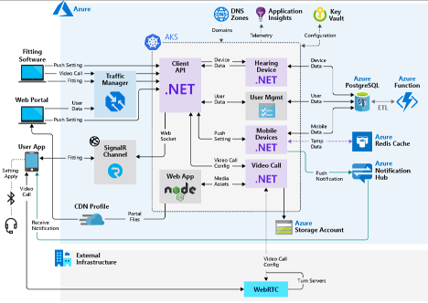
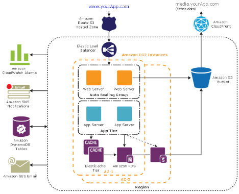

# Deployment Diagrams

## Purpose

This document is intended to provide a baseline understanding for what, why, and how to incorporate Deployment Diagrams
as part of your engagement.

[Wikipedia](https://en.wikipedia.org/wiki/Deployment_diagram) defines UML Deployment Diagrams as:

 > _models the physical deployment of artifacts on nodes_

Deployment Diagrams are a type of a static structure because it focuses on the infrastructure and hosting where all aspects of the system reside in.

It is not supposed to inform about the data flow, the caller or callee responsibilities, the request flows, nor any other "behavior" related characteristics.

## Essential Takeaways

The Deployment diagram should contain all Components identified in the [Component Diagram(s)](./component-diagrams.md), but captured alongside the following elements:

- Firewalls
- VNETs and subnets
- Virtual machines
- Cloud Services
- Data Stores
- Servers (Web, proxy)
- Load Balancers

This diagram should inform the audience:

- where things are hosted / running in
- what network boundaries are involved in the system

## When to Create?

Because Deployment Diagrams represent the final "hosting" architecture, it's recommended to create the "final envisioned" diagram from the beginning of an engagement. This allows the team to have a shared idea on what the team is working towards. Keep in mind that this might change if any non-functional requirement was not considered at the start of the engagement. This is okay, but
requires creating the necessary Backlog Items and updating the Deployment diagram in order to capture these changes.

It's also worthwhile to create and maintain a Deployment Diagram depicting the "current" state of the system. At times, it may be beneficial for there to be a Deployment Diagram per each environment (Dev, QA, Staging, Prod, etc...). However, this adds to the amount of maintenance required and should only be performed if there are substantial differences across environments.

The "current" Deployment diagram should be updated when:

- A new element has been introduced or removed in the system (see the "Essential Takeaways" section for a list of possible elements)

## Examples

Below are some basic examples:

## Versioning

Because Deployment Diagrams will be changing periodically, it's recommended to "publish" an image of the generated diagram periodically. The frequency might vary as the engagement proceeds.

The below approach can be used to assist the team on how often to update the published version of the diagram:

- At the beginning of the engagement, publishing an "envisioned" version of the Component Diagram will provide a common visual to all engineers when working on the different parts of the solution
- Throughout the engagement, update the "actual / current" diagram (state represented from the "main" branch) periodically. Ideally whenever a new Component is introduced into the system, or whenever a new "touch point" occurs between Components.

## Resources

- [Wikipedia](https://en.wikipedia.org/wiki/Deployment_diagram)
- [Visual Paradigm](https://www.visual-paradigm.com/guide/uml-unified-modeling-language/what-is-deployment-diagram/)
  - [PlantUML](https://marketplace.visualstudio.com/items?itemName=jebbs.plantuml) - requires a generator from code to PlantUML syntax to generate diagrams
    - [PlantUML Syntax](https://plantuml.com/deployment-diagram)
    - [Drawing manually](https://towardsdatascience.com/drawing-a-uml-diagram-in-the-vs-code-53c2e67deffe)
