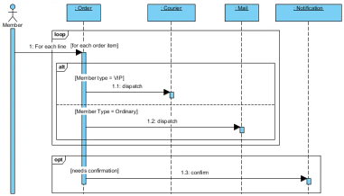
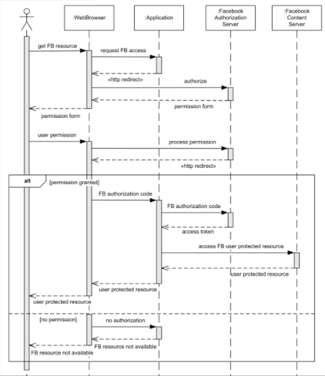

# Sequence Diagrams

## Purpose

This document is intended to provide a baseline understanding for what, why, and how to incorporate Sequence Diagrams
as part of an engagement. Regarding the **how**, the section at the bottom will provide tools and plugins to streamline as much as possible when generating Sequence Diagrams through VSCode.

[Wikipedia](https://en.wikipedia.org/wiki/Sequence_diagram) defines UML Sequence Diagrams responsible to:

 > _depict the objects involved in the scenario and the sequence of messages exchanged between the objects needed to carry out the functionality of the scenario_

What is a **scenario**? It can be:

- an actual user persona performing an action
- a system specific trigger (time based, condition based) that results in an action to occur

What is a **message** in this context? It can be:

- a synchronous or asynchronous request
- a transfer of any form of data between any objects

What is an **object** in this context? It can be:

- any specific user persona
- any service
- any data store
- a system (black box composed of unknown services, data stores or other components)
- an abstract sub-scenario (in order to minimize high complexity of a scenario)

## Essential Takeaways

A Sequence Diagram should:

- start with a **scenario**
- indicate which **object** or "actor" initiated that scenario
- have the scenario clearly indicate what the "end" state is, even if it doesn't necessarily end back with the object that initiated the scenario

It is okay for a single Sequence Diagram to have many different scenarios if they have some related context that merits them being grouped.

Another important thing to keep in mind, is that the **objects** involved in a Sequence Diagram should refer to existing Components from a [Component Diagram](./component-diagrams.md).

There are 2 areas where complexity can result in an overly "crowded" Sequence Diagram, making it costly to maintain. They are:

1. Large number of objects / components involved in a particular scenario
2. Capturing all the possible "failure" situations that a scenario may encounter

### Large Number of Objects

A Sequence Diagram typically starts with an end user persona performing an action, and then shows all the various components and request/data transfers that are involved in that scenario. However, more often than not, the complete end-to-end flow for that scenario may be too complex in order to capture within a single Sequence Diagram.

When this level of complexity occurs, consider creating separate **sub-scenario Sequence Diagrams**, and using it as an object in a particular Sequence Diagram. Examples for this are "Authentication" or "Authorization". Almost all user persona scenarios will have several objects/components involved in either of these sub-scenarios, but it is not necessary to include them in every Sequence Diagram
once the sub-scenarios have a stand-alone Sequence Diagram created.

Be sure that when using this approach of sub-scenarios to give it a name that encapsulates what the sub-scenarios is performing, and to determine the appropriate "actor" and "action" that initiates the sub-scenarios.

The combination and story telling between these **end user Sequence Diagrams** and the **sub-scenarios Sequence Diagrams** can greatly improve readability by distributing the level of complexity across multiple diagrams and take advantage of reusability of common sub-scenarios.

### Handling Large Number of Failure Situations

Another factor of high complexity is the possible failure situations that a particular scenario may encounter. Each object / component involved in the scenario could have several different "failure" situations, which could result in a very crowded and messy Sequence Diagram.

In order to make it realistic to manage all these scenarios, try to:

- Identify the most common failure situations that an "actor" may face as part of a scenario. Capturing these in a sequence diagram and documenting the other scenarios without having to manage them in a diagram will accomplish the goal of awareness
- "Bubble up" and "abstract" all the vast number of failure situations that can occur downstream in the system, and depict how the object / component closest to the "actor" handles all these failures and informs the "actor" of them

## When to Create?

Because Sequence Diagrams represent a detailed overview of the **behavior** of the system, outlining the various messages/requests sent within the system, it is recommended to begin the creation of these diagrams from the beginning of an engagement. While updating it as the various communications between Components are introduced into the system. The risks of not creating Sequence Diagrams
early on are that:

- the team will not create any because of it being perceived more as a "chore" instead of adding value
- the team will be unable to gain insights in time, from visualizing the various messages and requests sent between Components, in order to perform any potential refactoring
- the team or other necessary stakeholders won't have a complete understanding of the request/message/data flow within the system

Because of the inherent granularity of the system, the Sequence Diagrams won't have to be updated as often as [Class Diagrams](./class-diagrams.md), but may require more maintenance than [Component Diagrams](./component-diagrams.md). Things that might merit updating a Sequence Diagram could be:

- A new request/message/data being sent across Components involved in a scenario
- A change to one or several Components involved in a Sequence Diagram. Such as splitting a component into multiple ones, or consolidating many Components into a single one
- The introduction of a new Use Case or scenario that the system now supports

## Examples

Place Order Scenario:

- A "Member" user persona places an order, which can be composed of many "order items"
- The "Member" user persona can be either of type "VIP" or "Ordinary"
- Depending on the "Member type", each "order item" will be shipped using either a Courier or via Mail
- If the "Member" user persona selected the option to be informed once all "order items" have been shipped, then the system will send a notification

Facebook User Authentication Scenario:

- A user persona uses a Web Browser to interact with an "application" which tries to access a specific "Facebook resource"
- The "Facebook Authorization Server" is involved in order to have the user to authenticate with Facebook
- The user persona then receives a "permission form" in order to authorize the "application" access to the "Facebook resource"
- If the "application" was not authorized, then the "application" returns back an error
- If the "application" was authorized, then the "application" retrieves an "access token" from the "Facebook Authorization Server" and uses it to securely access the "Facebook resource" from the "Facebook Content Server". Once the content is obtained, the "application" sends it to the Web Browser

## Versioning

Because Sequence Diagrams are more expensive to maintain, it's recommended to "publish" an image of the generated diagram often, whenever a new "use case" or "scenario" is identified as part of the system behavior or requirements.

The most important element to these diagrams is to ensure that the latest version is **accurate**. If the latest diagram shows a sequence of communication between components that are no longer valid, then the diagram causes more harm than good.

The below approach can be used to assist the team on how often to update the published version of the diagram:

- At the beginning of the engagement, publishing an "envisioned" version of the Sequence Diagram will provide a common visual to all engineers when working on the different parts of the solution (focusing on the data flow and request flow)
- Throughout the engagement, update the published diagram periodically. Ideally whenever a new "use case" or "scenario" is identified, or when a Component is introduced or removed in the system, or when a change in data/request flow is made in the system

Depending on the tool being used, automatic versioning might be performed whenever an update to the Diagram is performed. If not, it is recommended to capture distinct versions whenever there is a particular customer need to have a snapshot of the project at a particular point in time. The hard requirement is that the latest diagram should be published and everyone should know how to access it as
the customer hand-off approaches.

## Resources

- [Wikipedia](https://en.wikipedia.org/wiki/Sequence_diagram)
- [Visual Paradigm](https://www.visual-paradigm.com/guide/uml-unified-modeling-language/what-is-sequence-diagram/)
- VS Code Plugins:
  - [PlantUML](https://marketplace.visualstudio.com/items?itemName=jebbs.plantuml) - requires a generator from code to PlantUML syntax to generate diagrams
    - [PlantUML Syntax](https://plantuml.com/sequence-diagram)
    - [Drawing manually](https://towardsdatascience.com/drawing-a-uml-diagram-in-the-vs-code-53c2e67deffe)
