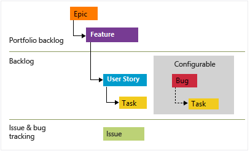
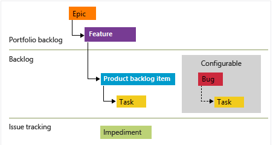

# Work Items

While many teams can work with a flat list of items, sometimes it helps to group related items into a hierarchical structure. You can use portfolio backlogs to bring more order to your backlog.

**Agile** process backlog work item hierarchy:

**Scrum** process backlog work item hierarchy:

Bugs can be set at the same level as User Stories / Product Backlog Items or Tasks.

## Epics and Features

User stories / Product Backlog Items roll up into **Features**, which typically represent a shippable deliverable that addresses a customer need e.g., "Add shopping cart". And Features roll up into **Epics**, which represent a business initiative to be accomplished e.g., "Increase customer engagement". Take that into account when naming them.

Each Feature or Epic should include as much detail as the team needs to:

- Understand the scope.
- Estimate the work required.
- Develop tests.
- Ensure the end product meets acceptance criteria.

Details that should be added:

- *Value Area*: Business (directly deliver customer value) vs. Architectural (technical services to implement business features).
- *Effort / Story Points / Size*: Relative estimate of the amount of work required to complete the item.
- *Business Value*: Priority of an item compared to other items of the same type.
- *Time Criticality*: Higher values indicate an item is more time critical than items with lower values.
- *Target Date* by which the feature should be implemented.

You may use work item tags to support queries and filtering.

## User Stories / Product Backlog Items

Each User Story / Product Backlog Item should be sized so that they can be completed within a sprint.

You should add the following details to the items:

- *Title*: Usually expressed as "As a [persona], I want [to perform an action], so that [I can achieve an end result].".
- *Description*: Provide enough detail to create shared understanding of scope and support estimation efforts. Focus on the user, what they want to accomplish, and why. Don't describe how to develop the product. Provide enough details so the team can write tasks and test cases to implement the item.
  - Include Design Reviews.
- *Acceptance Criteria*: Define what "Done" means.
- *Activity*: Deployment, Design, Development, Documentation, Requirements, Testing.
- *Effort / Story Points / Size*: Relative estimate of the amount of work required to complete the item.
- *Business Value*: Priority of an item compared to other items of the same type.
- *Original Estimate*: The amount of estimated work required to complete a task.

Remember to use the *Discussion* section of the items to keep track of related comments, and mention individuals, groups, work items or pull requests when required.

## Tasks

Each Task should be sized so that they can be completed within a day.

You should at least add the following details to the items:

- *Title*.
- *Description*: Provide enough detail to create shared understanding of scope. Any developer should be able to take the item and know what needs to be implemented.
  - Include Design Reviews.
- Reference to the working *branch* in related code repository.

Remember to use the Discussion section of the tasks to keep track of related comments.

## Bugs

You should use bugs to capture both the initial issue and ongoing discoveries.

You should at least add the following details to the bug items:

- *Title*.
- *Description*.
- *Steps to Reproduce*.
- *System Info* / *Found in Build*: Software and system configuration that is relevant to the bug and tests to apply.
- *Acceptance Criteria*: Criteria to meet so the bug can be closed.
- *Integrated in Build*: Name of the build that incorporates the code that fixes the bug.
- *Priority*:
  - 1: Product should not ship without the successful resolution of the work item. The bug should be addressed as soon as possible.
  - 2: Product should not ship without the successful resolution of the work item, but it does not need to be addressed immediately.
  - 3: Resolution of the work item is optional based on resources, time, and risk.
- *Severity*:
  - 1 - Critical: Must fix. No acceptable alternative methods.
  - 2 - High: Consider fix. An acceptable alternative method exists.
  - 3 - Medium: (Default).
  - 4 - Low.

## Issues / Impediments

Don't confuse with bugs. They represent unplanned activities that may block work from getting done. For example: feature ambiguity, personnel or resource issues, problems with environments, or other risks that impact scope, quality, or schedule.

In general, you link these items to user stories or other work items.

## Actions from Retrospectives

After a retrospective, every action that requires work should be tracked with its own Task or Issue / Impediment. These items might be unparented (without link to parent backlog item or user story).

## Related information

- [Best practices for Agile project management - Azure Boards | Microsoft Docs](https://learn.microsoft.com/azure/devops/boards/best-practices-agile-project-management?view=azure-devops&tabs=agile-process).
- [Define features and epics, organize backlog items - Azure Boards | Microsoft Docs](https://learn.microsoft.com/azure/devops/boards/backlogs/define-features-epics?view=azure-devops&tabs=scrum-process).
- [Create your product backlog - Azure Boards | Microsoft Docs](https://learn.microsoft.com/azure/devops/boards/backlogs/create-your-backlog?view=azure-devops&tabs=agile-process).
- [Add tasks to support sprint planning - Azure Boards | Microsoft Docs](https://learn.microsoft.com/azure/devops/boards/sprints/add-tasks?view=azure-devops).
- [Define, capture, triage, and manage bugs or code defects - Azure Boards | Microsoft Docs](https://learn.microsoft.com/azure/devops/boards/backlogs/manage-bugs?view=azure-devops).
- [Add and manage issues or impediments - Azure Boards | Microsoft Docs](https://learn.microsoft.com/azure/devops/boards/backlogs/manage-issues-impediments?view=azure-devops).
