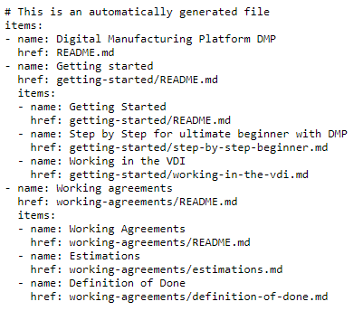
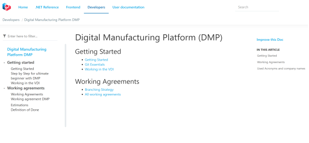

# Providing quality documentation in your project with DocFx and Companion Tools

For every project documentation is key to make sure you describe decisions, implementations, guidelines and end-user documentation. And when a project team gets larger, communication becomes more and more important. In the engagement we worked on with an enterprise customer (100+ team members) we came up with a structure, guidelines and tools to provide quality documentation, both for developers and for end-users.

The core of the solution is using markdown files and [DocFx](https://dotnet.github.io/docfx/). What you can do with DocFx is take markdown files and structured comments from code to generate a static website for structuring documentation, including fast search capabilities.

But of course, not everything comes out of the box. You still need a way to structure documentation, and there are gaps in the functionality of DocFx that are left to the users of that platform to decide on. We therefor created a few companion tools for DocFx next to guidelines. In this document we share those best practices for easy implementation in your project as well.

## Challenges and Objectives

A few things needed to be added to the work DocFx already does:

* Generate a table of contents to structure documentation

* Ensure there are no dead links and no orphaned attachments for quality

* Support multiple languages for end-user documentation

* Provide guidelines for writing documents and providing structure

* Create your own look and feel for the website

Although we created a template for the UI, it was just following the general approach as described in the documentation of DocFx, for instance [How-to: Create a Custom Template](https://dotnet.github.io/docfx/tutorial/howto_create_custom_template.html). We won’t go into detail about this here. We won’t cover either how to add your own transformations, but it is well covered in the article [How-to: Build your own type of documentation with a custom plug-in](https://dotnet.github.io/docfx/tutorial/howto_build_your_own_type_of_documentation_with_custom_plug-in.html).

## Generate a table of contents to structure documentation

DocFx uses a YAML file to define a table of contents. But there is no out-of-the-box solution to fill this with documents from a source. When you have thousands of documents, you want to make sure you have an easy to maintain solution. So for this purpose we created a generic companion tool called **TocDocFxCreation**. This is a command line tool that can also be used in a pipeline to generate a table of contents.

This tool takes a single folder as root of the documentation hierarchy. It traverses all folders and make an entry for all markdown files and folders containing them. So, the hierarchy is defined by the folder hierarchy basically. The result is something like this (small part of it).



DocFx will take this toc-file and generate a static website in this structure with HTML-pages for each document. And there is a template for the navigation and the look-and-feel of the website. It looks like this:



## Documentation website look and feel

Although this looks nice, we found some issues with the way the selection of a first topic was made. If you open for instance the “Getting started” menu item, it will by default show the first document alphabetically. This doesn’t always make that much sense. For instance, for the “Getting started” topic we wanted to show the basic Getting Started instructions, which were captured in README.md. And sometime there isn’t a logical standard document to begin with at all.

To solve this issue, we added some logic to detect the existence of a README.md or Index.md in a folder. If that exists, that one will become the first one in the list of articles for that folder. But we also added the possibility to generate an Index.md file containing the list of articles in that folder. That way you get a nice index page with a list of articles which makes more sense.

Still the rest of the articles in the folder are ordered alphabetically. Sometimes you want to make sure there is a specific sequence of documents. For that purpose, we added to option to use a _.order_ file in a folder. That file is a text-file that contains a list document names without the extension. That order will be taken first.

All files not mentioned in that file will then be ordered alphabetically after the defined list. This way we make sure that no files disappear from the documentation website by accident. Note that this same _.order_ file is used by [Azure DevOps](https://dev.azure.com) when you use the code as wiki capability. We have activated this feature allowing to manage the content for the documentations as code.

The last option we added to the tool is to override the used names for the documents. By default we read the contents of each markdown file and take the h1-title, usually the first line of the document. But the tool can also scan for _.override_ files per folder. In this file you can configure other titles for a file by listing them as `filename without extension;preferred title`. This will then override the default behavior. This is very useful in a multi-language documentation with the same structure. You want the end user to see the folder name in his own language.

Now we have everything in place to generate a nicely structured website. Or do we?

## Ensure there are no dead links and no orphaned attachments for quality

We found that it is easy to make mistakes while writing documents. Even if tools like Visual Studio Code, Typora or others will help you reference other files, it turned out that we had broken links. Sometimes the link was just entered wrong. Or the file was moved and the relative path wasn’t working anymore. Or the referenced file was deleted, moved or renamed.

In our project we defined a standard to store all attachments for reference from the markdown files (like images and such) in the _.attachments_ folder created under the root documentation folder. But we saw the folder piling up with files that were never referenced anymore. Same as for the _.order_ mechanism, we’ve leveraged the structure Azure DevOps provides with this _.attachments_ folder.

To solve this issue, we wrote the **DocLinkChecker** companion tool. This is also a command line tool taking switches to do his work. This tool can also be used in a pipeline.

The tool takes the root of the documentation folder as parameter. It will then traverse the hierarchy of folders and markdown files like the _TocDocFxCreation_ tool does. It will read the contents of all markdown files and check all relative references if they can be resolved in the folder-tree. If not, an error is given with filename, line number and position of the faulty link. In a quality assurance pipeline this prevents to merge the document if the links are not corrected.

The tool can also collect a list of all references from the scan as described. It will then check all files in the _.attachments_ folder if they are referenced. Any orphaned file will be reported in the output.

There is even an option to let the tool cleanup orphaned files from _.attachments_. This option is hard to use in a pipeline, as you are changing the branch. Especially in environments using pull requests to bring changes into the main development branch. But you can use the tool in a local environment to make sure it’s cleaned up.

## Support multiple languages for end-user documentation

The developer documentation is usually written in 1 language without translations. But for end-user documentation there is a need to offer multiple languages. Where writing end-user documentation is already a time-consuming task, translating it is making the process even harder. You also must take changes in the original text into account for instance.

To help you get started with this task we create the **DocLanguageTranslator** companion tool. This tool uses the [Azure Cognitive Services](https://azure.microsoft.com/services/cognitive-services/) to translate text to another language. This can be done for each file in the original hierarchy and then for each paragraph. It is also able to check if all files exist in all languages.

As said, this tool is to help you get started, not the definitive solution to just use and it always works. Translations are not perfect and there are also issues that reference might be translated where it will result in broken references. Of course, you can use the _DocLinkChecker_ tool again to validate this. This tool to generate missing document pages is intended to be used during the documentation creation phase.

The same tool allows to check the integrity of the end user documentation. The structure we’ve been using is a per language sub folder approach:

```yaml
/userdocs /.attachments picture-en.jpg picture-de.jpg photo.png otherdoc.pptx /en index.md /plant-production morefiles.md and-more.md /de .override index.md /plant-production morefiles.md and-more.mdindex.mdtoc.yml
```

This structure allows to create deep link from a UI based on the user language to point directly on the right page. And that’s the key reason why you’ll have to use the tool to check the integrity of the structure.

A TOC is generated per language, so the user will have its own local one in its own language. The _TocDocFxCreation_ tool will take care of that. The only TOC that needs to exist is the main one with only few entries.

## Provide guidelines for writing documents and providing structure

Now that we have the mechanics of the folders and files in place, we want to make sure that the documents are properly structured. For that purpose, we created guidelines for writing markdown files. It has some best practices, naming conventions and practical tips to get you started.

We also wanted to enforce quality of the documents using a special linter for markdown. For this purpose, we’ve used [markdownlint](https://github.com/markdownlint/markdownlint) as tool in the pipelines. This tool can be configured like any other linter to select which rules you want to enforce, or which rules you want to skip. By adding this file to your repository, the tool can pick it up locally as well. This gives the writer the opportunity to pre-test documentation locally first before pushing it into the main repository.

## Integrating documentation in your CI/CD pipelines

We created the website on Azure with an App Service using a Terraform-script to make sure it’s always created in the same way. It uses an Azure Key Vault to store the SSL certificate. And we added security to the website for internal use only. This is the script we used. We have variables to provide the common resource group, the location, the app name, the key vault name, the app hostname and the client id for AzureAD authentication.

In our CI pipeline we added a pipeline to validate all documentation before it’s pushed into the main branch. In this pipeline we essentially run markdownlint and the _DocLinkChecker_ tool to validate the documents. As this is very fast, it is okay to validate all markdown files with every PR.

The CD pipeline for generation of the website is a more time-consuming process. Therefor we chose to do this on a schedule — in our case on Monday, Wednesday and Friday at 6:00am. Whenever we have a change we need to push outside of this schedule, we just run the pipeline manually. The pipeline runs the _TocDocFxCreation_ tool, the _DocLinkChecker_ tool and, if they succeed, we run DocFx to generate the static website and publish it to the Azure App Service.

## Summary

All tools and documents can be found in a public repository called [docfx-companion-tools](https://github.com/Ellerbach/docfx-companion-tools). You can find the sources of the tools there if you want to change the behavior or enhance it. Also, guideline-documents can be found there which can be copied into your own repository to share in your team. We also included some extra links to resources.

We hope you like it, and it will help you deliver higher quality documentation in your projects as well.

## Resources

· [Github repository with DocFx companion tools](https://github.com/Ellerbach/docfx-companion-tools)

· [DocFx](https://dotnet.github.io/docfx/)

· [Markdownlinter](https://github.com/markdownlint/markdownlint)

· [Azure Cognitive Services](https://azure.microsoft.com/services/cognitive-services/)
