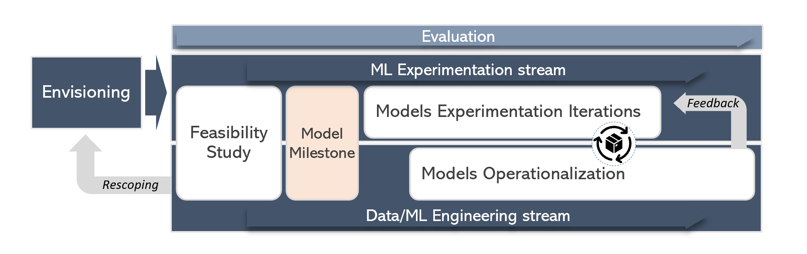

# Machine Learning Fundamentals at ISE

This guideline documents the Machine Learning (ML) practices in ISE. ISE works with customers on ML/AI projects and putting them in production, with an emphasis on engineering and research best practices throughout the project's life cycle.

## Goals

* Provide a set of ML practices to follow in an ML project.
* Provide clarity on ML process and how it fits within a software engineering project.
* Provide best practices for the different stages of an ML project.

## How to use these Fundamentals

* If you are starting a new ML project, consider reading through the [general guidance documents](#general-guidance).
* For specific aspects of an ML project, refer to the guidelines for different [project phases](#ml-project-phases).

## ML Project Phases

The diagram below shows different phases in an ideal ML project. Due to practical constraints and requirements, it might not always be possible to have a project structured in such a manner, however best practices should be followed for each individual phase.

* **[Envisioning](./envisioning-and-problem-formulation.md)**: Initial problem understanding, customer goals and objectives.
* **[Feasibility Study](./feasibility-studies.md)**: Assess whether the problem in question is feasible to solve satisfactorily using ML with the available data.
* **Model Milestone**: There is a basic model that is achieving the minimum required performance, both in terms of ML performance and system performance. Using the knowledge gathered to this milestone, define the scope, objectives, high-level architecture, definition of done and plan for the entire project.
* **[Model(s) experimentation](./model-experimentation.md)**: Tools and best practices for conducting successful model experimentation.
* **Model(s) Operationalization**: [Model readiness for production](ml-model-checklist.md) checklist.

## General Guidance

* [ML Process Guidance](./proposed-ml-process.md)
* [ML Fundamentals checklist](./ml-fundamentals-checklist.md)
* [Data Exploration](./data-exploration.md)
* [Agile ML development](./agile-development-considerations-for-ml-projects.md)
* [Testing Data Science and ML Ops code](./testing-data-science-and-mlops-code.md)
* [Profiling Machine Learning and ML Ops code](./profiling-ml-and-mlops-code.md)
* [Responsible AI](./responsible-ai.md)
* [Program Management for ML projects](./tpm-considerations-for-ml-projects.md)

## Resources

* [Model Operationalization](https://github.com/Microsoft/MLOps)
