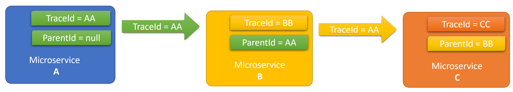

# Observability in Microservices

Microservices is a very popular software architecture, where the application is arranged as a collection of loosely coupled services. Some of those services can be written in different languages by different teams.

## Motivations

We need to consider special cases when creating a microservice architecture from the perspective of observability. We want to capture the interactions when making requests between those microservices and correlate them.

Imagine we have a microservice that accesses a database to retrieve some data as part of a request. This microservice is going to be called by someone else as part of an incoming http request or an internal process being executed. What happens if a problem occurs during the retrieval of the data (or the update of the data)? How can we associate, or correlate, that this particular call failed in the destination microservice?

This is a common issue. When calling other microservices, depending on the technology stack we use, we can accidentally hide errors and exceptions that might happen on the other side. If we are using a simple REST interface, the other microservice can return a 500 HTTP status code and we don't have any idea what happen inside that microservice.

More important, we don't have any way to associate our Correlation Id to whatever happens inside that microservice. Therefore, is so important to have a plan in place to be able to extend your traceability and monitoring efforts, especially when using a microservice architecture.

## How to Extend Your Tracing Information Between Microservices

The W3C consortium is working on a [Trace Context](https://www.w3.org/TR/trace-context/) definition that can be applied when using HTTP as the protocol in a microservice architecture. But let's explain how we can implement this functionality in our software.

The main idea behind this is to propagate the correlation information between HTTP request so other pieces of software can read this information and correctly correlate telemetry across microservices.

The way to propagate this information is to use HTTP Headers for the Correlation Id, parent Correlation Id, etc.

When you are in the scope of a HTTP Request, your tracing system should already have created four properties that you can use to send across your microservices.

- RequestId:0HLQV2BC3VP2T:00000001,
- SpanId:da13aa3c6fd9c146,
- TraceId:f11a03e3f078414fa7c0a0ce568c8b5c,
- ParentId:5076c17d0a604244

This is an example of the four properties you can find which identify the current request.

- RequestId is the unique id that represent the current HTTP Request.
- SpanId is the default automatically generated span. You can have more than one Span that scope different functionality inside your software.
- TraceId represent the id for current log trace.
- ParentId is the parent span id, that in some case can be the same or something different.

## Example

Now we are going to explore an example with 3 microservices that calls to each other in a row.

This image is the summary of what is needed in each microservice to propagate the trace-id from A to C.

The root caller is A and that is why it doesn't have a parent-id, only have a new trace-id. Next, A calls B using HTTP. To propagate the correlation information as part of the request, we are using two new headers based on the W3C Correlation specification, trace-id and parent-id. In this example because A is the root caller, A only sends its own trace-id to microservice B.

When microservice B receives the incoming HTTP request, it checks the contents of these two headers. It reads the content of the trace-id header and sets its own parent-id to this trace-id (as shown in the green rectangle inside's B). In addition, it creates a new trace-id to signal that is a new scope for the telemetry. During the execution of microservice B, it also calls microservice C and repeats the pattern. As part of the request it includes the two headers and propagates trace-id and parent-id as well.

Finally, microservice C, reads the value for the incoming trace-id and sets as his own parent-id, but also creates a new trace-id that will use to send telemetry about his own operations.

## Summary

A number of Application Monitoring (APM) technology products already supports most of this Correlation Propagation. The most popular is [OpenZipkin/B3-Propagation](https://github.com/openzipkin/b3-propagation). W3C already proposed a recommendation for the [W3C Trace Context](https://www.w3.org/blog/2019/12/trace-context-enters-proposed-recommendation/), where you can see what SDK and frameworks already support this functionality. It's important to correctly implement the propagation specially when there are different teams that used different technology stacks in the same project.

>Consider using [OpenTelemetry](./tools/OpenTelemetry.md) as it implements open-source cross-platform context propagation for end-to-end distributed transactions over heterogeneous components out-of-the-box. It takes care of automatically creating and managing the Trace Context object among a full stack of microservices implemented across different technical stacks.
