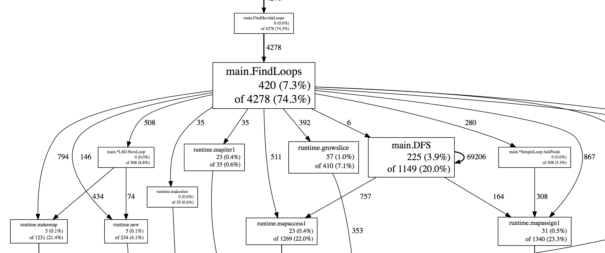
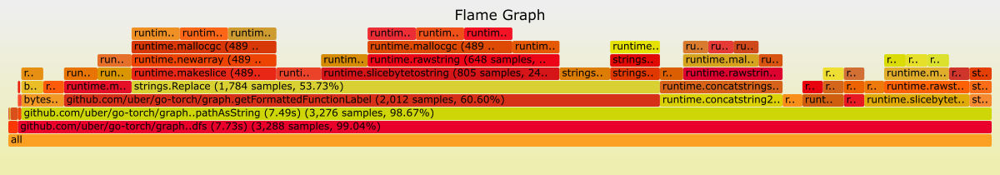

# Profiling

## Overview

Profiling is a form of runtime analysis that measures various components of the runtime such as, memory allocation, garbage collection, threads and locks, callstacks, or frequency and duration of specific functions. It can be used to see which functions are the most costly in your binary, allowing you to focus your effort on removing the largest inefficiencies as quickly as possible. It can help you find deadlocks, memory leaks, or innefficient memory allocaiton, and help inform decisions around resource allocation (ie: CPU or RAM).

## How to Profile your Applications

Profiling is somewhat language dependent, so start off by searching for "profile $language" (some common tools are listed below). Additionally, Linux Perf is a good fallback, since a lot of languages have bindings in C/C++.

Profiling does incur some cost, as it requires inspecting the callstack, and sometimes pausing the applicaiton alltogether (ie: to trigger a full GC in Java). It is recommended to continuously profile your services, say for 10s every 10 minutes. Consider the cost when deciding on tuning these parameters.

Different tools visualize profiles differently. Common CPU profiles might use a directed graph  or a flame graph. 

Unfortunately, each profiler tool typically uses it's own format for storing profiles, and comes with its own visualization.

## Specific tools

- (Java, Go, Python, Ruby, eBPF) [Pyroscope](https://github.com/pyroscope-io/pyroscope) coninuous profiling out of the box.
- (Java and Go) [Flame](https://github.com/VerizonMedia/kubectl-flame) - profiling containers in Kubernetes
- (Java, Python, Go) [Datadog Continuous profiler](https://www.datadoghq.com/product/code-profiling/)
- (Java, Python, Go, Node.js) [Instana](https://www.instana.com/blog/instana-announces-the-industrys-first-commercial-continuous-production-profiler/)
- (Go) [profefe](https://github.com/profefe/profefe), which builds `pprof` to provide continuous profiling
- (Java) [Opsian](https://opsian.com/)
- (Java) [Eclipse Memory Analyzer](https://www.eclipse.org/mat/)
