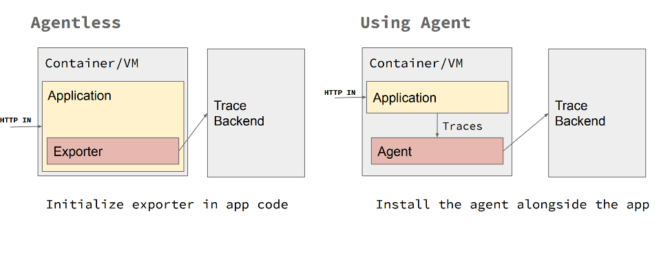
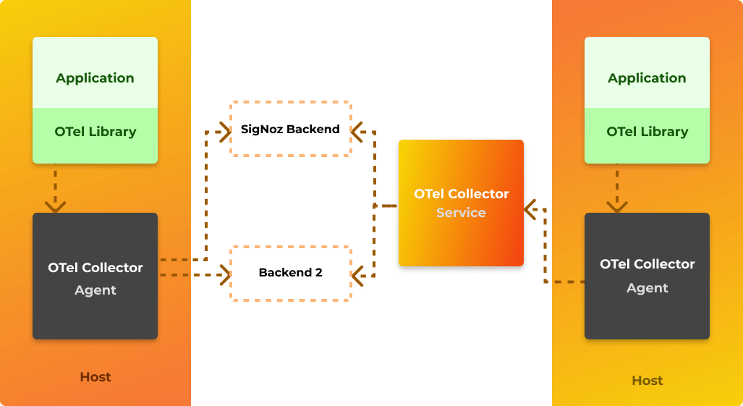
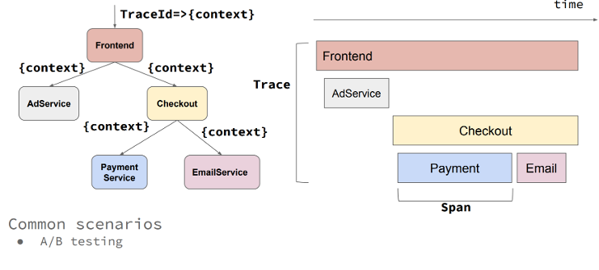
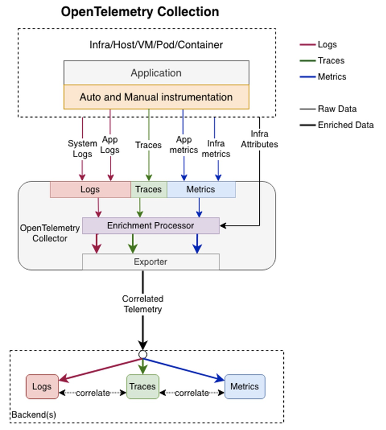

# Open Telemetry

Building observable systems enable one to measure how well or bad the application is behaving and WHY it is behaving either way. Adopting open-source standards related to implementing telemetry and tracing features built on top of the OpenTelemetry framework helps decouple vendor-specific implementations while maintaining an extensible, standard, and portable open-source solution.

OpenTelemetry is an open-source observability standard that defines how to generate, collect and describe telemetry in distributed systems. OpenTelemetry also provides a single-point distribution of a set of APIs, SDKs, and instrumentation libraries that implements the open-source standard, which can collect, process, and orchestrate telemetry data (signals) like traces, metrics, and logs. It supports multiple popular languages (Java, .NET, Python, JavaScript, Golang, Erlang, etc.). Open telemetry follows a vendor-agnostic and standards-based approach for collecting and managing telemetry data. An important point to note is that OpenTelemetry does not have its own backend; all telemetry collected by OpenTelemetry Collector must be sent to a backend like Prometheus, Jaeger, Zipkin, Azure Monitor, etc. Open telemetry is also the 2nd most active CNCF project only after Kubernetes.

The main two Problems OpenTelemetry solves are: First, vendor neutrality for tracing, monitoring, and logging APIs and second, out-of-the-box cross-platform context propagation implementation for end-to-end distributed tracing over heterogeneous components.

## Open Telemetry Core Concepts

### Open Telemetry Implementation Patterns

A detailed explanation of OpenTelemetry concepts is out of the scope of this repo. There is plenty of available information about how the SDK and the automatic instrumentation are configured and how the Exporters, Tracers, Context, and Span's hierarchy work. See the Reference section for valuable OpenTelemetry resources.

However, understanding the core implementation patterns will help you know what approach better fits the scenario you are trying to solve. These are three main patterns as follows:

* Automatic telemetry: Support for automatic instrumentation is available for some languages. OpenTelemetry automatic instrumentation (100% codeless) is typically done through library hooks or monkey-patching library code. Automatic instrumentation will intercept all interactions and dependencies and automatically send the telemetry to the configured exporters. More information about this concept can be found in the [OpenTelemetry instrumentation doc](https://opentelemetry.io/docs/instrumentation/).
* Manual tracing: This must be done by coding using the OpenTelemetry SDK, managing the `tracer` objects to obtain Spans, and forming instrumented OpenTelemetry Scopes to identify the code segments to be manually traced. Also, by using the @WithSpan annotations (method decorations in C# and [Java](https://opentelemetry.io/docs/instrumentation/java/automatic/annotations/#creating-spans-around-methods-with-withspan)) to mark whole methods that will be automatically traced.
* Hybrid approach: Most Production-ready scenarios will require a mix of both techniques, using the automatic instrumentation to collect automatic telemetry and the OpenTelemetry SDK to identify code segments that are important to instrument manually. When considering production-ready scenarios, the hybrid approach is the way to go as it allows for a throughout cover over the whole solution. It provides automatic context propagation and events correlation out of the box.

### Collector

[The collector](https://opentelemetry.io/docs/collector/) is a separate process that is designed to be a ‘sink’ for telemetry data emitted by many processes, which can then export that data to backend systems. The collector has two different [deployment strategies](https://opentelemetry.io/docs/collector/deployment/) – either running as an agent alongside a service or as a gateway which is a remote application. In general, using both is recommended: the agent would be deployed with your service and run as a separate process or in a sidecar; meanwhile, the collector would be deployed separately, as its own application running in a container or virtual machine. Each agent would forward telemetry data to the collector, which could then export it to a variety of backend systems such as Lightstep, Jaeger, or Prometheus. The agent can be also replaced with the automatic instrumentation if supported. The automatic instrumentation provides the collector capabilities of retrieving, processing and exporting the telemetry.

Regardless of how you choose to instrument or deploy OpenTelemetry, exporters provide powerful options for reporting telemetry data. You can directly export from your service, you can proxy through the collector, or you can aggregate into standalone collectors – or even a mix of these.

### Instrumentation Libraries

A library that enables observability for another library is called an instrumentation library. [OpenTelemetry libraries](https://opentelemetry.io/docs/concepts/instrumenting/) are language specific, currently there is good support for Java, Python, Javascript, dotnet and golang. Support for automatic instrumentation is available for some libraries which make using OpenTelemetry easy and trivial. In case automatic instrumentation is not available, manual instrumentation can be configured by using the OpenTelemetry SDK.

## Integration of OpenTelemetry

OpenTelemetry can be used to collect, process and export data into multiple backends, some popular integrations supported with OpenTelemetry are:

1. Zipkin
2. Prometheus
3. Jaeger
4. New Relic
5. Azure Monitor
6. AWS X-Ray
7. Datadog
8. Kafka
9. Lightstep
10. Splunk
11. GCP Monitor

## Why use OpenTelemetry

The main reason to use OpenTelemetry is that it offers an open-source standard for implementing distributed telemetry (context propagation) over heterogeneous systems. There is no need to reinvent the wheel to implement end-to-end business flow transactions monitoring when using OpenTelemetry.

It enables tracing, metrics, and logging telemetry through a set of single-distribution multi-language libraries and tools that allow for a plug-and-play telemetry architecture that includes the concept of agents and collectors.

Moreover, avoiding any proprietary lock down and achieving vendor-agnostic neutrality for tracing, monitoring, and logging APIs AND backends allow maximum portability and extensibility patterns.

Another good reason to use OpenTelemetry would be whether the stack uses OpenCensus or OpenTracing. As OpenCensus and OpenTracing have carved the way for OpenTelemetry, it makes sense to introduce OpenTelemetry where OpenCensus or OpenTracing is used as it still has backward compatibility.

Apart from adding custom attributes, sampling, collecting data for metrics and traces, OpenTelemetry is governed by specifications and backed up by big players in the Observability landscape like Microsoft, Splunk, AppDynamics, etc. OpenTelemetry will likely become a de-facto open-source standard for enabling metrics and tracing when all features become GA.

## Current Status of OpenTelemetry Project

OpenTelemetry is a project which emerged from merging of OpenCensus and OpenTracing in 2019. Although OpenCensus and OpenTracing are frozen and no new features are being developed for them, OpenTelemetry has backward compatibility with OpenCensus and OpenTracing. Some features of OpenTelemetry are still in beta, feature support for different languages is being tracked here: [Feature Status of OpenTelemetry](https://github.com/open-telemetry/opentelemetry-specification/blob/main/spec-compliance-matrix.md). Status of OpenTelemetry project can be tracked [here](https://opentelemetry.io/status/).

From the website:

>Our goal is to provide a generally available, production quality release for the tracing data source across most OpenTelemetry components in the first half of 2021. Several components have already reached this milestone! We expect metrics to reach the same status in the second half of 2021 and are targeting logs in 2022.

## What to Watch Out for

As OpenTelemetry is a very recent project (first GA version of some features released in 2020), many features are still in beta hence due diligence needs to be done before using such features in production. Also, OpenTelemetry supports many popular languages but features in all languages are not at par. Some languages offer more features as compared to other languages. It also needs to be called out as some features are not in GA, there may be some incompatibility issues with the tooling. That being said, OpenTelemetry is one of the most active projects of [CNCF](https://www.cncf.io), so it is expected that many more features would reach GA soon.

### January 2022 UPDATE

Apart from the logging specification and implementation that are still marked as draft or beta, all other specifications and implementations regarding tracing and metrics are marked as stable or feature-freeze. Many libraries are still on active development whatsoever, so thorough analysis has to be made depending on the language on a feature basis.

## Integration Options with Azure Monitor

### Using the Azure Monitor OpenTelemetry Exporter Library

This scenario uses the OpenTelemetry SDK as the core instrumentation library. Basically this means you will instrument your application using the OpenTelemetry libraries, but you will additionally use the Azure Monitor OpenTelemetry Exporter and then added it as an additional exporter with the OpenTelemetry SDK. In this way, the OpenTelemetry traces your application creates will be pushed to your Azure Monitor Instance.

### Using the Application Insights Agent Jar File - Java Only

Java OpenTelemetry instrumentation provides another way to integrate with Azure Monitor, by using [Applications Insights Java Agent jar](https://learn.microsoft.com/en-us/azure/azure-monitor/app/java-in-process-agent).

When configuring this option, the Applications Insights Agent file is added when executing the application. The `applicationinsights.json` configuration file must be also be added as part of the applications artifacts. Pay close attention to the preview section, where the `"openTelemetryApiSupport": true,` property is set to true, enabling the agent to intercept OpenTelemetry telemetry created in the application code pushing it to Azure Monitor.

OpenTelemetry Java Agent instrumentation supports many [libraries and frameworks and application servers](https://github.com/open-telemetry/opentelemetry-java-instrumentation/blob/main/docs/supported-libraries.md#supported-libraries-frameworks-application-servers-and-jvms). Application Insights Java Agent [enhances](https://learn.microsoft.com/en-us/azure/azure-monitor/app/java-in-process-agent#auto-instrumentation) this list.
Therefore, the main difference between running the OpenTelemetry Java Agent vs. the Application Insights Java Agent is demonstrated in the amount of traces getting logged in Azure Monitor. When running with Application Insights Java agent there's more telemetry getting pushed to Azure Monitor. On the other hand, when running the solution using the Application Insights agent mode, it is essential to highlight that nothing gets logged on Jaeger (or any other OpenTelemetry exporter). All traces will be pushed exclusively to Azure Monitor. However, both manual instrumentation done via the OpenTelemetry SDK and all automatic traces, dependencies, performance counters, and metrics being instrumented by the Application Insights agent are sent to Azure Monitor. Although there is a rich amount of additional data automatically instrumented by the Application Insights agent, it can be deduced that it is not necessarily OpenTelemetry compliant. Only the traces logged by the manual instrumentation using the OpenTelemetry SDK are.

#### OpenTelemetry vs Application Insights Agents Compared

| Highlight                                                                | OpenTelemetry Agent | App Insights Agent |
|--------------------------------------------------------------------------|---------------------|--------------------|
| Automatic Telemetry                                                      | Y                   | Y                  |
| Manual OpenTelemetry                                                     | Y                   | Y                  |
| Plug and Play Exports                                                    | Y                   | N                  |
| Multiple Exports                                                         | Y                   | N                  |
| Full Open Telemetry layout (decoupling agents, collectors and exporters) | Y                   | N                  |
| Enriched out of the box telemetry                                        | N                   | Y                  |
| Unified telemetry backend                                                | N                   | Y                  |

#### Summary

As you may have guessed, there is no "one size fits all" approach when implementing OpenTelemetry with Azure Monitor as a backend. At the time of this writing, if you want to have the flexibility of having different OpenTelemetry backends, you should definitively go with the OpenTelemetry Agent, even though you'd sacrifice all automating tracing flowing to Azure Monitor.
On the other hand, if you want to get the best of Azure Monitor and still want to instrument your code with the OpenTelemetry SDK, you should use the Application Insights Agent and manually instrument your code with the OpenTelemetry SDK to get the best of both worlds.
Either way, instrumenting your code with OpenTelemetry seems the right approach as the ecosystem will only get bigger, better, and more robust.

## Advanced topics

Use the [Azure OpenTelemetry Tracing plugin library for Java](https://github.com/Azure/azure-sdk-for-java/tree/main/sdk/core/azure-core-tracing-opentelemetry) to enable distributed tracing across Azure components through OpenTelemetry.

### Manual Trace Context Propagation

The trace context is stored in Thread-local storage. When the application flow involves multiple threads (eg. multithreaded work-queue, asynchronous processing) then the traces won't get combined into one end-to-end trace chain with automatic [context propagation](https://opentelemetry.io/docs/concepts/signals/traces/#context-propagation).
To achieve that you need to manually propagate the trace context ([example in Java](https://opentelemetry.io/docs/instrumentation/java/manual/#context-propagation)) by storing the [trace headers](https://www.w3.org/TR/trace-context/#trace-context-http-headers-format) along with the work-queue item.

### Telemetry Testing

Mission critical telemetry data should be covered by testing. You can cover telemetry by tests by mocking the telemetry collector web server. In automated testing environment the telemetry instrumentation can be configured to use [OTLP exporter](https://opentelemetry.io/docs/reference/specification/protocol/exporter/) and point the [OTLP exporter endpoint](https://github.com/open-telemetry/opentelemetry-java/blob/main/sdk-extensions/autoconfigure/README.md#otlp-exporter-span-metric-and-log-exporters)
to the collector web server. Using mocking servers libraries (eg. MockServer or WireMock) can help verify the telemetry data pushed to the collector.

## Resources

* [OpenTelemetry Official Site](https://opentelemetry.io/)
* [Getting Started with dotnet and OpenTelemetry](https://opentelemetry.io/docs/languages/net/getting-started/)
* [Using OpenTelemetry Collector](https://opentelemetry.io/docs/collector/getting-started/)
* [OpenTelemetry Java SDK](https://github.com/open-telemetry/opentelemetry-java)
* [Manual Instrumentation](https://github.com/open-telemetry/opentelemetry-java-instrumentation#manually-instrumenting)
* [OpenTelemetry Instrumentation Agent for Java](https://github.com/open-telemetry/opentelemetry-java-instrumentation)
* [Application Insights Java Agent](https://learn.microsoft.com/en-us/azure/azure-monitor/app/java-in-process-agent)
* [Azure Monitor OpenTelemetry Exporter client library for Java](https://github.com/Azure/azure-sdk-for-java/tree/3f31d68eed6fbe11516ca3afe3955c8840a6e974/sdk/monitor/azure-monitor-opentelemetry-exporter)
* [Azure OpenTelemetry Tracing plugin library for Java](https://github.com/Azure/azure-sdk-for-java/tree/main/sdk/core/azure-core-tracing-opentelemetry)
* [Application Insights Agent's OpenTelemetry configuration](https://github.com/microsoft/ApplicationInsights-Java/wiki/OpenTelemetry-API-support-(3.0))
