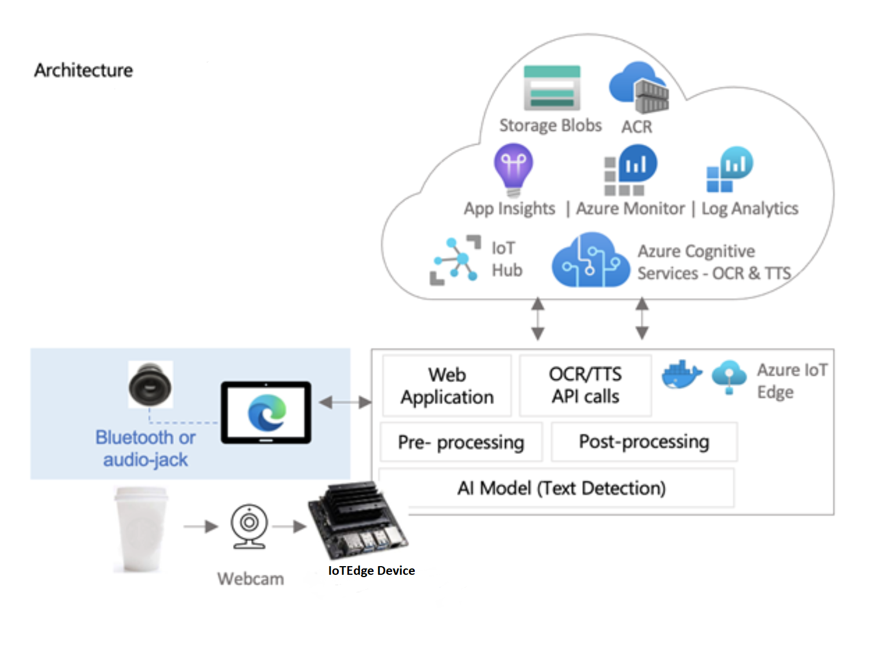
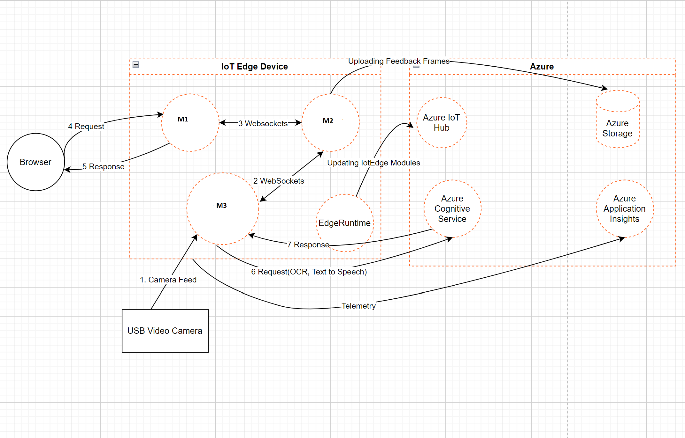
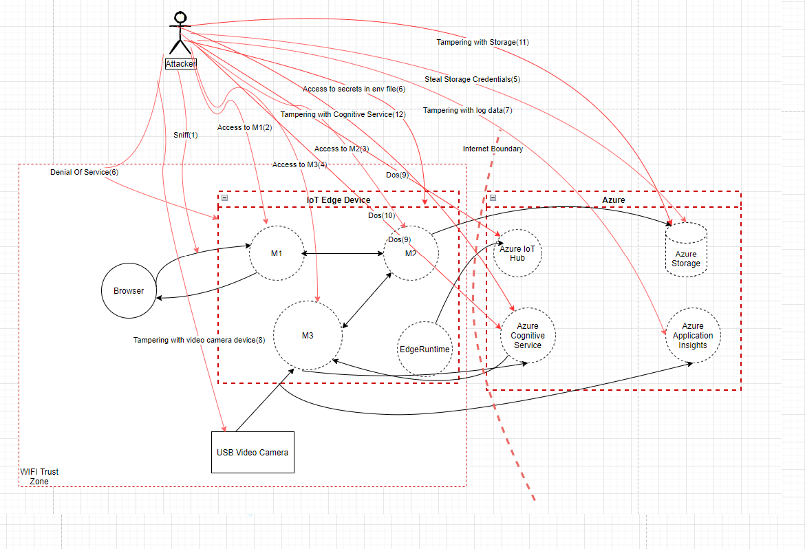
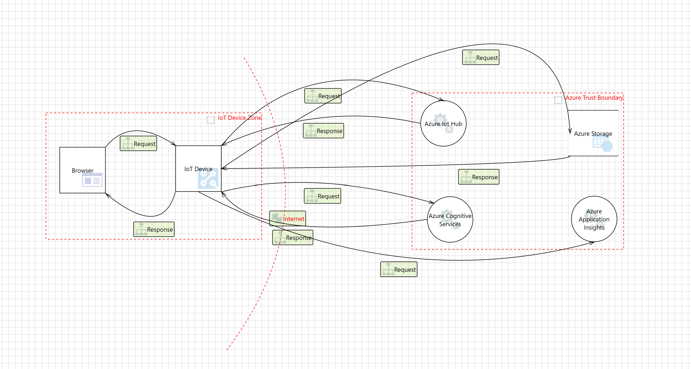

# Threat Modelling Example

This document covers the threat models for a sample project which takes video frames from video camera and process these frames on IoTEdge device and send them to Azure Cognitive Service to get the audio output.
 These models can be considered as reference template to show how we can construct threat modeling document. Each of the labeled entities in the figures below are accompanied by meta-information which describe the threats, recommended mitigations, and the associated [security principle or goal](#security-principles).

## Architecture Diagram

## Assets

| Asset                                   | Entry Point    | Trust Level                        |
|-----------------------------------------|----------------|------------------------------------|
| Azure Blob Storage                      | Http End point | Connection String                  |
| Azure Monitor                           | Http End Point | Connection String                  |
| Azure Cognitive Service                 | Http End Point | Connection String                  |
| IoTEdge Module: M1                      | Http End Point | Public Access (Local Area Network) |
| IoTEdge Module: M2                      | Http End Point | Public Access (Local Area Network) |
| IoTEdge Module: M3                      | Http End Point | Public Access (Local Area Network) |
| IoTEdge Module: IoTEdgeMetricsCollector | Http EndPoint  | Public Access (Local Area Network) |
| Application Insights                    | Http End Point | Connection String                  |

## Data Flow Diagram

- Client Browser makes requests to the M1 IoTEdge module. Browser and IoTEdge device are on same network, so browser directly hits the webapp URL.
- M1 IoTEdge module interacts with other two IoTEdge modules to render live stream from video device and display order scanning results via WebSockets.
- IoTEdge modules interact with Azure Cognitive service to get the translated text via OCR and audio stream via Text to Speech Service.
- IoTEdge modules send telemetry information to application insights.
- IoTEdge device is deployed with IoTEdge runtime which interacts with IoTEdge hub for deployments.
- IoTEdge module also sends some data to Azure storage which is required for debugging purpose.
- Cognitive service, application insights and Azure Storage are authenticated using connection strings which are stored in GitHub secrets and deployed using CI/CD pipelines.

## Threat List

## Assumptions

- Secrets like ACR credentials are stored in GitHub secrets store which are deployed to IoTEdge Device by CI/CD pipelines. However, CI/CD pipelines are out of scope.

## Threats

| Vector                                  | Threat                                                                                                                                                                                                                                   | Mitigation    |
|-----------------------------------------|------------------------------------------------------------------------------------------------------------------------------------------------------------------------------------------------------------------------------------------|---------------|
| (1) Sniff                               | Unencrypted data can be intercepted in transit                                                                                                                                                                                           | Not Mitigated |
| (2) Access to M1 IoT Edge Module        | Unauthorized Access to M1 IoT Edge Module                                                                                                                                                                                                | Not Mitigated |
| (3) Access to M2 IoT Edge Module        | Unauthorized Access to M2 IoT Edge Module                                                                                                                                                                                                | Not Mitigated |
| (4) Access to M3 IoT Edge Module        | Unauthorized Access to M3 IoT Edge Module                                                                                                                                                                                                | Not Mitigated |
| (5) Steal Storage Credentials           | Unauthorized Access to M2 IoTEdge Module where database secrets are used                                                                                                                                                                 | Not Mitigated |
| (6) Denial Of Service                   | Dos attack on all IoTEdge Modules since there is no Authentication                                                                                                                                                                       | Not Mitigated |
| (7) Tampering with Log data             | Application Insights is connected via Connection String which is stored in .env file on the IoTEdge device. Once user gains access to the device, .env file can be read and attacker can tamper the log data.                            | Not Mitigated |
| (8) Tampering with video camera device. | Video camera path is stored in .env file on the IoTEdge device. Once user gains access to the device, .env file can be read and attacker can tamper the video feed or use another video source or fake video stream.                     | Not Mitigated |
| (9) Spoofing Tampering                  | Azure IoT Hub connection string is stored in .env file on IoTEdge Device. Once user gains access to the device, .env file can be read and attacker cause Dos attacks on IoTHub                                                           | Not Mitigated |
| (10) Denial of Service DDOS attack      | Azure Cognitive Service connection string is stored in .env file on IoTEdge Device. Once user gains access to the device, .env file can be read and attacker cause DoS attacks on Azure Cognitive Service                                | Not Mitigated |
| (11) Tampering with Storage             | Storage connection string is stored in .env file on the IoTEdge device. Once user gains access to the device, .env file can be read and attacker can tamper data on storage or read from the storage.                                    | Not Mitigated |
| (12) Tampering with Storage             | Cognitive Service connection string is stored in .env file on the IoTEdge device. Once user gains access to the device, .env file can be read and attacker use cognitive service API's for his own purpose causing increase cost to use. | Not Mitigated |

## Threat Model

## Threat Properties

| **Notable Threats** |                               |                                                                                                                                                                                                                                                                                                   |                                                                                                                                                                                                                                                                                                                                                                                                                                                                                                                                                                                                                                                                                                                                                                                                                                                                   |
|---------------------|-------------------------------|---------------------------------------------------------------------------------------------------------------------------------------------------------------------------------------------------------------------------------------------------------------------------------------------------|-------------------------------------------------------------------------------------------------------------------------------------------------------------------------------------------------------------------------------------------------------------------------------------------------------------------------------------------------------------------------------------------------------------------------------------------------------------------------------------------------------------------------------------------------------------------------------------------------------------------------------------------------------------------------------------------------------------------------------------------------------------------------------------------------------------------------------------------------------------------|
| **\#**              | **Principle**                 | **Threat**                                                                                                                                                                                                                                                                                        | **Mitigation**                                                                                                                                                                                                                                                                                                                                                                                                                                                                                                                                                                                                                                                                                                                                                                                                                                                    |
| 1                   | Authenticity                  | Since channel from browser to IoTEdge Module is not authenticated, anyone can spoof it once gains access to WiFi network.                                                                                                                                                                         | Add authentication in all IoTEdge modules.                                                                                                                                                                                                                                                                                                                                                                                                                                                                                                                                                                                                                                                                                                                                                                                                                        |
| 2                   | Confidentiality and Integrity | As a result of the vulnerability of not encrypting data, plaintext data could be intercepted during transit via a man-in-the-middle (MitM) attack. Sensitive data could be exposed or tampered with to allow further exploits.                                                                    | All products and services must encrypt data in transit using approved cryptographic protocols and algorithms.  Use TLS to encrypt all HTTP-based network traffic. Use other mechanisms, such as IPSec, to encrypt non-HTTP network traffic that contains customer or confidential data. *Applies to data flow from browser to IoTEdge modules.*                                                                                                                                                                                                                                                                                                                                                                                                                                                                                                                   |
| 3                   | Confidentiality               | Data is a valuable target for most threat actors and attacking the data store directly, as opposed to stealing it during transit, allows data exfiltration at a much larger scale. In our scenario we are storing some data in Azure Blob containers.                                             | All customer or confidential data must be encrypted before being written to non-volatile storage media (encrypted at-rest) per the following requirements.  Use approved algorithms. This includes AES-256, AES-192, or AES-128. Encryption must be enabled before writing data to storage.  *Applies to all data stores on the diagram. Azure Storage encrypt data at rest by default (AES-256).*                                                                                                                                                                                                                                                                                                                                                                                                                                                                |
| 4                   | Confidentiality               | Broken or non-existent authentication mechanisms may allow attackers to gain access to confidential information.                                                                                                                                                                                  | All services within the Azure Trust Boundary must authenticate all incoming requests, including requests coming from the same network. Proper authorizations should also be applied to prevent unnecessary privileges.  Whenever available, use Azure Managed Identities to authenticate services. Service Principals may be used if Managed Identities are not supported. External users or services may use UserName + Passwords, Tokens, Certificates or Connection Strings to authenticate, provided these are stored on Key Vault or any other vaulting solution. For authorization, use Azure RBAC to segregate duties and grant only the least amount of access to perform an action at a particular scope. *Applies to Azure services like Azure IoTHub, Azure Cognitive Service, Azure Application Insights are authenticated using connection strings.* |
| 5                   | Confidentiality and Integrity | A large attack surface, particularly those that are exposed on the internet, will increase the probability of a compromise                                                                                                                                                                        | Minimize the application attack surface by limiting publicly exposed services.  Use strong network controls by using virtual networks, subnets and network security groups to protect against unsolicited traffic. Use Azure Private Endpoint for Azure Storage.  *Applies to Azure storage.*                                                                                                                                                                                                                                                                                                                                                                                                                                                                                                                                                                     |
| 6                   | Confidentiality and Integrity | Browser and IoTEdge device are connected over in store WIFI network                                                                                                                                                                                                                               | Minimize the attack on WIFI network by using secure algorithm like WPA2. *Applies to connection between browser and IoTEdge devices.*                                                                                                                                                                                                                                                                                                                                                                                                                                                                                                                                                                                                                                                                                                                             |
| 7                   | Integrity                     | Exploitation of insufficient logging and monitoring is the bedrock of nearly every major incident. Attackers rely on the lack of monitoring and timely response to achieve their goals without being detected.                                                                                    | Logging of critical application events must be performed to ensure that, should a security incident occur, incident response and root-cause analysis may be done. Steps must also be taken to ensure that logs are available and cannot be overwritten or destroyed through malicious or accidental occurrences. At a minimum, the following events should be logged. Login/logout events Privilege delegation events Security validation failures (e.g. input validation or authorization check failures) Application errors and system events Application and system start-ups and shut-downs, as well as logging initialization                                                                                                                                                                                                                                |
| 6                   | Availability                  | Exploitation of the public endpoint by malicious actors who aim to render the service unavailable to its intended users by interrupting the service normal activity, for instance by flooding the target service with requests until normal traffic is unable to be processed (Denial of Service) | Application is accessed via web app deployed as one of the IoTEdge modules on the IoTEdge device. This app can be accessed by anyone in the local area network. Hence DDoS attacks are possible if the attacker gained access to local area network. All services deployed as IoTEdge modules must use authentication. *Applies to services deployed on IoTEdge device*                                                                                                                                                                                                                                                                                                                                                                                                                                                                                           |
| 7                   | Integrity                     | Tampering with data                                                                                                                                                                                                                                                                               | Data at rest, in Azure Storage must be encrypted on disk. Data at rest, in Azure can be protected further by Azure Advanced Threat Protection. Data at rest, in Azure Storage and Azure monitor workspace will use Azure RBAC to segregate duties and grant only the least amount of access to perform an action at a particular scope. Data in motion between services can be encrypted in TLS 1.2 *Applies to data flow between IoTEdge modules and Azure Services.*                                                                                                                                                                                                                                                                                                                                                                                            |

## Security Principles

- **Confidentiality** refers to the objective of keeping data private or secret. In practice, it’s about controlling access to data to prevent unauthorized disclosure.
- **Integrity** is about ensuring that data has not been tampered with and, therefore, can be trusted. It is correct, authentic, and reliable.
- **Availability** means that networks, systems, and applications are up and running. It ensures that authorized users have timely, reliable access to resources when they are needed.
