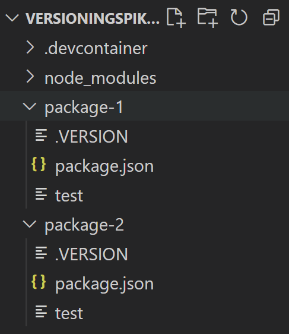

# Component Versioning

## Goal

Larger applications consist of multiple components that reference each other and rely on compatibility of the interfaces/contracts of the components.

To achieve the goal of loosely coupled applications, each component should be versioned independently hence allowing developers to detect breaking changes or seamless updates just by looking at the version number.

## Version Numbers and Versioning Schemes

For developers or other components to detect breaking changes the version number of a component is important.

There is different versioning number schemes, e.g.

`major.minor[.build[.revision]]`

or

`major.minor[.maintenance[.build]]`.

Upon build / CI these version numbers are being generated. During CD / release components are pushed to a *component repository* such as Nuget, NPM, Docker Hub where a history of different versions is being kept.

Each build the version number is incremented at the last digit.

Updating the major / minor version indicates changes of the API / interfaces / contracts:

* Major Version: A breaking change
* Minor Version: A backwards-compatible minor change
* Build / Revision: No API change, just a different build.

## Semantic Versioning

Semantic Versioning is a versioning scheme specifying how to interpret the different version numbers. The most common format is `major.minor.patch`. The version number is incremented based on the following rules:

* Major version when you make incompatible API changes,
* Minor version when you add functionality in a backwards-compatible manner, and
* Patch version when you make backwards-compatible bug fixes.

Examples of semver version numbers:

* **1.0.0-alpha.1**: +1 commit *after* the alpha release of 1.0.0
* **2.1.0-beta**: 2.1.0 in beta branch
* **2.4.2**: 2.4.2 release

A common practice is to determine the version number during the build process. For this the source control repository is utilized to determine the version number automatically based the source code repository.

The `GitVersion` tool uses the git history to generate *repeatable* and *unique* version number based on

* number of commits since last major or minor release
* commit messages
* tags
* branch names

Version updates happen through:

* Commit messages or tags for Major / Minor / Revision updates.
  > When using commit messages a convention such as Conventional Commits is recommended (see [Git Guidance - Commit Message Structure](git-guidance/README.md#commit-message-structure))
* Branch names (e.g. develop, release/..) for Alpha / Beta / RC
* Otherwise: Number of commits (+12, ...)

## Semantic Versioning Within a Monorepo

A monorepo, short for "monolithic repository", is a software development practice where multiple related projects, components, or modules are stored within a single version-controlled repository as opposed to maintaining them in separate repositories.



### Challenges with Versioning in a Monorepo Structure

Versioning in a monorepo involves making decisions about how to assign version numbers to different projects and components contained within the repository.

Assigning a single version number to all projects in a monorepo can lead to frequent version increments if changes in one project don't match the significance of changes in another. This might be excessive if some projects undergo rapid development while others evolve more slowly.

Ideally, we would want each project within the monorepo to have its own version number. Changes in one project shouldn't necessarily trigger version changes in others.
This strategy allows projects to evolve at their own pace, without forcing all projects to adopt the same version number. It aligns well with the differing release cadences of distinct projects.

### semantic-release Package for Versioning

[semantic-release](https://github.com/semantic-release/semantic-release) simplifies the entire process of releasing a package, which encompasses tasks such as identifying the upcoming version number, producing release notes, and distributing the package. This process severs the direct link between human sentiments and version identifiers. Instead, it rigorously adheres to the Semantic Versioning standards and effectively conveys the significance of alterations to end users.

`semantic-release` relies on commit messages to assess how codebase changes impact consumers. By adhering to structured conventions for commit messages, `semantic-release` autonomously identifies the subsequent semantic version, compiles a changelog, and releases the software.

[Angular Commit Message](https://gist.github.com/brianclements/841ea7bffdb01346392c) Conventions serve as the default for `semantic-release`. However, the configuration options of the @semantic-release/commit-analyzer and @semantic-release/release-notes-generator plugins, including presets, can be adjusted to modify the commit message format.

The table below shows which commit message gets you which release type when `semantic-release` runs (using the default configuration):

| Commit message                                                                                                                                                                               | Release type                                                                                            |
|----------------------------------------------------------------------------------------------------------------------------------------------------------------------------------------------|---------------------------------------------------------------------------------------------------------|
| fix(pencil): stop graphite breaking when too much pressure applied                                                                                                                           | Patch Fix Release                                                                                       |
| feat(pencil): add 'graphiteWidth' option                                                                                                                                                     | Minor Feature Release                                                                                   |
| perf(pencil): remove graphiteWidth option   <br>     BREAKING CHANGE: The graphiteWidth option has been removed.  The default graphite width of 10mm is always used for performance reasons. | Major Breaking Release <br> (Note that the BREAKING CHANGE:  token must be in the footer of the commit) |


The inherent setup of `semantic-release` presumes a direct correspondence between a GitHub repository and a package. Hence changes anywhere in the project result in a version upgrade for the project.

The [semantic-release-monorepo](https://github.com/pmowrer/semantic-release-monorepo) tool permits the utilization of `semantic-release` within a solitary GitHub repository that encompasses numerous packages.

Instead of attributing all commits to a single package, commits are assigned to packages based on the files that a commit touched.

If a commit touches a file in or below a package's root, it will be considered for that package's next release. A single commit can belong to multiple packages and may trigger the release of multiple packages.

In order to avoid version collisions, generated git tags are namespaced using the given package's name: `<package-name>`-`<version>`.


### semantic-release Configurations

`semantic-release`’s options, mode and plugins can be set via either:
<!-- // cSpell:ignore releaserc -->
- A .releaserc file, written in YAML or JSON, with optional extensions: .yaml/.yml/.json/.js/.cjs
- A release.config.(js|cjs) file that exports an object
- A release key in the project's package.json file

Here is an example .releaserc file which contains the configuration for:
1. git tags for the releases from different types of branches
2. Any plugins required, list of supported plugins can be found [here](https://semantic-release.gitbook.io/semantic-release/extending/plugins-list). In this file *semantic-release-monorepo* plugin is extended.

```json
{
    "ci": true,
    "repositoryUrl": "your repository url",
    "branches": [
      "master",
      {
        "name": "feature/*",
        "prerelease": "beta-${name.replace(/\\//g, '-').replace(/_/g, '-')}"
      },
      {
        "name": "[a-zA-Z0-9_]+/[a-zA-Z0-9-_]+",
        "prerelease": "dev-${name.replace(/\\//g, '-').replace(/_/g, '--')}"
      }
    ],
    "plugins": [
      "@semantic-release/commit-analyzer",
      "@semantic-release/release-notes-generator",
      [
        "@semantic-release/exec",
        {
          "verifyReleaseCmd": "echo ${nextRelease.name} > .VERSION"
        }
      ],
      "semantic-release-ado"
    ],
    "extends": "semantic-release-monorepo"
  }
```

## Resources

* [GitVersion](https://gitversion.net/)
* [Semantic Versioning](https://semver.org/)
* [Versioning in C#](https://learn.microsoft.com/en-us/dotnet/csharp/versioning)
* [semantic-release](https://github.com/semantic-release/semantic-release)
* [semantic-release-monorepo](https://github.com/pmowrer/semantic-release-monorepo)
