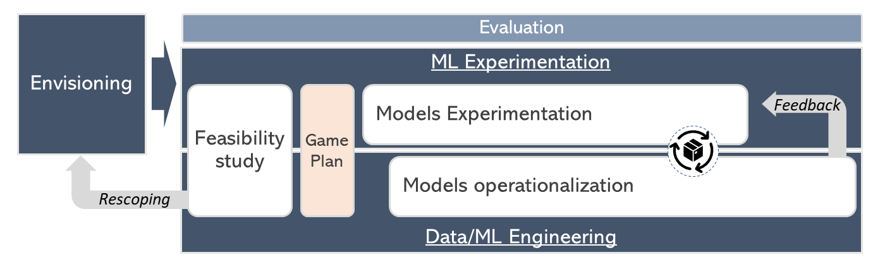

# Machine Learning fundamentals at CSE

This guideline documents the Machine Learning (ML) practices in CSE. CSE works with customers on developing ML models and putting them in production, while emphasizing engineering and research best practices throughout the project's life cycle.

## Goals

* Provide a set of ML practices to follow in an ML project.
* Provide clarity on ML process and how it fits within an software engineering project.
* Provide best practices for the different stages of an ML project.

## How to use these fundamentals

* If you are starting a new ML project, consider reading through the [general guidance documents](#general-guidance).
* For specific aspects of an ML project, refer to the guidelines for different [project phases](#ml-project-phases).

## ML Project phases

* Envisioning: Initial problem understanding, customer goals and objectives.
* [Feasibility study](ml-feasibility-study.md): Assess whether the problem in question is feasible to solve satisfactorily using ML with the available data.
* Kickoff: Define the scope, objectives, high-level architecture, definition of done and plan for the entire project.
* [Model(s) experimentation](ml-experimentation.md): Tools and best practices for conducting successful model experimentation.
* [Model readiness for production](ml-model-checklist.md) checklist.

## General guidance

* [ML Process Guidance](ml-proposed-process.md)
* [ML Fundamentals checklist](ml-fundamentals-checklist.md)
* [Agile ML development](ml-project-management.md)
* [Testing Data Science and ML Ops code](ml-testing.md)

## References

* [Responsible AI](https://www.microsoft.com/en-us/ai/responsible-ai-resources)
* [Model Operationalization](https://github.com/Microsoft/MLOps)
